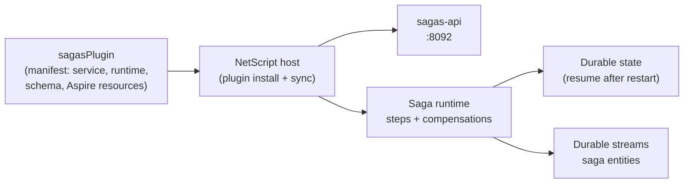

# @netscript/plugin-sagas

[](https://jsr.io/@netscript/plugin-sagas)
[](https://github.com/rickylabs/netscript/actions/workflows/ci.yml)
[](https://rickylabs.github.io/netscript/)

**The saga-orchestration plugin for NetScript: one install wires durable multi-step workflows with
compensation, a Saga API service, saga CLI commands, and Aspire orchestration into your app.**

Long-running business flows — checkout, onboarding, provisioning — fail in the middle, and the code
that unwinds a half-finished flow is the code nobody gets right ad hoc. `@netscript/plugin-sagas`
ships saga orchestration as one declarative manifest: `netscript plugin install saga` scaffolds a
sagas workspace, registers the Saga API service, provisions durable state storage, and adds the saga
runtime to your Aspire AppHost so in-flight workflows survive restarts and resume deterministically.

The manifest is plain data. Hosts read it to generate files and wiring; nothing executes until your
app boots. The saga DSL, engine, and runtime ports live in
[`@netscript/plugin-sagas-core`](https://jsr.io/@netscript/plugin-sagas-core) — this package binds
them to a NetScript host.

## Why teams use it

- **One manifest, whole capability** — `sagasPlugin` declares the Saga API service, the saga
  runtime, stream topics, database schema, runtime-config topics, contract versions, and Aspire
  resources as typed contribution axes the host turns into running processes.
- **Compensation built in** — workflows declare forward steps and compensations; saga state is
  persisted so a crash mid-flow resumes instead of stranding half-applied effects.
- **Saga API included** — the `sagas-api` service (default port `8092`) backs saga and instance
  introspection over a versioned contract.
- **An operations CLI** — `list`, `inspect`, `add-saga`, `update-saga`, `remove-saga`,
  `generate-registry`, and `publish` cover authoring and inspection; `inspect` degrades gracefully
  to a local source scan when the Saga API is not running.
- **Stable identity constants** — `SAGAS_PLUGIN_ID`, `SAGAS_API_SERVICE_NAME`, and
  `SAGAS_API_DEFAULT_PORT` are exported so hosts and wiring never hard-code literals.
- **Durable streams + Aspire** — `./streams` publishes saga entities to durable stream topics;
  `./aspire` contributes the saga resources to the AppHost.

## Architecture



## Install

From the root of a NetScript project:

```bash
netscript plugin install saga --name sagas
```

The plugin owns its setup — the CLI ships no embedded templates. The scaffolder wires the Saga API
service, the saga runtime, stream topics, database schema, and Aspire resources into your workspace,
then pins the matching `@netscript/*` versions. Sagas require Deno KV and optionally Postgres for
durable state (`--saga-store-backend kv|prisma`); the install records these requirements so
`netscript db` and Aspire provision them for you.

To consume the plugin programmatically (custom hosts, tests, tooling), add it as a library:

```bash
deno add jsr:@netscript/plugin-sagas
```

The standalone plugin CLI is also directly runnable:

```bash
deno x -A jsr:@netscript/plugin-sagas@<version>/cli inspect
```

Pin `<version>` to match your installed CLI; bare `jsr:@netscript/*` specifiers do not resolve on
the pre-release line.

## Quick example

Install the plugin, then inspect the saga surface — with no Saga API running, `inspect` reports the
runtime as unreachable and still scans local saga sources:

```bash
$ netscript plugin install saga --name sagas
Installed saga plugin "sagas" on port 8092.
Created 4 plugin files.
Regenerated 12 Aspire helper files.

$ deno x -A jsr:@netscript/plugin-sagas@<version>/cli inspect
Found 0 saga source files.
{
  "source": "local",
  "runtimeError": "fetch failed",
  "roots": [
    "sagas"
  ],
  "entries": []
}
```

As a library, the manifest and identity constants are inspectable data:

```typescript
import {
  SAGAS_API_DEFAULT_PORT,
  SAGAS_API_SERVICE_NAME,
  SAGAS_PLUGIN_ID,
  sagasPlugin,
} from '@netscript/plugin-sagas';

console.log(SAGAS_PLUGIN_ID); // "sagas"
console.log(SAGAS_API_SERVICE_NAME); // "sagas-api"
console.log(SAGAS_API_DEFAULT_PORT); // 8092
console.log(sagasPlugin.name); // "@netscript/plugin-sagas"
```

## Public surface

| Entry         | What it gives you                                                    |
| ------------- | -------------------------------------------------------------------- |
| `.`           | `sagasPlugin` plus the `SAGAS_*` identity and service constants      |
| `./cli`       | The saga command group (`list`, `inspect`, `add-saga`, `publish`, …) |
| `./runtime`   | The saga execution runtime composition                               |
| `./public`    | The typed orchestration surface hosts re-export                      |
| `./services`  | The Saga API service composition (`sagas-api`, port `8092`)          |
| `./streams`   | Durable-stream factory for saga entities                             |
| `./aspire`    | The saga Aspire contribution for the AppHost                         |
| `./contracts` | The versioned saga API contract generated registries bind against    |
| `./scaffold`  | The plugin-owned scaffolder `netscript plugin install saga` executes |

The always-current symbol list is
[`deno doc jsr:@netscript/plugin-sagas@<version>`](https://jsr.io/@netscript/plugin-sagas/doc) (pin
`<version>` on the pre-release line, as above).

## Docs

- **Sagas reference — commands, service, and contract**:
  [rickylabs.github.io/netscript/reference/sagas/](https://rickylabs.github.io/netscript/reference/sagas/)
- **Background Processing — sagas alongside jobs and triggers**:
  [rickylabs.github.io/netscript/background-processing/](https://rickylabs.github.io/netscript/background-processing/)
- **Checkout saga tutorial — build a multi-step saga end to end**:
  [rickylabs.github.io/netscript/tutorials/storefront/04-checkout-saga/](https://rickylabs.github.io/netscript/tutorials/storefront/04-checkout-saga/)
- **API docs on JSR**:
  [jsr.io/@netscript/plugin-sagas/doc](https://jsr.io/@netscript/plugin-sagas/doc)

## Compatibility

The saga runtime, CLI, and Saga API service require Deno 2.9+ (they use `Deno.*` and Deno KV APIs).
The manifest itself is plain data and can be imported anywhere TypeScript runs.

## License

Apache-2.0 — see [LICENSE](https://github.com/rickylabs/netscript/blob/main/LICENSE). Published to
JSR with cryptographically verified provenance.
