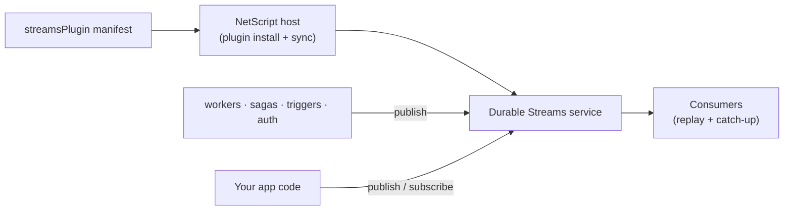

# @netscript/plugin-streams

[](https://jsr.io/@netscript/plugin-streams)
[](https://github.com/rickylabs/netscript/actions/workflows/ci.yml)
[](https://rickylabs.github.io/netscript/)

**The durable-streams plugin for NetScript: one install wires a replayable streaming service, typed
topics, stream CLI commands, and Aspire orchestration into your app — no database required.**

Every real app grows event flows — workers publish executions, auth publishes sessions, your own
code publishes domain changes — and someone has to run the pipe they all flow through.
`@netscript/plugin-streams` ships that pipe as one declarative manifest:
`netscript plugin install stream` scaffolds the Durable Streams service into your workspace and adds
it to your Aspire AppHost. Topics are durable and replayable, so consumers that start late or
restart mid-stream catch up instead of missing events.

The plugin is deliberately self-contained: it needs neither Postgres nor Deno KV, so it installs
without provisioning any database. The producer and schema primitives live in
[`@netscript/plugin-streams-core`](https://jsr.io/@netscript/plugin-streams-core) — this package
wires the streams service into a NetScript host.

## Why teams use it

- **One manifest, whole capability** — `streamsPlugin` declares the Durable Streams service,
  contract versions, and Aspire resources as typed contribution axes the host turns into a running
  process.
- **Durable, replayable topics** — other plugins and your own application code publish to and
  consume from topics that survive restarts and support replay.
- **Typed topic definitions** — `defineStreamTopic`, `defineStreamProducer`, and
  `defineStreamConsumer` give producers and consumers payload types checked at compile time.
- **An operations CLI** — `list-topics`, `inspect`, `stats`, `subscribe`, `add-schema`,
  `add-producer`, and `clear` cover inspecting and operating the stream surface.
- **Zero extra infrastructure** — no migrations, no KV, no external broker; the service is a
  standalone utility process Aspire starts with the rest of your app.

## Architecture



## Install

From the root of a NetScript project:

```bash
netscript plugin install stream --name streams
```

The plugin owns its setup — the CLI ships no embedded templates. The scaffolder wires the Durable
Streams service and Aspire resources into your workspace, then pins the matching `@netscript/*`
versions. No database is provisioned: streams is a self-contained utility.

To consume the plugin programmatically (custom hosts, tests, tooling), add it as a library:

```bash
deno add jsr:@netscript/plugin-streams@<version>
```

The standalone plugin CLI is also directly runnable:

```bash
deno x -A jsr:@netscript/plugin-streams@<version>/cli list-topics
```

Pin `<version>` to match your installed CLI; bare `jsr:@netscript/*` specifiers do not resolve on
the pre-release line.

## Quick example

Install the plugin, then list the topics it serves — the install scaffolds a default notifications
stream, so discovery finds it immediately:

```bash
$ netscript plugin install stream --name streams
Installed stream plugin "streams" on port 4437.
Created 2 plugin files.
Regenerated 12 Aspire helper files.

$ deno x -A jsr:@netscript/plugin-streams@<version>/cli list-topics
1 stream topic(s) discovered.
{
  "topics": [
    {
      "name": "/v1/streams/notifications/events",
      "streamPath": "/v1/streams/notifications/events",
      "producerId": "notifications-producer",
      "producerFile": "streams/notifications-stream.ts",
      "collections": []
    }
  ]
}
```

As a library, define a typed topic and derive its producer and consumer handles. The handles are
wiring stubs — runtime IO throws `StreamUnsupportedOperationError`, so bind
`@netscript/plugin-streams-core` for actual publishing:

```typescript
import {
  defineStreamConsumer,
  defineStreamProducer,
  defineStreamTopic,
} from '@netscript/plugin-streams';

type OrderPlaced = { orderId: string; total: number };

// Any Standard Schema validator works here (Zod, Valibot, or hand-rolled).
const topic = defineStreamTopic<OrderPlaced>('orders.placed', {
  '~standard': {
    version: 1,
    vendor: 'orders',
    validate: (value: unknown) => ({ value: value as OrderPlaced }),
  },
});

const producer = defineStreamProducer(topic);
const consumer = defineStreamConsumer(topic);

console.log(topic.name); // "orders.placed"
// `producer.publish` / `consumer.subscribe` are typed to `OrderPlaced`.
void producer;
void consumer;
```

## Public surface

| Entry        | What it gives you                                                                                                           |
| ------------ | --------------------------------------------------------------------------------------------------------------------------- |
| `.`          | `streamsPlugin` plus `defineStreamTopic` / `defineStreamProducer` / `defineStreamConsumer` and the manifest type vocabulary |
| `./cli`      | The streams command group (`list-topics`, `inspect`, `stats`, `subscribe`, …)                                               |
| `./services` | The Durable Streams service composition                                                                                     |
| `./aspire`   | The streams Aspire contribution for the AppHost                                                                             |
| `./scaffold` | The plugin-owned scaffolder `netscript plugin install stream` executes                                                      |

The always-current symbol list is
[`deno doc jsr:@netscript/plugin-streams@<version>`](https://jsr.io/@netscript/plugin-streams/doc)
(pin `<version>` on the pre-release line, as above).

## Docs

- **Streams reference — commands, service, and topics**:
  [rickylabs.github.io/netscript/reference/streams/](https://rickylabs.github.io/netscript/reference/streams/)
- **Streams capability — durable topics end to end**:
  [rickylabs.github.io/netscript/capabilities/streams/](https://rickylabs.github.io/netscript/capabilities/streams/)
- **API docs on JSR**:
  [jsr.io/@netscript/plugin-streams/doc](https://jsr.io/@netscript/plugin-streams/doc)

## Compatibility

The Durable Streams service and CLI require Deno 2.9+. The manifest and topic definitions are plain
data and can be imported anywhere TypeScript runs.

## License

Apache-2.0 — see [LICENSE](https://github.com/rickylabs/netscript/blob/main/LICENSE). Published to
JSR with cryptographically verified provenance.
