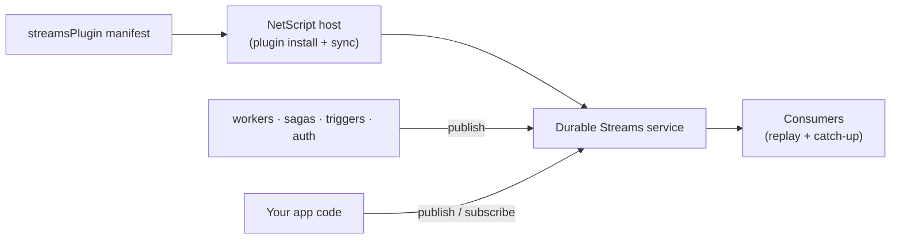

# @netscript/plugin-streams

[](https://jsr.io/@netscript/plugin-streams)
[](https://github.com/rickylabs/netscript/actions/workflows/ci.yml)
[](https://rickylabs.github.io/netscript/)

**The Durable Streams protocol plugin for NetScript: one install wires an ephemeral streaming
service, stream CLI commands, and Aspire orchestration — with file storage as an explicit opt-in.**

Every real app grows event flows — workers publish executions, auth publishes sessions, your own
code publishes domain changes — and someone has to run the pipe they all flow through.
`@netscript/plugin-streams` ships that pipe as one declarative manifest:
`netscript plugin install stream` scaffolds the Durable Streams service into your workspace and adds
it to your Aspire AppHost. Memory storage supports replay only during the current service process.
It loses every stream on restart; the protocol name does not promise persistent storage.

The plugin is deliberately self-contained: it needs neither Postgres nor Deno KV, so it installs
without provisioning any database.

> **Durability is opt-in.** The scaffolded service reads `STREAMS_DATA_DIR`. When it is **unset —
> which is the default the scaffold installs — the service stores events in memory only**, so they
> do not survive a restart. Set `STREAMS_DATA_DIR=<path>` to switch to file-backed storage. The
> service logs a warning at startup whenever it comes up ephemeral. File mode requires an existing,
> writable directory and a successful startup write/read probe; a bad opt-in fails startup.
>
> Note also that the framework prepends `/v1/stream/netscript` to the configured `streamPath`:
> `streamPath: '/workers/executions'` resolves to `<base>/v1/stream/netscript/workers/executions`.
> Calling the configured path verbatim returns 404. The producer and schema primitives live in
> [`@netscript/plugin-streams-core`](https://jsr.io/@netscript/plugin-streams-core) — this package
> wires the streams service into a NetScript host.

## Storage contract and operations

The runtime manifest records `storage.defaultMode = "memory"`, `ephemeral = true`, and the file
opt-in environment key. The installer manifest description declares the ephemeral default and the
`STREAMS_DATA_DIR` opt-in. `/health` includes a `checks` entry named `streams-storage` with
`storage.mode` (`memory` or `file`), `durable`, and `probe` (`not-applicable` or `passed`). Healthy
memory mode means the service is reachable; it explicitly reports `durable: false`. Local directory
paths are omitted from health.

The generated AppHost already supports `Environment` on plugin entries. Provision a project-local
persistent directory yourself, ignore it in Git, then add this to the existing
`NetScript.Plugins.streams` entry in `appsettings.json` and regenerate the Aspire helpers with
`netscript generate aspire`:

```json
{
  "Environment": {
    "STREAMS_DATA_DIR": ".netscript/data/streams"
  }
}
```

Paths resolve from the streams resource working directory (the project root in the default
scaffold). Create `.netscript/data/streams` before starting the AppHost and add `.netscript/data/`
to `.gitignore`. The generated plugin registration passes `STREAMS_DATA_DIR` through
`withEnvironment`. For a deployed process, mount a persistent writable directory and set the
equivalent environment value; a container's disposable filesystem does not provide persistent
storage. Unset means memory; empty, missing, non-directory, or unwritable values fail startup
without falling back.

The process-boundary acceptance test in `services/src/tests/storage-restart_test.ts` uses
`DurableStreamProducer` upserts and a delete, flushes, stops the service process, restarts it on the
same directory, and compares all HTTP events. Its memory control gets 404 after restart. This proves
orderly process restart, not power-loss durability, concurrent writers, replication, or automatic
backup. Only one service process may own a data directory.

Retention is unbounded unless an explicit stream expiry/deletion policy is configured. A producer
entity delete appends a tombstone; it does not compact retained history. Protocol TTL is a sliding
inactivity window renewed by reads/appends; absolute expiry is fixed. Either expires the whole
stream, not individual records. Use absolute expiry or scheduled whole-stream/day-segment deletion
under a background service identity for a hard bound, and monitor disk capacity. Automatic log
compaction and archival are not provided.

Recovery preserves complete native frames and discards an incomplete final frame; truncated writes
can lose the final event. Missing segment files can read empty and corrupt LMDB metadata can prevent
startup: the startup probe checks directory I/O, not the integrity of every historical record. Do
not interpret it as a corruption repair or data-loss guarantee. Restore a known-good backup when
recovery fails; preserve a copy of the damaged directory for investigation.

For backup, stop producers and gracefully stop streams, then copy the **entire** data directory
(LMDB metadata and native segment files together). Restore that complete copy into an existing,
writable directory with the service stopped, keep the same storage/protocol versions, and verify
HTTP replay before resuming producers. Live file copies are not a supported consistent backup.
Durable-by-default provisioning and migration are tracked in
[#2114](https://github.com/rickylabs/netscript/issues/2114) for 0.0.9.

Durable recovery reads native frame headers through a reusable 64 KiB window. Tail reads seek from
recent verified frame boundaries and allocate only the requested complete messages. The recent
boundary cache has fixed capacity (32 segments, 128 checkpoints per segment), so retained history
does not increase recovery or idle-tail memory. Responses still require memory for the payloads
requested by the caller; cold historical offsets may scan earlier framing headers. Partial final
headers, payloads, or trailers stop at the last complete native offset, including fork bases.

The service composes the native LMDB store with a local bounded I/O adapter. It preserves the append
log format, producer state, fork stitching and JSON response formatting. The adapter checks the two
upstream I/O hooks at construction and changes only its own subclass. Upstream tracking:
[durable-streams/durable-streams#420](https://github.com/durable-streams/durable-streams/issues/420).
Contributors can start at `services/src/bounded-file-store.ts`; framing and the large-log RSS
regression sit beside it.

## Why teams use it

- **One manifest, whole capability** — `streamsPlugin` declares the Durable Streams service,
  contract versions, and Aspire resources as typed contribution axes the host turns into a running
  process.
- **Explicit storage choice** — memory is ephemeral; the opt-in file backend is proven to replay
  real producer writes after an orderly service process restart.
- **Typed topic definitions** — `defineStreamTopic`, `defineStreamProducer`, and
  `defineStreamConsumer` give producers and consumers payload types checked at compile time.
- **An operations CLI** — `list-topics`, `inspect`, `stats`, `subscribe`, `add-schema`,
  `add-producer`, and `clear` cover inspecting and operating the stream surface.
- **Zero extra infrastructure** — no migrations, no KV, no external broker; the service is a
  standalone utility process Aspire starts with the rest of your app.

## Architecture


```mermaid
flowchart LR
    M["streamsPlugin manifest"] --> H["NetScript host<br/>(plugin install + sync)"]
    H --> S["Durable Streams service"]
    P1["workers · sagas · triggers · auth"] -- publish --> S
    P2["Your app code"] -- publish / subscribe --> S
    S --> C["Consumers<br/>(replay + catch-up)"]
```

## Install

From the root of a NetScript project:

```bash
netscript plugin install stream --name streams
```

The plugin owns its setup — the CLI ships no embedded templates. The scaffolder wires the Durable
Streams service and Aspire resources into your workspace, then pins the matching `@netscript/*`
versions. No database is provisioned: streams is a self-contained utility.

To consume the plugin programmatically (custom hosts, tests, tooling), add it as a library:

```bash
deno add jsr:@netscript/plugin-streams@<version>
```

The standalone plugin CLI is also directly runnable:

```bash
deno x -A jsr:@netscript/plugin-streams@<version>/cli list-topics
```

Pin `<version>` to match your installed CLI; bare `jsr:@netscript/*` specifiers do not resolve on
the pre-release line.

## Quick example

Install the plugin, then list the topics it serves — the install scaffolds a default notifications
stream, so discovery finds it immediately:

```bash
$ netscript plugin install stream --name streams
Installed stream plugin "streams" on port <allocated-port>.
Created 2 plugin files.
Regenerated 12 Aspire helper files.

$ deno x -A jsr:@netscript/plugin-streams@<version>/cli list-topics
1 stream topic(s) discovered.
{
  "topics": [
    {
      "name": "/v1/streams/notifications/events",
      "streamPath": "/v1/streams/notifications/events",
      "producerId": "notifications-producer",
      "producerFile": "streams/notifications-stream.ts",
      "collections": []
    }
  ]
}
```

As a library, define a typed topic and derive its producer and consumer handles. The handles are
wiring stubs — runtime IO throws `StreamUnsupportedOperationError`, so bind
`@netscript/plugin-streams-core` for actual publishing:

```typescript
import {
  defineStreamConsumer,
  defineStreamProducer,
  defineStreamTopic,
} from '@netscript/plugin-streams';

type OrderPlaced = { orderId: string; total: number };

// Any Standard Schema validator works here (Zod, Valibot, or hand-rolled).
const topic = defineStreamTopic<OrderPlaced>('orders.placed', {
  '~standard': {
    version: 1,
    vendor: 'orders',
    validate: (value: unknown) => ({ value: value as OrderPlaced }),
  },
});

const producer = defineStreamProducer(topic);
const consumer = defineStreamConsumer(topic);

console.log(topic.name); // "orders.placed"
// `producer.publish` / `consumer.subscribe` are typed to `OrderPlaced`.
void producer;
void consumer;
```

## Public surface

| Entry        | What it gives you                                                                                                           |
| ------------ | --------------------------------------------------------------------------------------------------------------------------- |
| `.`          | `streamsPlugin` plus `defineStreamTopic` / `defineStreamProducer` / `defineStreamConsumer` and the manifest type vocabulary |
| `./cli`      | The streams command group (`list-topics`, `inspect`, `stats`, `subscribe`, …)                                               |
| `./services` | The Durable Streams service composition                                                                                     |
| `./aspire`   | The streams Aspire contribution for the AppHost                                                                             |
| `./scaffold` | The plugin-owned scaffolder `netscript plugin install stream` executes                                                      |

The always-current symbol list is
[`deno doc jsr:@netscript/plugin-streams@<version>`](https://jsr.io/@netscript/plugin-streams/doc)
(pin `<version>` on the pre-release line, as above).

## Docs

- **Streams reference — commands, service, and topics**:
  [rickylabs.github.io/netscript/reference/streams/](https://rickylabs.github.io/netscript/reference/streams/)
- **Streams capability — protocol, producers, and storage modes**:
  [rickylabs.github.io/netscript/capabilities/streams/](https://rickylabs.github.io/netscript/capabilities/streams/)
- **API docs on JSR**:
  [jsr.io/@netscript/plugin-streams/doc](https://jsr.io/@netscript/plugin-streams/doc)

## Compatibility

The Durable Streams service and CLI require Deno 2.9+. The manifest and topic definitions are plain
data and can be imported anywhere TypeScript runs.

## License

Apache-2.0 — see [LICENSE](https://github.com/rickylabs/netscript/blob/main/LICENSE). Published to
JSR with cryptographically verified provenance.
