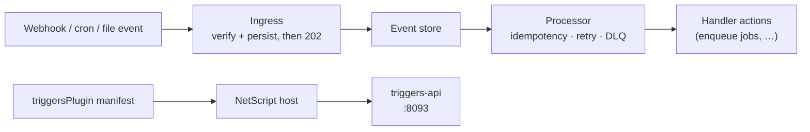

# @netscript/plugin-triggers

[](https://jsr.io/@netscript/plugin-triggers)
[](https://github.com/rickylabs/netscript/actions/workflows/ci.yml)
[](https://rickylabs.github.io/netscript/)

**The trigger-processing plugin for NetScript: one install wires webhook ingress, scheduled and
file-watch triggers, durable processing, a Triggers API service, CLI commands, and Aspire
orchestration into your app.**

Webhooks are easy until one arrives twice, one arrives during a deploy, or a slow handler makes the
sender time out and retry. `@netscript/plugin-triggers` ships trigger processing as one declarative
manifest: `netscript plugin install trigger` scaffolds a triggers workspace, registers the Triggers
API service, provisions the event store, and adds the processor runtime to your Aspire AppHost.
Ingress acknowledges and persists first, then processes — so a crash after the `202` is recoverable
and duplicates are absorbed by idempotency.

The manifest is plain data. Hosts read it to generate files and wiring; nothing executes until your
app boots. The handler-first trigger DSL and runtime ports live in
[`@netscript/plugin-triggers-core`](https://jsr.io/@netscript/plugin-triggers-core) — this package
binds them to a NetScript host.

## Why teams use it

- **One manifest, whole capability** — `triggersPlugin` declares the Triggers API service, the
  trigger processor, stream topics, database schema, runtime-config topics, contract versions, and
  Aspire resources as typed contribution axes the host turns into running processes.
- **Three trigger kinds, one runtime** — webhook, scheduled, and file-watch triggers drain through
  the same processor with at-least-once delivery, idempotency, and dead-lettering.
- **Ack-then-process ingress** — inbound webhooks are verified and persisted before the `202`
  acknowledgement, so slow handlers never block the sender and crashes replay from the stored event.
- **Concurrent by default** — the processor fans out with a default concurrency of 10
  (`TRIGGER_CONCURRENCY`) for bursty workloads.
- **Triggers API included** — the `triggers-api` service (default port `8093`) backs trigger and
  event introspection over a versioned contract.
- **An operations CLI** — `list`, `add-webhook`, `add-scheduled`, `add-file-watch`, `fire`,
  `preview`, `test`, `events`, and `enable`/`disable` cover authoring and operating triggers.

## Architecture



## Install

From the root of a NetScript project:

```bash
netscript plugin install trigger --name triggers
```

The plugin owns its setup — the CLI ships no embedded templates. The scaffolder wires the Triggers
API service, the processor runtime, stream topics, database schema, and Aspire resources into your
workspace, then pins the matching `@netscript/*` versions. Triggers require Deno KV and optionally
Postgres; the install records both so `netscript db` and Aspire provision them for you.

To consume the plugin programmatically (custom hosts, tests, tooling), add it as a library:

```bash
deno add jsr:@netscript/plugin-triggers@<version>
```

The standalone plugin CLI is also directly runnable:

```bash
deno x -A jsr:@netscript/plugin-triggers@<version>/cli list
```

Pin `<version>` to match your installed CLI; bare `jsr:@netscript/*` specifiers do not resolve on
the pre-release line.

## Quick example

Install the plugin, then list the trigger definitions it manages:

```bash
$ netscript plugin install trigger --name triggers
Installed trigger plugin "triggers" on port 8093.
Created 5 plugin files.
Regenerated 12 Aspire helper files.

$ deno x -A jsr:@netscript/plugin-triggers@<version>/cli list
Found 0 trigger definitions.
{
  "triggers": []
}
```

As a library, the manifest and identity constants are inspectable data:

```typescript
import {
  TRIGGERS_API_DEFAULT_PORT,
  TRIGGERS_API_SERVICE_NAME,
  TRIGGERS_PLUGIN_ID,
  triggersPlugin,
} from '@netscript/plugin-triggers';

console.log(TRIGGERS_PLUGIN_ID); // "triggers"
console.log(TRIGGERS_API_SERVICE_NAME); // "triggers-api"
console.log(TRIGGERS_API_DEFAULT_PORT); // 8093
console.log(triggersPlugin.name); // "@netscript/plugin-triggers"
```

## Public surface

| Entry        | What it gives you                                                                                                         |
| ------------ | ------------------------------------------------------------------------------------------------------------------------- |
| `.`          | `triggersPlugin` plus the `TRIGGERS_*` identity and service constants                                                     |
| `./cli`      | The trigger command group (`list`, `add-webhook`, `fire`, `events`, …)                                                    |
| `./runtime`  | The processor runtime (`createRuntimeTriggerProcessor`) with KV-backed event store, idempotency, and dead-letter adapters |
| `./public`   | The typed trigger surface hosts re-export                                                                                 |
| `./services` | The Triggers API service composition (`triggers-api`, port `8093`)                                                        |
| `./streams`  | Durable-stream factory for trigger entities                                                                               |
| `./aspire`   | The trigger Aspire contribution for the AppHost                                                                           |
| `./scaffold` | The plugin-owned scaffolder `netscript plugin install trigger` executes                                                   |

The always-current symbol list is
[`deno doc jsr:@netscript/plugin-triggers@<version>`](https://jsr.io/@netscript/plugin-triggers/doc)
(pin `<version>` on the pre-release line, as above).

## Docs

- **Triggers reference — commands, service, and contract**:
  [rickylabs.github.io/netscript/reference/triggers/](https://rickylabs.github.io/netscript/reference/triggers/)
- **Background Processing — triggers alongside jobs and sagas**:
  [rickylabs.github.io/netscript/background-processing/](https://rickylabs.github.io/netscript/background-processing/)
- **API docs on JSR**:
  [jsr.io/@netscript/plugin-triggers/doc](https://jsr.io/@netscript/plugin-triggers/doc)

## Compatibility

The processor runtime, CLI, and Triggers API service require Deno 2.9+ (they use `Deno.*` and Deno
KV APIs). The manifest itself is plain data and can be imported anywhere TypeScript runs.

## License

Apache-2.0 — see [LICENSE](https://github.com/rickylabs/netscript/blob/main/LICENSE). Published to
JSR with cryptographically verified provenance.
