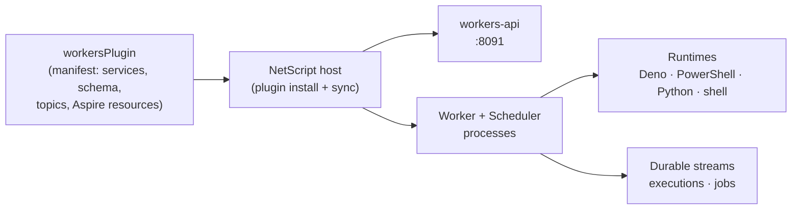

# @netscript/plugin-workers

[](https://jsr.io/@netscript/plugin-workers)
[](https://github.com/rickylabs/netscript/actions/workflows/ci.yml)
[](https://rickylabs.github.io/netscript/)

**The background-workers plugin for NetScript: one install wires durable jobs, multi-runtime tasks,
workflows, a Workers API service, worker CLI commands, and Aspire orchestration into your app.**

Background processing is usually a shopping trip — a queue library here, a scheduler there, an admin
API you write yourself, and deployment glue nobody wants to own. `@netscript/plugin-workers` ships
the whole capability as one declarative manifest: `netscript plugin install worker` scaffolds a
workers workspace, registers the Workers API service, provisions the storage it needs, and adds the
worker processes to your Aspire AppHost so everything starts with the rest of your app.

The manifest is plain data. Hosts read it to generate files and wiring; nothing executes until your
app boots. The reusable job, task, and workflow builders live in
[`@netscript/plugin-workers-core`](https://jsr.io/@netscript/plugin-workers-core) — this package
binds them to a NetScript host.

## Why teams use it

- **One manifest, whole capability** — `workersPlugin` declares services, background processors,
  stream topics, database schema, runtime-config topics, contract versions, and Aspire resources as
  typed contribution axes the host turns into running processes.
- **Multi-runtime tasks** — jobs and tasks execute across Deno, PowerShell, Python, and shell
  runtimes with at-least-once delivery keyed on `idempotencyKey`.
- **A real operations surface** — the plugin CLI covers the job lifecycle end to end: `add-job`,
  `add-task`, `add-workflow`, `run`, `run-task`, `list-jobs`, `executions`, `logs`, `trigger`,
  `enable`/`disable`, and `compile-registry`.
- **Workers API included** — the `workers-api` service (default port `8091`) exposes job and
  execution introspection over a versioned contract, so dashboards and agents query state instead of
  scraping logs.
- **Durable by default** — `./streams` publishes execution and job entities to durable stream
  topics, and worker metrics flow through the shared NetScript telemetry conventions.
- **Aspire-native** — `./aspire` contributes the worker resources to the AppHost, so local
  orchestration and deployment see workers as first-class processes.

## Architecture



## Install

From the root of a NetScript project:

```bash
netscript plugin install worker --name workers
```

The plugin owns its setup — the CLI ships no embedded templates. The scaffolder wires the Workers
API service, background processors, stream topics, database schema, and Aspire resources into your
workspace, then pins the matching `@netscript/*` versions. Workers require Deno KV and optionally
Postgres; the install records both from the manifest so `netscript db` and Aspire provision them for
you.

To consume the plugin programmatically (custom hosts, tests, tooling), add it as a library:

```bash
deno add jsr:@netscript/plugin-workers@<version>
```

The standalone plugin CLI is also directly runnable:

```bash
deno x -A jsr:@netscript/plugin-workers@<version>/cli list-jobs
```

Pin `<version>` to match your installed CLI; bare `jsr:@netscript/*` specifiers do not resolve on
the pre-release line.

## Quick example

Install the plugin, then list the jobs it manages:

```bash
$ netscript plugin install worker --name workers
Installed worker plugin "workers" on port 8091.
Created 4 plugin files.
Regenerated 12 Aspire helper files.

$ deno x -A jsr:@netscript/plugin-workers@<version>/cli list-jobs
Found 0 worker jobs.
{
  "jobs": []
}
```

As a library, the manifest is inspectable data:

```typescript
import { workersPlugin } from '@netscript/plugin-workers';

console.log(workersPlugin.name); // "@netscript/plugin-workers"

// Declared service contributions (the Workers API runs on port 8091).
const service = workersPlugin.contributions.services?.[0];
console.log(service?.name); // "workers-api"
console.log(service?.port); // 8091
```

## Public surface

| Entry         | What it gives you                                                          |
| ------------- | -------------------------------------------------------------------------- |
| `.`           | `workersPlugin` — the typed `PluginManifest` with every contribution axis  |
| `./cli`       | The workers command group (`add-job`, `run`, `list-jobs`, `executions`, …) |
| `./worker`    | The `Worker` consumer and cron `Scheduler` runtime classes                 |
| `./services`  | The Workers API service composition (`workers-api`, port `8091`)           |
| `./streams`   | Durable-stream factory for execution and job entities                      |
| `./aspire`    | The workers Aspire contribution for the AppHost                            |
| `./contracts` | The versioned workers API contract generated registries bind against       |
| `./scaffold`  | The plugin-owned scaffolder `netscript plugin install worker` executes     |

The always-current symbol list is
[`deno doc jsr:@netscript/plugin-workers@<version>`](https://jsr.io/@netscript/plugin-workers/doc)
(pin `<version>` on the pre-release line, as above).

## Docs

- **Workers reference — commands, service, and contract**:
  [rickylabs.github.io/netscript/reference/workers/](https://rickylabs.github.io/netscript/reference/workers/)
- **Background Processing — jobs, tasks, and workflows end to end**:
  [rickylabs.github.io/netscript/background-processing/](https://rickylabs.github.io/netscript/background-processing/)
- **How-to — roll out runtime overrides**:
  [rickylabs.github.io/netscript/how-to/roll-out-runtime-overrides/](https://rickylabs.github.io/netscript/how-to/roll-out-runtime-overrides/)
- **API docs on JSR**:
  [jsr.io/@netscript/plugin-workers/doc](https://jsr.io/@netscript/plugin-workers/doc)

## Compatibility

The worker runtime, CLI, and Workers API service require Deno 2.9+ (they use `Deno.*` and Deno KV
APIs). The manifest itself is plain data and can be imported anywhere TypeScript runs. Task runtimes
additionally shell out to PowerShell, Python, or a POSIX shell when a definition targets them, so
those interpreters must be present on the machine that runs such tasks.

## License

Apache-2.0 — see [LICENSE](https://github.com/rickylabs/netscript/blob/main/LICENSE). Published to
JSR with cryptographically verified provenance.
