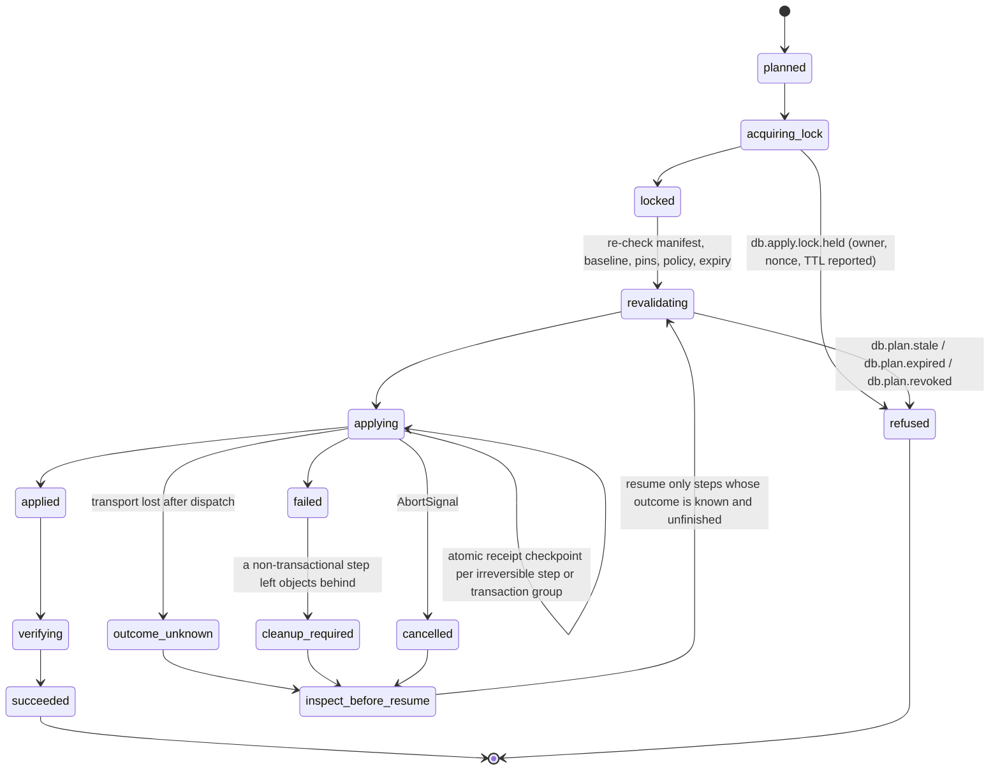

# Database architecture — a provider-neutral kernel with a Prisma 8 PostgreSQL adapter

## Summary

NetScript replaces its inherited database foundation with one provider-neutral composition and
operations kernel, and certifies exactly one adapter first: Prisma 8 on PostgreSQL.

Applications and plugins author schema in **native Prisma TypeScript** — the current model-first
`defineContract(scaffold, callback)` form — and pass that exact native value into NetScript's own
adoption surface, which adds identity, ownership, capability requirements, policy, and lifecycle.
That surface has the three levels NetScript already uses for Hono, the SDK, and Fresh: an **L1
recipe** for the golden path, the **L2 factories** it calls, and **L3 native Prisma plus kernel
primitives**. None of them describes a model, field, relation, or query: NetScript adds no schema or
query vocabulary and re-exports no builder. A compiler with no live dependencies resolves those
definitions into canonical contract artifacts and one deterministic, content-addressed
`DatabaseManifest`. That manifest is the durable join point for everything downstream: an app-local
binding typed from the authored contracts by erased inference, with an automatically emitted
declaration supplying the same evidence for any space the consumer did not author; typed
process/request sessions; bounded `StandardSchemaV1` validators; programmatic
emit/inspect/plan/apply/verify operations; provider markers and ledgers; immutable receipts; and
generated CLI, Aspire, and agent projections.

The end-to-end flow is one pipeline of separately named values, and no stage may impersonate
another:

```text
native contracts + NetScript definitions
  → deterministic composition → ContractArtifacts → DatabaseManifest
  → app-local binding → sessions + bounded validators
  → inspected baseline → ExecutablePlan → provider apply/ledger
  → immutable OperationReceipts → verify / resume
```

This is a clean break. There is no compatibility API, no Prisma 7 fallback, no dual runtime, no
legacy adapter facade, and no application that composes both stacks. Data continuity is nevertheless
absolute: `netscript db adopt` introspects live databases, proposes ownership, writes provider
marker metadata only, and performs **no application-schema DDL and no application-data DML** — the
only writes are idempotent, receipt-backed provider marker and ledger rows.

Two acceptance conditions bind implementation, and the design is narrowed rather than softened if
either fails:

> **Exact native contract inference survives into the app-local query binding** — no private
> imports, no copied overloads, no casts, no widening, and no manual type-generation step in a
> developer's normal loop.
>
> **Runtime validation is intentionally bounded and fails closed** — a schema is produced only where
> the contract plus registered operation, selection, codec, and extension metadata can prove it.

Explicit non-goals: no query DSL or repository layer, no portable client facade, no runtime
capability negotiation, no global provider registry, and no hosted control plane. Where a capability
cannot be made sound today — multi-namespace typing, full operation validation from contract data,
destructive plugin removal, non-PostgreSQL providers — this RFC withholds the claim and names the
gate that would release it. The locked decision ledger, waves, and conformance matrices live in the
[approved plan](../.llm/runs/docs-database-architecture-rfc--prisma-8-rfc/plan.md); the evidence
behind every upstream claim lives in the linked research artifacts.

## Motivation

### The problem is not a Prisma version

NetScript does not have one database architecture. It has five partially overlapping systems whose
identities and ownership rules do not line up: an appsettings/Aspire resource model, a fixed CLI
engine registry and operation runner, a generated per-engine Prisma workspace and task graph, a
runtime adapter wrapping a user-constructed Prisma client, and an install-time plugin fragment
copier. The happy path works only when all five agree about config keys, engine directory names,
environment variables, generated files, Prisma CLI behaviour, adapter packages, and a live Aspire
resource graph — an agreement the framework makes a developer and CI responsibility. No canonical
value joins the five views, so every fix lands in one of them and the failure moves
([current-state audit](../.llm/runs/docs-database-architecture-rfc--prisma-8-rfc/research/netscript-current-state.md)).

Three defects are structural rather than incidental.

**Provider identity has replaced target identity.** The generated workspace directory is computed as
`join('database', provider.dirName)` from a closed engine enum
(`packages/cli/src/kernel/adapters/database/workspace-resolver.ts:51`), so two PostgreSQL databases
share one schema tree, one migration history, one generated client, and one task set:
`db add postgres --name analytics` writes another configuration entry but still resolves
`database/postgres/`. Engine selection is a `switch` over
`'postgres' | 'mysql' | 'sqlite' | 'mssql'` — the literal counter-example doctrine records as AP-24
([anti-patterns](../docs/architecture/doctrine/09-anti-patterns-and-fitness-functions.md)) — and
every downstream artifact inherits that collapse.

**Generation is a repair pipeline, not an emission.** The nominal `db:generate` path removes
placeholders, generates a client, generates again through a Zod wrapper, rewrites the result four
ways, builds an alias barrel, patches a facade, and repairs once more — non-atomic generated source
that NetScript mutates from upstream textual output, while a developer can edit the schema, skip the
pipeline, and keep compiling against stale types. Pure code generation also boots Aspire, the open
`DB-GENERATE-ASPIRE-COUPLING` debt entry.

**Plugin schema contribution has no ownership semantics.** Plugins ship plain `database/**/*.prisma`
files that the CLI copies into the consumer's schema tree, scanning top-level blocks with a regex
parser and rejecting same-name declarations with different bodies. That cannot express a
contribution contract, schema version, capability requirement, dependency order, declaration or
migration ownership, uninstall data policy, or provenance, and its failure modes are on record:
dependency-mode installs reported success while omitting every plugin table ([#1014][ns-1014]), and
model-name clashes broke authentication installs until namespacing plus a collision guard landed
([PR #1059][ns-1059]). Removal deletes a directory; it plans no migration.

The operational history says the same thing from a different angle. Each row below cost real
recovery time, and each is a missing architectural concept rather than a missing feature:

| Incident                                                 | Lesson the architecture must encode                                                         |
| -------------------------------------------------------- | ------------------------------------------------------------------------------------------- |
| A read-only command killed the resident AppHost          | Operations need one lifecycle owner and an operation class                                  |
| A second AppHost mounted live `PGDATA` and corrupted it  | Operations bind an authoritative resolved value, never rebuild it                           |
| Headless migrate returned success with no artifact       | An exit code is not a result; operations need typed postconditions                          |
| A generated Zod alias hid symbols; its repair broke boot | Generated symbol paths cannot be the contract; validation needs a standards-facing boundary |

Substituting Prisma 8 for Prisma 7 under this structure would preserve every one of those seams.

### Why Prisma 8 changes the calculus

Prisma 8 is not Prisma 7 with a new generator. Its source is arranged as a canonical contract plus
separate control and execution planes: PSL or a TypeScript builder lowers into a canonical
`contract.json` and `contract.d.ts`, a small versioned runtime consumes the contract, a programmatic
control client exposes emit/inspect/plan/apply, migrations are content-addressed graph edges with
per-space markers and a ledger, and **contract spaces** make one contributor's
`(contract, migration graph, head ref)` a first-class disjoint tuple ([ADR 212][adr-212]). That
replaces generated client source, source rewriting, copied-file ownership, log scraping, and the
single `engine` string with modelled equivalents
([deep dive](../.llm/runs/docs-database-architecture-rfc--prisma-8-rfc/research/prisma-8-deep-dive.md)).

It is also not a safe surface to expose directly, and this RFC treats that as a design input:

- RC1 is Early Access and explicitly not recommended for production ([README][rc1-readme]); its
  notes warn that respins may break, remove, or rename APIs and the contract format
  ([release][rc1-release]). PostgreSQL is the sole database intended for the 8.0 GA target set —
  MongoDB is Early Access, SQLite a proof of concept, MySQL later, SQL Server absent
  ([scorecard][rc1-scorecard]).
- `@prisma/orm-postgres`, the one package an application installs, publishes 138 top-level export
  subpath keys at the pin, spanning adapters, control and contract internals, migration tooling,
  query ASTs, runtime, and utilities; re-exporting that surface would convert Early-Access internals
  into NetScript public API.
- The seam moved within six days of the RC tag: the `prisma-next` CLI stopped being published in
  favour of a unified CLI ([`3dc98cb`][pn-3dc98cb]), migration commands moved behind the control
  API, contract JSON Schema became generated, the PostgreSQL floor dropped from 17 to 15, and
  aggregate number semantics changed.

The correct response to a good architecture on a moving surface is to adopt its _semantics_ through
one small allowlisted adapter, and keep NetScript's own vocabulary, artifacts, and operations stable
across the churn.

## Guide-level explanation

This section describes the system as if it had shipped.

> **Example status.** A snippet with a file-path comment and imports is a complete module for the
> packages in [§ The package graph](#the-package-graph); a snippet marked _excerpt_ names the values
> it assumes from an earlier one. `@netscript/*` shapes are proposed API. `@prisma/*` shapes are
> observed in the pinned RC1 checkout and linked to it; the exact module specifier is an
> adapter-pinned, implementation-time decision (W3), because Prisma's public CLI package name
> changed six days after the RC tag.

### Step 1 — author the contract natively

Schema authoring is Prisma's job and NetScript does not put a vocabulary in front of it. The current
authoring API is model-first: `defineContract(scaffold, callback)`, where the callback receives a
composed helper surface and returns native `types`, `models`, and `enums`
([`define-contract.ts`][rc1-define-contract]; the callback overload preserves its returned literal
types).

One thing precedes the contract: the extension bundle. A logical extension such as pgvector has
authoring, control, runtime, and validation facets, and the authoring facet has to exist _before_
the builder runs, so the application configures the bundle once and passes its **public authoring
projection** into `defineContract`:

```ts
// database/extensions.ts — one configured, identity- and version-checked bundle
import { pgvector } from '@netscript/database-prisma-postgres';

export const vector = pgvector({ dimensions: 1536 });
```

```ts
// database/app.contract.ts — provider-native authoring; specifier pinned in W3
import { defineContract, rel } from '@prisma/orm-postgres/contract-builder';
import { vector } from './extensions.ts';

export const appContract = defineContract(
  { extensions: { pgvector: vector.authoring } }, // the bundle's authoring facet, not a second import
  ({ field, model, type }) => {
    const types = { Embedding: type.pgvector.Vector(1536) } as const;

    const User = model('User', {
      fields: {
        id: field.id.uuidv4String(),
        email: field.text(),
        createdAt: field.temporal.createdAt(),
      },
    });

    const Post = model('Post', {
      fields: {
        id: field.id.uuidv4String(),
        userId: field.uuidString(),
        title: field.text(),
        createdAt: field.temporal.createdAt(),
        embedding: field.namedType(types.Embedding).optional(),
      },
    });

    return {
      types,
      models: {
        User: User.relations({ posts: rel.hasMany(Post, { by: 'userId' }) }),
        Post: Post.relations({ user: rel.belongsTo(User, { from: 'userId', to: 'id' }) }),
      },
    };
  },
);
```

Every helper above is the pinned RC1 spelling, including `field.temporal.createdAt()` and the
`type.pgvector.Vector(1536)` named type ([pinned contract example][rc1-contract-example]). NetScript
neither recreates the fluent `target(...).table(...).column(...)` chain that upstream removed, nor
mirrors this vocabulary in a schema or query DSL of its own, nor re-exports Prisma's builder — it
owns only the orchestration around the contract, and that surface has three levels.

### Step 2 — three levels of adoption, one application

The same app and the same `appContract` appear at every level. L1 calls L2; L2 produces the value
L3's primitives consume. Nothing below defines a model, field, relation, or query.

**L1 — the golden path.** One call with inspectable, replaceable defaults: target id `primary`, app
space `app`, managed ownership, and retain-on-removal. The provider is **not** one of the defaults —
the application constructs exactly one configured provider value and hands it in, so a
provider-neutral package never chooses, imports, or looks up a provider.

```ts
// database/database.ts
import { fromAspire } from '@netscript/aspire';
import { defineSingleTargetDatabase } from '@netscript/database';
import { prismaPostgres } from '@netscript/database-prisma-postgres';
import { authSpace } from '@netscript/plugin-auth-core/database';
import { appContract } from './app.contract.ts';
import { vector } from './extensions.ts';

/** The one configured provider value. Targets, runtime, and control all receive this object. */
export const postgres = prismaPostgres({ minVersion: 15 });

export default defineSingleTargetDatabase({
  provider: postgres,
  contract: appContract,
  connection: fromAspire('netscript-db'),
  spaces: [authSpace()], // plugin-owned schema, independently versioned
  extensions: [vector], // the same bundle the contract was authored with
});
```

`defineSingleTargetDatabase` is provider-neutral: it names the shape it supports (one target, one
app space) rather than promising a PostgreSQL implementation from a package that has no provider
dependency, and it literally calls the L2 factories below and returns the same `DatabaseDefinition`.
`fromAspire` is an Aspire-owned **pure reference constructor** exported by `@netscript/aspire`; it
builds plain connection-reference data and performs no IO, and the matching `ConnectionSource`
adapter that resolves it lives in the same package. `@netscript/database` exports only the neutral
`fromEnv` equivalent and never imports Aspire.

**L2 — the factories L1 calls.** Drop one level for a second target, an explicit policy, a role, or
several app-owned spaces. The recipe is not a parallel implementation: it calls exactly these, and
returns the same `DatabaseDefinition`.

```ts
// database/database.ts — the same app, one level down
import { fromAspire } from '@netscript/aspire';
import {
  defineDatabase,
  defineDatabaseSpace,
  defineDatabaseTarget,
  fromEnv,
} from '@netscript/database';
import { prismaPostgres } from '@netscript/database-prisma-postgres';
import { authSpace } from '@netscript/plugin-auth-core/database';
import { appContract } from './app.contract.ts';
import { vector } from './extensions.ts';
import { warehouseContract } from './warehouse.contract.ts';

export const postgres = prismaPostgres({ minVersion: 15 }); // configured once, reused everywhere

const primary = defineDatabaseTarget({
  id: 'primary',
  provider: postgres,
  connection: fromAspire('netscript-db'),
  roles: { writer: {}, 'reader:reporting': { readOnly: true } },
  policy: { destructive: 'deny', defaultOwnership: 'managed' },
});

const analytics = defineDatabaseTarget({
  id: 'analytics', // same provider, different database, zero shared state
  provider: postgres,
  connection: fromEnv('ANALYTICS_DATABASE_URL'),
  policy: { destructive: 'plan-only', defaultOwnership: 'adopted' },
});

export default defineDatabase({
  targets: { primary, analytics },
  spaces: {
    app: defineDatabaseSpace({
      id: 'app',
      owner: 'app',
      version: '1.0.0',
      target: 'primary',
      contract: appContract, // `typeof appContract` is preserved exactly
      policy: { removal: 'retain' },
    }),
    auth: authSpace({ target: 'primary' }),
    warehouse: defineDatabaseSpace({
      id: 'warehouse',
      owner: 'app',
      version: '1.0.0',
      target: 'analytics',
      contract: warehouseContract,
    }),
  },
  extensions: [vector], // the same configured bundle, still registered exactly once
});
```

Adding `analytics` is the entire multi-target delta. The two targets share nothing — separate output
roots, artifacts, lineages, markers, bindings, locks, and receipts — a relation between their models
is refused with `db.compose.cross-target-relation`, and no multi-target operation is ever described
as atomic.

`defineDatabaseSpace` stores `appContract` and preserves `typeof appContract` unchanged; everything
NetScript adds is plain data that survives a provider replacement. The target key is checked where
both halves are visible: `defineDatabase` requires every space's target to be a key of `targets`, so
`target: 'primry'` is a type error at that call, and a bypassed check is refused with
`db.compose.target.unknown` — there is no fallback chain anywhere.

**L3 — the native foundation.** The same native contract and the same definition value, but the
application drives the pipeline itself instead of letting the launcher do it: compiler → manifest →
adapter binding → runtime → control, with no NetScript magic in between.

```ts
// tools/pipeline.ts — excerpt. `database` and `postgres` come from database/database.ts above,
// `primaryBinding` from database/binding.ts below, `connections` from Step 3's composition root,
// and `io` is the artifact source/publisher pair the launcher normally supplies.
import { compileDatabase } from '@netscript/database';
import { createDatabaseControl } from '@netscript/database-control';
import { createDatabaseRuntime } from '@netscript/database-runtime';

const compiled = await compileDatabase(database, io); // offline effects only; no connection in scope
if (!compiled.ok) throw new DatabaseCompositionError(compiled.diagnostics);

const { manifest } = compiled; // durable, content-addressed; the only value passed on from here

await using runtime = await createDatabaseRuntime({
  manifest,
  providers: [postgres],
  bindings: [primaryBinding],
  scope: 'process',
  connections,
});

const control = createDatabaseControl({ manifest, providers: [postgres] });
```

Nothing downstream of `compileDatabase` receives the `DatabaseDefinition`: runtime and control take
the manifest, the configured provider, connections, and bindings. The binding itself is the one
place where app-local type evidence and emitted artifacts meet:

```ts
// database/binding.ts — hand-written once
import type { ContractOf } from '@netscript/database';
import type { ProcessSessionOf } from '@netscript/database-runtime';
import {
  createPrismaPostgresBinding,
  type QueriesOf,
} from '@netscript/database-prisma-postgres/binding';
// Source-native evidence: type-only, erased at run time.
import type database from './database.ts';
// Generated declaration: the auth space is artifact-only here, so its exact type cannot be
// reconstructed from JSON. The launcher emits this declaration atomically during the same compile.
import type { AuthContract } from '../.netscript/database/primary/auth.contract.d.ts';
import { manifest } from '../.netscript/database/manifest.ts'; // emitted value

export const primaryBinding = createPrismaPostgresBinding<{
  app: ContractOf<typeof database, 'app'>;
  auth: AuthContract;
}>({
  target: 'primary',
  manifest, // carries the ManifestDigest, provider pin, and per-space ContractSnapshotIds
});

export type PrimaryQueries = QueriesOf<typeof primaryBinding>; // { app: …; auth: … }
export type PrimarySession = ProcessSessionOf<typeof primaryBinding>;
```

The type argument is a **literal, space-keyed map** and each entry carries its own evidence: `app`
from erased source inference, `auth` from a generated declaration. Prisma contract spaces are
separate contracts with separate artifacts and heads ([space aggregate][rc1-space-aggregate]), so
the binding never merges them into one contract or one query type, and each entry keeps its own
`ContractSnapshotId`. An application that does not query a pinned space simply omits it from the
map: the space is still planned, applied, and verified — it just has no typed query surface.
Claiming `auth` in `PrimaryQueries` without importing its declaration would be the unsound version
of this, and the emitter refuses to produce a binding whose map names a space it has no evidence
for. `primaryBinding` is a real value constructed by the adapter factory from the manifest's
identities — never an ambient `declare const`.

#### Who owns what

| Surface                                                                | Owner                                                                                  | Source of truth                                               | Produces / lowers to                                                                  | Must not cross                                                                              |
| ---------------------------------------------------------------------- | -------------------------------------------------------------------------------------- | ------------------------------------------------------------- | ------------------------------------------------------------------------------------- | ------------------------------------------------------------------------------------------- |
| `defineContract`, ORM and SQL query surfaces                           | `@prisma/orm-postgres`, imported directly by app and plugin authoring modules          | Prisma                                                        | native contract value, `contract.json`, `contract.d.ts`                               | never mirrored, wrapped, or re-exported by NetScript                                        |
| L1 `defineSingleTargetDatabase` and the L2 `defineDatabase*` factories | `@netscript/database`                                                                  | this RFC                                                      | L1 calls L2 → one `DatabaseDefinition` → `resolveDatabase`/`compileDatabase`          | no schema or query vocabulary, no provider import, no live IO                               |
| `prismaPostgres(...)` and `pgvector(...)` bundles                      | `@netscript/database-prisma-postgres` (or an extension publisher inside that boundary) | the adapter                                                   | one opaque configured value carrying identity, version, capabilities, and four facets | control/runtime facets never leave the provider boundary; the app touches only `.authoring` |
| `fromAspire` and its `ConnectionSource` adapter                        | `@netscript/aspire`                                                                    | Aspire                                                        | plain connection-reference data, resolved at runtime                                  | reference construction performs no IO; the kernel never imports Aspire                      |
| `createPrismaPostgresBinding`, `QueriesOf`                             | `@netscript/database-prisma-postgres/binding`                                          | app-local `typeof` evidence + emitted declarations + manifest | per-space query/transaction types and a digest-verifying runtime value                | provider-specific by design; never a provider-neutral query API                             |
| Sessions, validators, ports                                            | `@netscript/database-runtime`, `@netscript/database-control`                           | manifest, binding, pinned artifacts                           | typed sessions, Standard Schema values, plans, receipts                               | provider-neutral packages never name a Prisma type                                          |
| CLI, Aspire resources, agent surfaces                                  | `@netscript/cli`, `@netscript/aspire`                                                  | `DatabaseManifest` + operation catalog                        | commands, resources, agent schemas                                                    | never evaluates authoring TypeScript                                                        |

#### The normal loop has no manual type generation

`netscript dev`, `start`, `test`, and `build` compile the authoring graph to a content-addressed
artifact set before the runtime loads; generated task dependencies give a plain `deno task` the same
behaviour. `dev` watches the graph, writes a temporary artifact set, verifies it, and atomically
swaps the directory before restarting affected consumers — which is also how the generated
declaration for an artifact-only space stays current without anyone running a type-generation
command. CI runs an explicit `netscript db emit --verify` compile-and-diff so a stale commit fails
there rather than in production. A digest mismatch is still a hard refusal that names the file that
changed, but the normal launcher has already repaired it, so `db emit` is an escape hatch, never a
ritual. Compilation is not migration: it reads authoring sources and publishes artifacts, and it
never opens a connection, plans, or applies. Plan and apply authority stays explicit.

### Step 3 — sessions and queries

```ts
// composition-root.ts — hand-written; the only place a target is bound by name
import { aspireConnections } from '@netscript/aspire';
import {
  createDatabaseRuntime,
  envConnections,
  resolveConnections,
} from '@netscript/database-runtime';
import { manifest } from './.netscript/database/manifest.ts';
import { postgres } from './database/database.ts';
import { primaryBinding, type PrimarySession } from './database/binding.ts';

const connections = await resolveConnections(manifest, [aspireConnections, envConnections]);

await using runtime = await createDatabaseRuntime({
  manifest,
  providers: [postgres],
  bindings: [primaryBinding],
  scope: 'process',
  connections,
});

const primary: PrimarySession = runtime.bind(primaryBinding); // digests verified before any query
const accounts: AccountStore = new PrismaAccountStore(primary); // application-owned port
```

```ts
// accounts.store.ts — application-owned adapter; `space` selects one contract space,
// and the surface inside it is Prisma's own (shapes follow the pinned RC1 ORM examples).
export class PrismaAccountStore implements AccountStore {
  constructor(private readonly primary: PrimarySession) {}

  recentPosts(userId: string, limit: number) {
    return this.primary.space('app').orm.Post
      .where({ userId })
      .orderBy((post) => post.createdAt.desc())
      .take(limit)
      .all();
  }

  register(id: string, email: string) {
    return this.primary.transaction(
      'app',
      (tx) => tx.orm.User.select('id', 'email').create({ id, email }),
    );
  }
}
```

Those are the RC1 collection shapes verbatim — Pascal-case models, fluent
`where(...).orderBy(...).take(...).all()` reads and `select(...).create(...)` writes
([reads][rc1-orm-read], [writes][rc1-orm-write]). `space('app')` hands back the provider's own
facade, so `.orm` is the ORM collection client and `.sql` is the same SQL DSL escape hatch the
provider already ships; NetScript wraps neither and adds no query language of its own. `postgres` is
the identical configured provider value the target declared, imported from the application's own
database module, so no composition root builds a second one. Connections are resolved from the
manifest's connection references through `ConnectionSource` adapters, which is the only place Aspire
enters the picture.

Feature code receives `AccountStore` — an application-owned port — not the runtime. `runtime.bind`
is reachable only from declared composition-root files, enforced by `arch:check`, because a database
handle reachable from anywhere is a service locator with a domain name; NetScript generates no
repositories.

Space selection is explicit because spaces are separate contracts, and the transaction callback
receives that space's own inferred transaction type, **distinct** from its query type: whether an
interactive transaction exposes exactly the ordinary surface is upstream behaviour W4 must prove.
Interactive transactions exist only on process-scoped sessions; a request-scoped session is
`AsyncDisposable`, caches no collaborators, and has no `transaction` member at all.

### Step 4 — validation at trust boundaries

Validators come from the registered values, not from the contract alone, and there is no generated
validator file anywhere in the repository. The contract proves model **values**; the create, update,
and filter grammar the collection surface accepts is compile-time-only at run time (see
[§ the runtime validation subsystem](#the-runtime-validation-subsystem)), so an **operation pack**
has to contribute it. The configured provider value carries exactly one — `prismaPostgres` registers
`ormCollection@1`, covering the RC1 collection grammar — through the same single registration flow
as every other facet: no second import, no separate validator wiring. That pack's `(id, version)` is
recorded in the manifest beside the provider pin and enters every derived validator's cache key, so
`input('create', …)` below is supported _because_ `ormCollection@1` is registered for this space. A
space whose provider or extensions contribute no pack for an operation fails at schema construction
instead of guessing.

```ts
import { primaryBinding } from './database/binding.ts';

const users = primaryBinding.ref({ space: 'app' }).model('User');

const createUser = users.input('create', { representation: 'json' });
const publicUser = users.output({ select: { id: true, email: true } }, { representation: 'json' });
const wholeUser = users.output('model', { representation: 'json' });
```

Two methods, two representations. `input` produces an **operation input** schema — the pack-backed
half — while `output` produces a **selected result** schema for the shape actually requested, or the
whole-model shape under the explicit `'model'` form. The only public representations are `runtime`
and `json`. Both implement `StandardSchemaV1`, so they drop into independent consumers unchanged,
and each boundary uses the schema that actually describes it:

```ts
// an oRPC route contract: create-input in, selected output out
const createAccount = baseContract
  .route({ method: 'POST', path: '/accounts' })
  .input(createUser)
  .output(publicUser);

// a Fresh action consuming the same input schema for the same payload shape
const parsed = await createUser['~standard'].validate(formPayload);
if (parsed.issues) return renderFieldErrors(parsed.issues);
```

Validating an inbound payload with a query-result schema is a category error, and the API's shape
makes it visible rather than merely discouraged.

Both limits are enforced rather than documented. An unsupported operation — or an `output` selection
whose leaves are computed, raw, or aggregated — throws `DB_VALIDATION_UNSUPPORTED` while the schema
is being constructed, naming the missing metadata. Invalid user data never throws: it returns
Standard Schema issues with a field path, a stable code, and the contract coordinates.

### Step 5 — install a plugin that owns its schema

A plugin whose tables outlive an install — auth, workers, sagas — contributes a **full space**: its
own native contract, canonical artifact, migration lineage, and head, versioned independently of the
application.

```ts
// plugins/auth/core/src/database.ts — the plugin owns a space, not a fragment
import { CAP, pinnedSpace } from '@netscript/database-contract';
import { definePluginSpace } from '@netscript/plugin';

export const authSpace = definePluginSpace({
  id: 'plugin:@netscript/plugin-auth',
  owner: '@netscript/plugin-auth',
  version: '0.0.7',
  contractFormat: '>=1 <2',
  requires: [CAP.sqlFamily, CAP.nativeUuid],
  owns: { tables: ['auth_user', 'auth_session', 'auth_account', 'auth_verification'] },
  augmentation: {
    grants: [{ object: 'auth_user', kind: 'add-optional-column', prefix: 'x_' }],
    denies: ['drop-column', 'change-type', 'add-required-column'],
  },
  policy: { removal: 'retain' },
  // One pinned space aggregate, not a lone contract.json: descriptor snapshot, canonical contract
  // data *and* declaration, migration packages and graph, head ref, hashes, and provenance.
  space: pinnedSpace('./artifacts/auth.space'),
});
```

`definePluginSpace` returns a **callable descriptor**: `authSpace()` takes the single target an L1
application has, `authSpace({ target: 'primary' })` names one explicitly at L2, and both produce the
same `SpaceContribution`. Installation copies nothing into the application's schema; it writes that
pinned aggregate under the application's generated root, mirroring the shape Prisma's own migration
tooling already loads per space ([space aggregate][rc1-space-aggregate]). Production apply and
verify read the aggregate, so a deployment never needs the plugin's package graph resolvable, and an
aggregate that disagrees with the installed package is `db.space.skew`. Typed queries against the
space use the consumer declaration emitted from that same aggregate — the `AuthContract` import in
the binding above — and the spaces are never merged.

Ownership is checked over `(target, namespace, object kind, name)`, not over declaration text, so
two spaces wanting a table named `user` are a conflict naming both. Because the first adapter
supports one physical namespace per target, physical name collisions are refused at composition and
a published space names its objects so they cannot collide.

Uninstalling is a planned operation, not a directory delete: **detach-and-retain** removes the
runtime binding while data, provider marker, lineage, and ownership history stay behind a
verify-only tombstone.

### Step 6 — one extension, registered once

Upstream, one logical extension is several modules: `@prisma/orm-extension-pgvector/pack` for
authoring and `@prisma/orm-extension-pgvector/runtime` for the runtime facet, plus control wiring.
Registering some of them and forgetting the rest is silent until something fails. Those runtime and
control modules are exactly what an application must not import, so the **adapter or the extension's
publisher** assembles the bundle inside the provider boundary:

```ts
// @netscript/database-prisma-postgres — assembled inside the provider boundary, not by the app
export declare function pgvector(options: PgVectorOptions): DatabaseExtension<'pgvector'>;
// → { id, version, requires: [CAP.pgvector], authoring, control, runtime, validation }
//   `authoring` is the only facet an application can reach.
```

The application creates that value **once, before the contract** (Step 1), and passes the same
object to the definition (Step 2). Composition then runs two phases. Phase 1 collects every declared
bundle, checks identity and version against what each space's contract was authored with, refuses a
duplicate identity or a facet mismatch with `db.compose.extension.facet-mismatch`, and orders
contributions. Phase 2 invokes the native model-first builder with `bundle.authoring`,
canonicalizes, publishes artifacts, and then fans the _same_ bundle into control, runtime, and
validation. A later value cannot supply the authoring facet retroactively, which is why the order is
fixed.

The provider-neutral kernel sees only identity, version, provider and capability requirements, and
opaque facet handles. The L3 escape hatch stays open with one condition: an author may call
`defineContract` against Prisma's public `/pack` import directly, but if the space declares that
extension in its NetScript definition, the contract must be built from the registered bundle's
`.authoring` projection — composition compares the extension identity and version recorded in the
emitted contract against the registered bundle and refuses on mismatch. A raw pack import is
equivalent only when no bundle is registered for it, and then that extension has no control,
runtime, or validation facet at all.

### Step 7 — the operational journey

Every operation is a typed programmatic call first; the CLI, the docs, and the agent surface are
projections of the same catalog. The API boundary — not a promise in prose — is what proves that
pure work cannot reach a database:

```ts
// excerpt: `manifest`, `postgres`, and `connections` are the values bound in Step 3
import { createDatabaseControl } from '@netscript/database-control';
import { newRunId } from '@netscript/database-contract';

const runId = newRunId();
const policy = { destructive: 'allow-with-approval' } as const;

// Pure control: artifacts and policy only. It has no connection resolver to reach.
const control = createDatabaseControl({ manifest, providers: [postgres] });

const emitted = await control.emit({ targets: ['primary'], runId });
const advisory = await control.preview({ targets: ['primary'], runId });

// Live control: constructed from the pure catalog by supplying explicit live dependencies.
await using live = await control.connect({ connections });

const baseline = await live.inspect({ targets: ['primary'], runId });
const plan = await live.plan({ targets: ['primary'], baseline, policy, runId });

const signed = await control.sign(plan); // artifact-side: no database, no lock
const applied = await live.apply({ plan: signed, runId });
const verified = await live.verify({ targets: ['primary'], runId });
```

`emit` is offline because there is no connection in scope, not because an injected resolver happens
to go unused. This is the structural closure of the `DB-GENERATE-ASPIRE-COUPLING` debt entry: Aspire
is a property of a target's connection source, and a pure operation never receives one.

```console
$ netscript db plan --target primary --json
{
  "operation": "plan",
  "runId": "01JYZ…",
  "outcome": "succeeded",
  "perTarget": [
    {
      "target": "primary",
      "status": "succeeded",
      "spaces": [
        { "space": "app", "status": "planned", "steps": 3, "destructive": 0 },
        { "space": "plugin:@netscript/plugin-auth", "status": "planned", "steps": 1 }
      ],
      "plan": { "planId": "plan:4c19…", "expiresAt": "2026-08-13T18:42:00Z" }
    }
  ],
  "diagnostics": [],
  "nextAction": { "operation": "apply", "args": { "plan": "plan:4c19…" } }
}
```

Four properties follow from that shape. Every requested target appears with a status — no silent
skip, no implicit "all". `nextAction` is structured data, so CLI, CI annotations, and agents render
the same remediation without parsing prose. Human text is never a contract; gates assert on codes.
And the exit code is a projection of `outcome` (`succeeded` → 0, `refused`/`failed` → non-zero,
`partial-success` → non-zero with a resume token), never the result itself.

When something goes wrong, the vocabulary is equally explicit:

```console
$ netscript db apply --plan plan:4c19…
error db.plan.stale: plan plan:4c19… was bound to manifest nsdb1:9f3c…, current is nsdb1:12ab…
  target: primary
  next:   netscript db plan --target primary
```

### What you stop doing, and what you are refused

Copied plugin fragments, self-repairing generate pipelines, hand-synchronised Zod mirrors, deep
imports into generated output, silent target defaulting, Aspire-to-compile, log-scraped migration
results, and hand-maintained agent instructions all stop being developer-visible work. What the
system declines to do is equally explicit:

| You try to…                                                           | You get                                                                          |
| --------------------------------------------------------------------- | -------------------------------------------------------------------------------- |
| Bind a space to a target that does not exist                          | A **type error** at `defineDatabase`; `db.compose.target.unknown` if bypassed    |
| Declare a relation between models in two targets                      | `db.compose.cross-target-relation`                                               |
| Let two spaces manage one object or claim one table name              | `db.compose.ownership.conflict` / `db.compose.object-name.conflict`, naming both |
| Use a capability the bound target does not declare                    | `db.compose.capability.missing`, naming capability, space, target                |
| Request a non-default physical namespace                              | `db.target.namespace-unsupported` — withheld, not faked                          |
| Apply a speculative preview                                           | Refusal: a preview has no `planId`; `apply` takes bound plans only               |
| Apply a plan after manifest, baseline, pins, or policy changed        | `db.plan.stale`; after expiry, `db.plan.expired`                                 |
| Migrate a read replica                                                | Refusal: replicas are roles, and no operation addresses a role                   |
| Run a destructive production step on an interactive "yes"             | Refusal: production requires an approved, signed plan                            |
| Build a validator with no contributed operation or selection metadata | `DB_VALIDATION_UNSUPPORTED` at schema construction                               |
| Target Prisma SQLite, MongoDB, MySQL, or SQL Server                   | `db.target.unsupported` — no fallback, no Prisma 7 path                          |
| Drop a plugin's tables on uninstall                                   | Refusal: `retain` is guaranteed; `archive`/`drop` await conformance              |

## Reference-level explanation

### Vocabulary and identity

Similar-looking values are intentionally distinct; conflating any two is a review finding.

| Term                 | Meaning and invariant                                                                     |
| -------------------- | ----------------------------------------------------------------------------------------- |
| `DatabaseDefinition` | Authored targets, spaces, connections, capabilities, policy. Pure; no IO. Not a manifest. |
| `NativeContract`     | A Prisma `defineContract` result; NetScript never translates its vocabulary.              |
| `AppBinding`         | App-local bridge from authored contracts to sessions and validators. Never published.     |
| `SpeculativePreview` | Advisory only. **Cannot be approved or applied**; has no `PlanId`.                        |

A `SpaceContribution` carries a space's owner, version, target, dependencies, ownership,
capabilities, artifact refs, and retention; `ValidationIR` is the internal, never-exported
value/selection algebra behind the validators. `DatabaseDefinition`, `DatabaseManifest`,
`ExecutablePlan`, `ProviderMarker`/`ProviderLedger`, and `OperationReceipt` stay separate, and a
provider-owned `ContractArtifact` is pinned per space and distinct from all five.

Identity is declared, never derived: provider names, engine names, filesystem paths, config aliases,
and traversal order are never identities and never dependency edges.

| Identity              | Notes                                                                                       |
| --------------------- | ------------------------------------------------------------------------------------------- |
| `TargetId`            | Author-chosen. Owns connection, output root, binding, lineage, locks, receipts.             |
| `RoleRef`             | `(TargetId, 'writer' \| 'reader:<name>')`. A replica is a role; no operation addresses one. |
| `NamespaceRef`        | `(TargetId, namespace)`. Kernel axis; the first adapter declares only the default.          |
| `SpaceId`             | `'app'`, `'plugin:@netscript/plugin-auth'`. One schema owner; never an install path.        |
| `ObjectKey`           | `(TargetId, namespace, objectKind, name)`. Unit of ownership; one `managed` owner.          |
| `RunId` / `ReceiptId` | Sortable ids supplied at the edge, so receipts are addressable and resumable.               |

`ContractSnapshotId`, `ManifestDigest`, and `PlanId` are content hashes, described with the
artifacts they address.

### The package graph

Six new units and four changed ones. Each has exactly one doctrine archetype; where two genuinely
apply, the remedy is two packages, not one package with two shapes.

| Unit                                  | Archetype | Why this boundary exists                                                                                                        |
| ------------------------------------- | --------- | ------------------------------------------------------------------------------------------------------------------------------- |
| `@netscript/database-contract`        | A1        | Identities, artifacts, diagnostics, SPIs. Zero dependencies, so everything can depend on it.                                    |
| `@netscript/database`                 | A4        | L1 recipe, L2 factories, `ContractOf`, and deterministic resolution; separation from control keeps composition free of live IO. |
| `@netscript/database-runtime`         | A3        | Scope, binding, connection ownership, close ordering, cancellation — the mandatory A3 gate column.                              |
| `@netscript/database-control`         | A2        | Catalog, plan/apply/verify, policy, locks, receipts, recovery, saga — with failure-injection gates.                             |
| `@netscript/database-prisma-postgres` | A2        | The **only** framework Prisma import boundary, extensions included; independently versioned.                                    |
| `@netscript/database-testkit`         | A6        | Runnable provider **and space** conformance certification with machine-readable reports.                                        |

Four existing units change: `@netscript/plugin` (A4) gains `definePluginSpace` typed only by
`-contract` and loses the legacy database abstracts; first-party `plugins/*` (A5) become thin
descriptors plus pinned artifacts; `@netscript/aspire` (A2) narrows to one `ConnectionSource`
adapter and a manifest-derived resource projection, **never required by a pure operation**; and
`@netscript/cli` (A6) projects the operation catalog with no database logic and no engine switch.

The dependency edges are exact, and each clause is mechanically checkable:

- `@netscript/database-contract` imports nothing from this family and no provider. Everything else
  depends on it.
- `@netscript/database` depends on `-contract` only. It owns the L1 recipe, the L2 factories, and
  deterministic resolution.
- `@netscript/database-runtime` and `@netscript/database-control` depend on `-contract` only. They
  consume manifests, pinned artifacts, and the shared SPIs — never a `DatabaseDefinition`, so they
  have no reason to depend on `@netscript/database` — and they never import each other.
- `@netscript/database-prisma-postgres` implements the published runtime and control SPIs and is
  supplied to both as a value by the application composition root.
- `@netscript/plugin` publishes plain contributions typed by `-contract`, with no provider, runtime,
  or control dependency.
- `@netscript/database-testkit` may depend on every public surface; nothing depends on it at
  runtime.

**No framework package depends on a provider** — providers are composition-root values, so there is
no global registry and no lookup by string — and **no framework package re-exports Prisma**: only
the adapter and extension publishers import Prisma runtime or control modules, while application and
plugin authoring modules import Prisma's public authoring builder during the controlled build phase.
The adapter owns exactly two public subpaths, its root and `/binding`.

Doctrine currently codifies the model this RFC removes — Archetype 5 makes plugin database
contributions plain `*.prisma` files ([archetypes](../docs/architecture/doctrine/06-archetypes.md))
— so wave W0 amends it and registers every new unit in the gated denominator. No database package
inherits the oRPC-only `--allow-slow-types` carve-out
([public surface](../docs/architecture/doctrine/02-public-surface.md)).

### The definition layer and type propagation

`defineDatabaseSpace` wraps an already-authored native contract: `TContract` is inferred from the
passed value and never widened, re-keyed, or re-interpreted, so `SpaceDefinition['contract']` has
type `TContract`. The target key is checked one level up, where both halves are visible:

```ts
// @netscript/database

/** Composes targets and spaces into a frozen definition; the target keys are checked here. */
export declare function defineDatabase<
  const TTargets extends Readonly<Record<string, DatabaseTargetDefinition<string>>>,
  const TSpaces extends Readonly<
    Record<string, DatabaseSpaceDefinition<string, Extract<keyof TTargets, string>, unknown>>
  >,
>(
  input: { targets: TTargets; spaces: TSpaces; extensions?: readonly DatabaseExtension[] },
): DatabaseDefinition<TTargets, TSpaces>;

/**
 * Mathematically pure and total: in-memory resolution of a definition plus already-loaded contract
 * snapshots. No IO of any kind; it returns diagnostics instead of throwing on authoring mistakes.
 */
export declare function resolveDatabase(
  definition: AnyDatabaseDefinition,
  snapshots: readonly ContractSnapshot[],
):
  | { readonly ok: true; readonly manifest: DatabaseManifest }
  | { readonly ok: false; readonly diagnostics: readonly Diagnostic[] };

/**
 * Offline effects only: reads contract artifacts through the supplied source, calls
 * `resolveDatabase`, and atomically publishes the emitted artifact set. Never resolves a
 * connection, Aspire resource, secret, or network endpoint.
 */
export declare function compileDatabase(
  definition: AnyDatabaseDefinition,
  io: ContractArtifactSource & ArtifactPublisher,
): Promise<
  | { readonly ok: true; readonly manifest: DatabaseManifest }
  | { readonly ok: false; readonly diagnostics: readonly Diagnostic[] }
>;
```

The split matters because "pure" is used for two different things elsewhere in this document.
`resolveDatabase` is pure in the mathematical sense. `compileDatabase` performs offline effects —
loading sources, publishing artifacts — and is classified `pure` **only** in the operation catalog's
sense defined below: no live database, network, or connection. Live control never receives a
definition at all.

Four inference rules, each with a conformance fixture: literal preservation through `const` type
parameters; **contract identity**, so `typeof definition.spaces.app.contract` is exactly
`typeof appContract`; **no structural widening**, so a deliberately widened fixture must _fail_ its
soundness gate; and **no leakage into neutral packages**, so no **provider-neutral** NetScript
declaration names a Prisma type. `ContractOf<TDefinition, TSpaceId>` extracts one space's contract
evidence as an opaque generic; mapping it to concrete Prisma query and transaction types is the job
of the adapter's explicitly provider-specific `/binding` declaration, which is allowed to name
Prisma types because that is precisely what it is for.

Two tracks run in parallel and must never be merged. The **inference track** is `typeof definition`:
provider generics valid only inside the application's own compilation, erased at run time. The
**identity track** is `ContractSnapshotId` and `ManifestDigest`: plain data used by plans, markers,
receipts, validators, and agents, crossing every boundary freely. Conflating them is how a system
ends up unable to answer "is this database consistent with this build?" without type-checking, so
every binding carries the digests and refuses a mismatch at bind time with `db.artifact.stale`.

#### Where each space's type evidence comes from

Two upstream facts decide the app-authored case. Prisma's emitted runtime option type carries a
compile-time `TContract` in a phantom `_contract?: TContract` field beside the runtime
`contractJson` ([`postgres.ts`][rc1-postgres-runtime]), and the no-emit path passes the authored
value directly as `postgres<typeof contract>({ contract })` ([no-emit context][rc1-no-emit]) — so a
query surface can be typed from `typeof` while the runtime value comes from the canonical artifact.
And root `deno.json` enables `isolatedDeclarations`, under which an exported inferred
`defineContract(...)` constant needs an explicit annotation; app-owned authoring modules are **build
inputs, not JSR exports**, so that narrow app-local project sets `isolatedDeclarations: false` while
every published `@netscript/*` package keeps it `true`. For app-authored spaces nothing is emitted,
no neutral declaration names a Prisma type, and no slow-types waiver is requested: evidence flows
`typeof definition → ContractOf → adapter binding`.

A consumer cannot do that for a space it did not author. A pinned plugin space arrives as artifacts,
and TypeScript cannot reconstruct an exact contract type from JSON. For those spaces — and for an
application that deliberately exports an inferred definition from a publishable package — the
provider **declaration** is generated **automatically and atomically in the same compile** that
publishes the artifacts, and imported as type-only evidence into the hand-written binding. It is
never hand-run, never a framework slow type, and never control authority: runtime and control still
consume the manifest and pinned artifact values, and a declaration only tells the type checker what
the artifact already says.

The fallback is bounded to exactly those two boundaries, both proved in W3. If direct app inference
turns out to require a private import, a copied overload, a cast, a provider type in a neutral
package, or runtime evaluation of authoring code, that is recorded as a **W3 kill/rethink
criterion** — the layered surface is reconsidered rather than silently promoted to universal
generation.

**The one deliberate soundness seam.** `runtime.bind` returns a session whose query types come from
app-local inference, and the kernel cannot prove that the runtime value the provider constructs
matches them, because those type parameters are erased. Three gates make the seam safe: the binding
is constructed by the adapter factory from the same manifest that produced the artifacts; it carries
the manifest digest, provider pin, and per-space snapshot ids that the provider verifies at bind
time; and a conformance case asserts that a mismatched binding fails at bind rather than at first
query.

### Contribution modes

The mode decides migration ownership, and it is explicit.

| Mode                                                                                                                                                       | Owns migrations | Used for                                                       |
| ---------------------------------------------------------------------------------------------------------------------------------------------------------- | --------------- | -------------------------------------------------------------- |
| Space (`definePluginSpace`, `defineDatabaseSpace`) — a complete native contract, canonical artifact, lineage, and head, published as pinned data           | The contributor | **All persistent plugin-owned tables**, and application schema |
| App-local fragment (`defineContractFragment`) — a function taking the exact composed native helpers and returning const-preserved `types`/`models`/`enums` | The application | Application schema split across modules                        |

A fragment's `build` parameter necessarily names the provider's composed helper type, so under
`isolatedDeclarations` a **published** package cannot export one without putting a Prisma type in a
published declaration. Fragments are therefore application-local and a published fragment is a gate
failure — which is why persistent plugin tables default to full spaces published as plain data plus
pinned artifacts.

Composition is two-phase because extension packs determine the composed helper object's shape
_before_ Prisma invokes the callback. Phase 1 collects contributions, bundles, dependency edges, and
capability requirements, resolving extension identity and version, detecting facet mismatch,
ordering fragments, and refusing cycles; phase 2 builds one scaffold into the exact composed helper
surface, invokes fragments in dependency order, canonicalizes, and atomically publishes the
artifacts. Both phases are pure, the root is explicit calls and spreads in deterministic order —
never a registry, never `Array.reduce`, never `Record<string, ModelLike>` — and fragment order must
not change the canonical digest. Plugin spaces never appear in that root.

```ts
// database/contract-root.ts — app-owned fragments composed in one explicit, const-preserving root
export const primaryContract = defineContract(scaffold, (h) => {
  const billing = billingFragment.build(h, {});
  const app = appFragment.build(h, { billing });

  return {
    types: { ...billing.types, ...app.types },
    models: { ...billing.models, ...app.models },
    enums: { ...billing.enums, ...app.enums },
  } as const;
});
```

### Artifacts and their authority

Six separately named values, with disjoint responsibilities. Nothing else is authoritative for these
questions.

| Value or artifact                   | Authoritative for                     | Identity and failure behaviour                                                                                    |
| ----------------------------------- | ------------------------------------- | ----------------------------------------------------------------------------------------------------------------- |
| `DatabaseDefinition`                | Authored intent                       | Consumed only by `compileDatabase` in `@netscript/database`; no runtime, control, apply, or verify path takes one |
| `ContractArtifact`                  | Provider contract content             | `ContractSnapshotId`; `db.artifact.stale` refuses to plan or bind                                                 |
| `DatabaseManifest`                  | Resolved desired composition          | `ManifestDigest` over the canonical manifest including pins; a different digest refuses and names both            |
| `ExecutablePlan`                    | What will be executed                 | `PlanId`; `db.plan.stale`, `db.plan.expired`, `db.plan.revoked`                                                   |
| `ProviderMarker` / `ProviderLedger` | **Applied state**                     | Provider-owned opaque versioned attributes; divergence is drift, classified by ownership                          |
| `OperationReceipt`                  | Evidence of attempts and observations | `ReceiptId` per run, ordered checkpoints; never desired state, and resume reads it _plus_ live state              |

Manifests and plans carry secret _references_ only, so a plan is safe to commit and archive.
Artifact roots are staged and atomically committed, never patched in place. Receipt outcomes are
`succeeded`, `refused`, `skipped`, `failed`, `partial-success`, `cleanup-required`,
`outcome-unknown`, and `cancelled`; the last three are separate from `failed` because "the ledger
was repaired" must never read as "the database was repaired" ([Flyway repair][flyway-repair]).

Composition is pure and total: every invariant it checks has a diagnostic and a negative test, and a
determinism gate asserts that `ManifestDigest` is a pure function of the definition, its snapshots,
and its pins.

### Operations, plans, and recovery

Operations are classified before they run, and the class determines what an operation may resolve.
In this catalog `pure` means **no live database, network, connection, or orchestrator** — not
side-effect-free: `emit` reads authoring artifacts and publishes an artifact set atomically.
`compose` is the catalog's projection of the A4 compiler, and the control package does not own the
compiler; live control never receives a `DatabaseDefinition`.

| Class       | Examples                                                    | May resolve                                                                                                                    | Lock     |
| ----------- | ----------------------------------------------------------- | ------------------------------------------------------------------------------------------------------------------------------ | -------- |
| `pure`      | `compose`, `emit`, `inventory`, offline `preview`, `sign`   | Artifact readers, the atomic publisher, the signature policy. **Never** a connection, Aspire, Docker, secrets, or the network. | No       |
| `live-read` | `inspect`, live `preview`, `plan`, `verify`                 | An explicit target connection                                                                                                  | No       |
| `mutating`  | `apply`, `seed`, adoption baseline, space retirement        | An explicit connection, provider lock/fencing, a bound plan                                                                    | Yes      |
| `resident`  | `studio`, and anything whose connection lives inside a host | An explicit target and an orchestration binding                                                                                | Advisory |

`sign` is deliberately `pure`: signing binds a policy decision to an artifact, so it neither takes a
connection nor acquires a migration lock. A plan is created only from an inspected baseline and
binds everything that could invalidate it — manifest digest, closure, baseline fingerprint, provider
pins, policy decision, environment, secret references, ordered steps, the destructive-operation list
with its data-loss risk, and a mandatory expiry. In CI and production the policy must be
`allow-with-approval` **and** the plan must carry a signature.



The rules that give that diagram teeth. **Resume never blindly replays** non-idempotent DDL or a
data transform: it inspects live state and the provider ledger first, revalidates the plan bindings,
and continues only operations whose outcome is known and unfinished. Because resume is a _lookup_,
the receipt store supports append plus lookup by `RunId`, `ReceiptId`, and resume token, and an
implementation may split those into source and sink roles. **Checkpoints are per irreversible
operation or provider transaction group.** **Lock scope is `(target, physical database)`**, with
owner identity, nonce, fencing evidence where the provider supports it, TTL, heartbeat, and explicit
force-unlock preconditions; a provider without a certified lock is refused for concurrent-safe
apply.

**Multi-target execution is a saga, never a transaction.** Selection expands to a dependency
closure, records every omission with a reason code, orders targets deterministically, and gives each
its own runner, lock, and receipt.

Rollup is a total deterministic function over terminal statuses. Every selected space ends in
exactly one of `succeeded`, `skipped` (deliberately excluded, with a recorded reason), or a
non-success status — `outcome-unknown`, `cleanup-required`, `failed`, `refused`, `cancelled` — in
that closed dominance order. A target is `succeeded` when every selected space is `succeeded` or
`skipped` and at least one succeeded; `skipped` when every selected space is `skipped`; otherwise it
takes the dominant non-success status among its spaces. Mixed space outcomes therefore never make a
target "partially successful". The run applies the same function one level up: `succeeded` when
every selected target is `succeeded` or `skipped` with at least one success, `skipped` when all are,
`partial-success` when at least one target succeeded **and** another has a non-success status, and
otherwise the dominant non-success status — so a run in which no target succeeded is never reported
as partial success.

Selective execution is recovery machinery, not the normal deployment path
([resource targeting][tf-targeting]). The catalog is the source: CLI, Aspire, docs, and agent
surfaces are projections, a freshness gate fails on any diff, and a conformance case executes every
documented example.

### The runtime layer

A session carries its `TargetId`, scope, per-space contract snapshot ids, a `health(signal)` method,
and `space(id)`. That call returns the provider's own facade for one space — for the Prisma adapter,
`.orm` is the collection client and `.sql` the SQL DSL escape hatch, both exactly as upstream ships
them — typed from that space's own evidence. Scope is a **type**, not a configuration flag:
`ProcessTargetSession<TId, TQueries, TTx>` adds `transaction(space, run, options?)`, while
`RequestTargetSession<TId, TQueries>` is `AsyncDisposable`, caches no collaborators, and has no
`transaction` member at all — the same asymmetry Prisma's serverless facade encodes by omitting its
closure-cached surfaces.

Guarantees the A3 gates must prove: **one lifecycle owner** — no `setClient`, no circular assembly;
**close ordering** — sessions drain before connections close, in reverse bind order, leak-free
across repeated start/stop and request lifecycles; **cancellation** — every long-running call takes
an `AbortSignal`, observable in the receipt and never orphaning a connection; **readers cannot
migrate**; **redaction** — connection strings, passwords, and secret references never reach
diagnostics, receipts, or logs; and **bind refuses mismatch**.

Ports stay at three or four cohesive methods, because AP-3 names "a port with every operation the
backend can perform" as the integration-package failure mode and today's `DatabaseAdapter<TClient>`
is that anti-pattern in shipped code. The consumed set is `ContractArtifactSource`,
`ArtifactPublisher` (stage/commit/abort, never patch in place), `ProviderRuntimeFactory`,
`ProviderControl` (emit/inspect/plan/apply), `ConnectionSource` (the Aspire, environment, and
secret-reference adapters), `MigrationLock`, and the append-plus-lookup receipt store, plus `Clock`,
`IdSource`, and `SignaturePolicy` where deterministic testing or production approval requires them.
**Verify is not a provider method**: it is composed from `ProviderControl.inspect` plus a manifest
comparison plus ownership classification, which is what keeps drift semantics identical across
providers.

### The runtime validation subsystem

This is the axis where an attractive inference is easiest to over-sell. The
[runtime-validation source audit](../.llm/runs/docs-database-architecture-rfc--prisma-8-rfc/research/runtime-validation-source-audit.md)
is the evidence; three facts are decisive. The contract carries a bounded runtime value algebra —
codec references, value objects, unions, mandatory nullability, `many`, `dict`, value-set
references, and explicit relation and cross-space coordinates. But **the complete operation and
result type universe is not runtime data**: the SQL field, operation, codec, and aggregate type maps
sit under an optional phantom key ([`TypeMapsPhantomKey`][rc1-type-maps]), are emitted into
`contract.d.ts`, and are erased at runtime. And plans retain enough for **direct** projections and
no more — a projection carries alias, expression, and an _optional_ codec reference, absent for
computed expressions, subqueries, and raw aliases.

Two related upstream facts are often merged and must not be. Prisma's own Standard Schema usage
validates codec **parameters**, not model values. Separately, a codec declares three **conversion**
representations — application runtime, driver wire, and target JSON — of which only `runtime` and
`json` are NetScript's public validation representations; the driver-wire channel stays
adapter-internal, and conversion success is never validation.

Three schema classes with materially different guarantees, which is why they are not hidden behind
one method:

| Class           | Guarantee                                                                                                  | Refusal boundary                                                                                      |
| --------------- | ---------------------------------------------------------------------------------------------------------- | ----------------------------------------------------------------------------------------------------- |
| Model value     | `output('model', …)` validates a named model, value object, or enum.                                       | Never implies uniqueness, foreign keys, or check constraints hold.                                    |
| Operation input | `input(op, …)` exists **only** where a registered operation pack contributes exact runtime metadata.       | Create/update/filter/nested-write/polymorphic grammar absent from runtime data fails at construction. |
| Selected result | `output(selection, …)` validates a direct projection with known alias, codec, nullability, representation. | Computed, subquery, raw, aggregate, include, and unknown leaves need a contributed schema or fail.    |

Operation metadata reaches the interpreter as an **operation pack** contributed by the configured
provider or an extension bundle through the single registration flow — `prismaPostgres` contributes
`ormCollection@1` for the RC1 collection grammar — and each pack's identity and version is recorded
in the manifest and in every derived validator's cache key. Nothing is inferred from the contract
that the contract does not contain.

`ValidationIR` supports exactly the algebra the pinned source proves: registered codec leaves,
nullability, lists and dictionaries, value objects, whole-model values with an explicit presence
policy, direct-column projections, integrity-checked cross-space relations, deterministically
discriminable unions, and value sets and enums whose membership resolves from the value set or
native-enum entity rather than from a codec id.

Schema **construction** throws a deterministic `DB_VALIDATION_UNSUPPORTED` — with coordinates naming
target, space, snapshot, model, operation or selection, representation, and the missing metadata —
for at least: unknown codecs or codecs without a representation-specific value schema; unknown pack
entity kinds; corrupt or missing aggregate spaces, heads, hashes, cross-space references, or value
sets; ambiguous unions and unresolvable model variants; operation grammar absent from runtime data;
computed, subquery, raw, aggregate, include, or unknown result leaves; opaque SQL index and check
expressions; database-state constraints such as uniqueness and foreign keys, which are not local
value validation; and asynchronous predicates where the requested mode promises synchronous
validation.

No unsupported case becomes `unknown`, a pass-through, or a warning. This is deliberately **stricter
than the provider's own decoders**, which accept missing codecs and pass through unknown shapes: a
decoder's job is decoding, a validator's job is refusing. Invalid _values_ never throw — they return
Standard Schema issues carrying a stable code, contract coordinates, field path, expected class, and
observed value class.

A codec is supported only when its contributor supplies a deterministic value schema for **every**
advertised public representation:

```ts
defineValidationCodec({
  codecId: 'pgvector.vector@1',
  representations: { runtime: vectorRuntimeSchema, json: vectorJsonSchema },
});
```

Encode/decode functions are not validation: conversion success is compatible with arbitrary
coercion, as the ArkType JSON extension documents. A derived validator's cache key covers the
canonical snapshot digest, contract schema version, `SpaceId`, target/family, operation or
normalized selection shape, representation, interpreter ABI version, and the identity and version of
every contributing operation pack and codec; a storage hash alone is insufficient, because domain,
roots, and extension semantics can change without storage changing. Plugin spaces cache under their
own `SpaceId`.

Input validation is **mandatory** at external mutation boundaries wherever a supported schema
exists; output validation is **mandatory** for declared API/RPC responses, SSR/hydration payloads,
and external-service messages, and **opt-in** for internal query loops, because a design that
validates every row on every read gets disabled wholesale. An input failure is a client error with
field paths; an output failure is a server/contract error **and** a drift signal. NetScript
re-exports no validation library, and no ahead-of-time projection is claimed: one may ship later
only if it is content-addressed, atomically replaced, never required by any code path, and corpus-
equivalent to the runtime interpreter.

### Ownership, spaces, and the withheld namespace capability

| Policy     | Planned | Mutated | Verified                    | Typical source                                                    |
| ---------- | ------- | ------- | --------------------------- | ----------------------------------------------------------------- |
| `managed`  | Yes     | Yes     | Fully                       | A space that owns the objects                                     |
| `adopted`  | Yes     | Yes     | Against a reviewed baseline | Objects brought under management by `db adopt`                    |
| `external` | No      | No      | Against declared assertions | Hosted platforms and upstream extensions owning their own objects |
| `ignored`  | No      | No      | No                          | Deliberate exclusion with a recorded reason                       |

Exactly one `managed` owner per `ObjectKey`; identical declaration text from two contributors is
still a conflict; cross-space references require the same target plus a declared dependency edge;
and augmentation is an **owner-granted closed permission**, so the absence of a grant is a denial
and an unsupported modification either asks the owner or becomes an app-owned migration. The
`external` policy is not an edge case — a hosted database whose tables evolve outside the
framework's knowledge is the normal shape of a managed service, and upstream has a recorded instance
of a pinned extension contract diverging from an externally evolving database and failing
verification ([prisma#29896][pn-29896]).

The space lifecycle is `declared → installed → upgraded`, with refusals for overlap, missing or
cyclic dependencies, contract-format skew, capability regression, ownership widening, and mirror
skew; then `detached → retained`, with `archived` and `dropped` specified but unclaimed.
Detach-and-retain is the **only guaranteed removal**, and retained is a lifecycle state rather than
an ownership policy: the space keeps its data, marker, lineage, and ownership history as a
**verify-only tombstone** that drift reporting still sees but no plan or apply may touch until a new
explicit space re-adopts it. Detaching a space a still-installed space depends on is refused.

Prisma's runtime lowering honours per-model namespaces, but its authoring type maps do not: the
authoring path lumps every model under the default storage namespace and leaves additional namespace
maps empty ([`contract-types.ts`][rc1-namespace-map]), and the audited post-RC object retains the
limitation. `NamespaceRef` therefore stays a **kernel** identity axis — manifests, ownership, object
keys, and plans all carry it — while the adapter declares only the default physical namespace as a
capability, and a second namespace or a non-default binding is refused with
`db.target.namespace-unsupported`. The capability must not be advertised until exact type/runtime
parity passes with **no casts, no private imports, and no flattening workaround**. Logical `SpaceId`
and ownership coordinates prevent silent merging, but they do **not** let two identical physical
table names coexist in one namespace. If upstream never fixes the type maps, the kernel carries an
unused axis and nothing else needs rework.

### The refusal boundary

These refusals are the architecture: each is mechanically checkable and each has a conformance row
in the [approved plan](../.llm/runs/docs-database-architecture-rfc--prisma-8-rfc/plan.md). Beyond
the summary's non-goals and the guide's refusals: **no compatibility layer** and no code path that
selects between the two stacks; **no text-patched generated source and no arbitrary TypeScript
during production apply**, because artifacts are emitted from an IR and replaced atomically while CI
consumes verified artifacts; and **no implicit target selection, cross-target atomicity,
cross-database relation, or cross-database transaction**.

## Drawbacks

**It is a large program, it lands as a break, and it adds indirection.** Twelve waves, six new
packages, changes to four existing ones, a doctrine amendment, a first-party plugin conversion, and
a cutover; until then the repository carries both foundations on separate branches. A definition
compiles to a manifest, which binds a plan, which yields a receipt — for a solo developer with one
PostgreSQL database that is more moving parts than `prisma migrate dev`, and the pay-off arrives
with the second target, the first plugin space, the first partial failure, and the first production
apply. Six published packages are likewise a real maintenance surface, each carrying JSR
obligations.

**It bets on an Early-Access upstream, and pays for the insulation.** RC1 is not recommended for
production, its notes warn that respins may break APIs and the contract format, and the seam moved
within six days of the tag. One adapter package, one facade module, an import allowlist, independent
versioning, and a kill switch that costs a provider rather than the architecture keep that contained
— but they add a boundary a direct dependency would not need, and the conformance matrix behind them
(real PostgreSQL, Windows and Linux, failure injection, crash and unknown-outcome recovery, packed
consumer installs, a two-consumer Standard Schema corpus) is a standing CI bill. That cost is the
point: it turns "upstream says it is supported" into "NetScript proved it".

**Validation is narrower than users will want, and some capabilities regress.** "Derive all my
validators from the schema" is the intuitive expectation, and this design refuses it for filters,
nested writes, polymorphic narrowing, and computed/raw/aggregate results unless exact metadata is
contributed — a correct refusal this RFC would rather explain than silently return a schema that
accepts wrong data. Prisma SQLite, MongoDB, MySQL, and SQL Server are not carried forward,
multi-namespace typing is withheld, and destructive plugin removal is not guaranteed; each names the
gate that would release it, but a user with a MySQL target today has no path inside this design
other than the old release line. One soundness seam at `runtime.bind` is likewise accepted rather
than eliminated, mitigated by three gates but real. And the type story is not uniform: app-authored
spaces need no emitted types at all, while a queried pinned space depends on a declaration the
launcher emits — automatic and atomic, but still a build artifact a reader has to know exists.

## Rationale and alternatives

### Why this shape

Four observations force the design. **Nothing joins the five current systems**, so a join point is
mandatory — and it must be a _value_, because inspection, diffing, hashing, review, transport to CI,
agent consumption, and stale detection are properties of a serialisable value, while a live graph
reachable from feature code is a service locator with a domain name. **Provider identity replaced
target identity**, so identity must be declared, provider-neutral, and the key of every artifact.
**Prisma's contract, space, and lineage semantics are good while its operational layer has gaps**,
so NetScript owns policy, locking, recovery, receipts, and the saga. And **NetScript already has an
adoption pattern** — preset, factories, native primitives — so the database surface is a third
instance of it rather than a new idiom.

### Alternatives considered and rejected

| Alternative                                                          | Why rejected                                                                                                                                                                                                                                                                                                                           |
| -------------------------------------------------------------------- | -------------------------------------------------------------------------------------------------------------------------------------------------------------------------------------------------------------------------------------------------------------------------------------------------------------------------------------- |
| Keep Prisma 7 and add Prisma 8 as an opt-in pilot (issue #313)       | It preserves every seam in Motivation; the current architecture is what a compatibility-first constraint produced.                                                                                                                                                                                                                     |
| A one-to-one migration of the current design onto Prisma 8           | Engine-as-identity, the repair pipeline, copied fragments, exit-code results, and Aspire-coupled generation are version-independent.                                                                                                                                                                                                   |
| A proprietary NetScript schema DSL lowering to the contract          | A third schema language tracking every native type, index kind, constraint, and default; permanently lagging.                                                                                                                                                                                                                          |
| A live `DatabaseGraph` as the public artifact                        | A runtime graph accretes traversal APIs and becomes a lookup surface; the manifest gives every property it was wanted for.                                                                                                                                                                                                             |
| Re-export Prisma from a NetScript package                            | AP-14, the publish constraint, and 138 upstream export keys — it converts Early-Access internals into NetScript public API.                                                                                                                                                                                                            |
| A generated app-local binding as the universal default               | Prisma's phantom contract type parameter and an app-local `isolatedDeclarations` scope make direct inference sound for app-authored spaces, so universal generation would add a ritual with no type benefit. Generation is kept exactly where evidence is missing: pinned spaces the consumer did not author, and publishable exports. |
| Generated mirror validators (one schema file per model/input/output) | Combinatorially wrong for selection-aware output, and it recreates the repair pipeline that already failed here.                                                                                                                                                                                                                       |
| Claim full operation/result validation from contract data            | The operation and result type maps are phantom and erased at runtime; the claim would be false.                                                                                                                                                                                                                                        |
| Copy plugin schema fragments (status quo)                            | No version, ownership, capability guard, dependency order, provenance, or safe removal — two recorded production failures.                                                                                                                                                                                                             |
| Build a hosted control plane (registry, RBAC, approvals, drift)      | Persistent products with operators, not local primitives; a local kernel exposes stable artifacts and integration events instead.                                                                                                                                                                                                      |
| Extend the `--allow-slow-types` carve-out to database packages       | It converts an application-local inference problem into permanent framework-wide publish debt.                                                                                                                                                                                                                                         |

### Market lessons

Seventeen comparators were examined for the framework-level problem rather than for ORM popularity
([market analysis](../.llm/runs/docs-database-architecture-rfc--prisma-8-rfc/research/market-analysis.md)).
Five lessons changed this design:

- **One resolved manifest beats many config files.** Named connections in Adonis, Rails, and Django
  are legible and Atlas proves multiple schema sources can compose, but none yields a deterministic
  content-addressed resolved value.
- **Contributor-owned migration spaces are the only ownership model that scales**, and **managed and
  external ownership are different**. Django's per-app graphs and Prisma's contract spaces are the
  strong examples, while Flyway locations and Liquibase changelogs merge into one shared history;
  Rails' `database_tasks: false`, Drizzle's filters, Atlas's external sources, and the upstream
  Supabase drift incident all show that treating every visible object as your own reports permanent
  false drift.
- **A preview is not an executable plan, and applying a valid plan is not a transaction.** Atlas's
  develop → review → deliver → apply model is the right process shape; Terraform and Pulumi supply
  the recovery lesson encoded here as `outcome-unknown` and inspect-before-resume.
- **Runtime-derived, selection-shaped validation is the right ergonomic, but the boundary must be
  standard.** ZenStack v3 is the closest comparator ([its Zod factory][zenstack-zod]), and its
  validators are Zod-specific while schema-time and runtime installation can diverge; NetScript
  binds both halves in one contribution record and keeps Standard Schema as the boundary.

## Breaking changes and migration

**This is a breaking change.** The tracking issue and the RFC PR carry the `breaking` label.

### The no-compatibility law

None of the following survives: a Prisma 7 client or facade; a legacy generated module or alias
barrel; a dual client or `setClient` lifecycle; a deprecated re-export; a dual migration history; a
copied schema bridge; a runtime shim; or any code path that selects between the old and new stacks.
Old and new may coexist **in the repository** on separate branches or release lines while features
are developed; a single application composition may never load both.

| Surface                                                                                     | Break                                                                                                                |
| ------------------------------------------------------------------------------------------- | -------------------------------------------------------------------------------------------------------------------- |
| `@netscript/database` (current adapters, `setClient`) and `@netscript/prisma-adapter-mysql` | Replaced wholesale; the hand-written driver adapter is retired.                                                      |
| Generated engine workspaces `database/<engine>/`                                            | Deleted with their `db:*` task graph, repair scripts, and Zod pipeline.                                              |
| Generated client deep imports                                                               | Removed; applications consume the app-local binding.                                                                 |
| `@netscript/plugin` legacy database abstracts and plugin `*.prisma` fragments               | Replaced by `definePluginSpace` and pinned-artifact spaces. Copying stops.                                           |
| The current `db` CLI verbs                                                                  | Catalog projections: `generate` → pure `emit`, `migrate` → `plan` + `apply`, `list`/`status` → `inventory`/`verify`. |
| Implicit target defaulting and silent single-target execution                               | **Deliberately removed.** There is no fallback chain anywhere.                                                       |
| Prisma SQLite / MySQL / SQL Server targets                                                  | Not carried forward; structured `db.target.unsupported`.                                                             |

### The adoption protocol

`netscript db adopt` is a temporary migration codemod and tool. It is not a compatibility layer, not
a permanent command, and it is deleted after the migration window. It operates on an **explicitly
selected target set** and returns a status for **every** selected target — there is no "whatever was
reachable" mode.

| Step | Operation                                                                                                                              | Mutates the database?           | Failure behaviour                                                                                            |
| ---- | -------------------------------------------------------------------------------------------------------------------------------------- | ------------------------------- | ------------------------------------------------------------------------------------------------------------ |
| 1    | Read legacy configuration and derive explicit `TargetId`s from config keys, never engine names                                         | No                              | Refuse on ambiguous or duplicate keys, or when two keys resolved to one engine directory                     |
| 2    | Introspect every **selected** target                                                                                                   | No                              | An unreachable target is `not-attempted` with a reason code; the run continues but cannot be marked complete |
| 3    | Propose ownership — one space per attributable owner, plus `external`/`adopted` — and hard-stop on unattributed or conflicting objects | No                              | Unattributable objects are reported, never guessed                                                           |
| 4    | Compile the manifest, atomically emit artifacts, and establish one baseline lineage node per space matching the **observed** state     | No                              | Standard composition diagnostics                                                                             |
| 5    | Write provider marker/ledger metadata **only** — no application-schema DDL, no application-data DML                                    | **Yes: provider metadata rows** | Idempotent and re-runnable; every write is receipt-backed                                                    |
| 6    | Verify live state against the manifest and baseline; require zero drift on every selected target                                       | No                              | Any diff is a genuine finding: an unattributed object or a wrong ownership assignment                        |
| 7    | Delete legacy engine workspaces, task graphs, copied fragments, repair scripts, and old adapters                                       | No                              | Reversible by reverting the commit                                                                           |

Step 5 is the load-bearing property, stated precisely: adoption performs **no application-schema DDL
and no application-data DML**. It does write provider marker and ledger metadata — that is metadata
DML, it is idempotent, and every write is backed by a receipt — and it creates, alters, or drops
nothing that belongs to the application. That is what makes the migration safe on production data.
Full cutover — step 7 and removal of the legacy release line — is blocked until every _intended_
target has been reached, attributed, baselined, and verified; a partially adopted target set is
resumable, never finished.

Required before a release-class cutover: a seeded production-shaped **rehearsal** proving zero
schema/data mutation with the receipt as evidence; a verified restorable **backup** before the first
mutating operation in each environment; a committed **ownership preflight** listing every target
with reachability and provider version, every `ObjectKey` with owner and policy, every
unattributable object, and every capability requirement; **destructive consent** as an approved
signed plan; per-target **partial outcomes** with resume tokens; a **crash** fault-injection run
exercising checkpoints, `outcome-unknown`, and inspect-before-resume; **idempotent marker** writes;
a **secret** redaction case; **lock** contention, TTL expiry, holder death, and force-unlock
preconditions; and an agreed migration window, legacy release-line end date, and rollback runbook.

### Rollback boundaries

| Point                                                  | Rollback                                                                                                                                                                                                                                                                        | Cost                                                           |
| ------------------------------------------------------ | ------------------------------------------------------------------------------------------------------------------------------------------------------------------------------------------------------------------------------------------------------------------------------- | -------------------------------------------------------------- |
| Before the marker write                                | Delete generated artifacts                                                                                                                                                                                                                                                      | None; nothing was written to any database                      |
| After markers, before the cutover commit               | Remove the adopted spaces' marker rows **where certified provider marker semantics prove removal is safe and idempotent**; otherwise preserve the marker and move the space to the retained verify-only tombstone state — no binding, plan, or apply until explicit re-adoption | Trivial; markers carry no user data                            |
| After the cutover commit, before the first new `apply` | Revert the commit                                                                                                                                                                                                                                                               | Repository-only; the database is untouched                     |
| After the first new `apply`                            | **Forward only** — lineage, provider ledger, receipts                                                                                                                                                                                                                           | Ordinary migration recovery; the receipt names which steps ran |

There is deliberately no "run both stacks" rollback: it would require the compatibility layer this
design refuses and would double the failure surface exactly when the system is least understood.

## Prior art

No product is a template. The
[market analysis](../.llm/runs/docs-database-architecture-rfc--prisma-8-rfc/research/market-analysis.md)
records the full comparison; the sources that shaped specific decisions are
[Django's per-app migration graphs][django-multidb] and Prisma's [contract spaces ADR][adr-212] for
contributor ownership, [Terraform's targeting guidance][tf-targeting] and
[Pulumi's interrupted-update recovery][pulumi-interrupted] for saga semantics,
[Flyway's `repair`][flyway-repair] for the ledger-versus-database distinction,
[ZenStack's runtime Zod factory][zenstack-zod] for selection-shaped validators, and the upstream
[Supabase drift incident][pn-29896] for ownership policy.

NetScript's own prior art is closer. The oRPC integration proves the type discipline — the real
upstream builder, NetScript policy around it, precise types flowing from upstream values, Standard
Schema consumed structurally, and compile-failure soundness tests
([transfer analysis](../.llm/runs/docs-database-architecture-rfc--prisma-8-rfc/research/typescript-schema-orpc-audit.md))
— while `defineService`, `defineServices`, and `defineFreshApp` prove the adoption shape: a preset
that literally calls the public factories, which compose the native library
([layered DX audit](../.llm/runs/docs-database-architecture-rfc--prisma-8-rfc/research/layered-dx-api-audit.md)).

## Unresolved questions

The vocabulary, identity model, package graph, artifact taxonomy, refusal boundary, ownership model,
plan/apply/recovery semantics, validation bounds, layered adoption surface, and clean-break law are
**locked**. Nothing below can force a package-boundary rewrite, and the full ledger with owning
waves is in the [approved plan](../.llm/runs/docs-database-architecture-rfc--prisma-8-rfc/plan.md).

Implementation-time, by owning wave: the exact Prisma import allowlist, module specifiers, L1/L2 API
spelling, the source-native-versus-generated boundary, and whether the multi-namespace capability
can be claimed at all (W3 — adapter-local by construction, and pinning a specifier now would design
against a surface that moved post-RC); the concrete scope shapes and whether an interactive
transaction can expose the ordinary query type (W4); plan signature format and key custody, the
provider lock mechanism, and receipt storage and retention (W5/W10 — the ports and the signed-plan
requirement are locked, only the mechanisms are open); and the migration window, legacy release-line
end date, and rollback runbook (W10).

Conditional on upstream, each blocking only a _claim_: whether Prisma's namespace type map stops
flattening non-default namespaces; whether prepared-statement, transaction, raw-SQL, and
numeric/aggregate semantics settle by GA (aggregate semantics already changed after RC1, so no
public guarantee is made until proven per pin); whether upstream ships an extension or space removal
primitive (if not, `retain` is the product behaviour); whether the contract format stabilises (more
than one break without a migration path is a kill trigger); and whether the Deno platform matrix is
clean without vendoring or patching (failure kills the adapter, not the kernel).

Explicitly deferred rather than open: a second provider; Prisma SQLite, MongoDB, MySQL, and SQL
Server; runtime capability negotiation; AOT validation; archive/drop removal; public
raw/prepared/aggregate conveniences; and hosted approval, registry, promotion, fleet, drift, and
secret services. Cross-database relations and transactions are **unsupported**, not parity debt.

Two questions are genuinely for reviewers. Is detach-and-retain as the only guaranteed removal
acceptable for the first release, given that archive and drop are specified but unclaimed? And is
the split type story the right trade — an app-local `isolatedDeclarations: false` authoring scope
(build inputs, never JSR exports) for spaces the application authors, plus an automatically emitted
declaration for spaces it only consumes — against the simpler-to-explain alternative of generating
every space's types?

## Future possibilities

Natural extensions this architecture enables and this RFC deliberately excludes:

- **A second certified provider**, proving the narrow provider SPI with a real adapter when demand
  and maturity exist — never a speculative fallback built to prove a port.
- **The multi-namespace capability**, **archive/drop retirement**, and **AOT validation**, each
  released by its gate — upstream type parity, provider conformance, corpus equivalence — rather
  than by a workaround.
- **Delivery-backend adapters** exporting plans, receipts, and diagnostics to Atlas, Bytebase, or a
  hosted approval system, and **deeper agent capability** through an allowlisted operation surface
  with catalog-derived policy metadata — adapters over stable artifacts, never local
  reimplementations.
- **Additional first-party spaces** beyond auth, workers, sagas, triggers, and streams, and
  **read-replica-aware routing helpers** if a concrete need appears — composition affordances, never
  a hidden router that could send a write to a reader.

<!-- NetScript issues and pull requests -->

[ns-1014]: https://github.com/rickylabs/netscript/issues/1014
[ns-1059]: https://github.com/rickylabs/netscript/pull/1059

<!-- Prisma 8 primary sources, pinned -->

[rc1-release]: https://github.com/prisma/prisma/releases/tag/v8.0.0-rc.1
[rc1-readme]: https://github.com/prisma/prisma/blob/v8.0.0-rc.1/README.md
[rc1-scorecard]: https://github.com/prisma/prisma/blob/v8.0.0-rc.1/scorecard.md
[adr-212]: https://github.com/prisma/prisma/blob/v8.0.0-rc.1/docs/architecture%20docs/adrs/ADR%20212%20-%20Contract%20spaces.md
[pn-3dc98cb]: https://github.com/prisma/prisma/commit/3dc98cb
[pn-29896]: https://github.com/prisma/prisma/issues/29896

<!-- Prisma RC1 pinned source, tag v8.0.0-rc.1 -->

[rc1-define-contract]: https://github.com/prisma/prisma/blob/v8.0.0-rc.1/packages/3-extensions/postgres/src/contract/define-contract.ts#L46-L121
[rc1-contract-example]: https://github.com/prisma/prisma/blob/v8.0.0-rc.1/examples/prisma-8-demo/prisma/contract.ts
[rc1-postgres-runtime]: https://github.com/prisma/prisma/blob/v8.0.0-rc.1/packages/3-extensions/postgres/src/runtime/postgres.ts#L96-L110
[rc1-no-emit]: https://github.com/prisma/prisma/blob/v8.0.0-rc.1/examples/prisma-8-demo/src/prisma-no-emit/context.ts#L11
[rc1-orm-read]: https://github.com/prisma/prisma/blob/v8.0.0-rc.1/examples/prisma-8-demo/src/orm-client/get-user-posts.ts
[rc1-orm-write]: https://github.com/prisma/prisma/blob/v8.0.0-rc.1/examples/prisma-8-demo/src/orm-client/create-user.ts
[rc1-space-aggregate]: https://github.com/prisma/prisma/blob/v8.0.0-rc.1/packages/1-framework/3-tooling/migration/src/aggregate/types.ts#L71-L124
[rc1-namespace-map]: https://github.com/prisma/prisma/blob/v8.0.0-rc.1/packages/2-sql/2-authoring/contract-ts/src/contract-types.ts#L644-L691
[rc1-type-maps]: https://github.com/prisma/prisma/blob/v8.0.0-rc.1/packages/2-sql/1-core/contract/src/types.ts#L207

<!-- Comparators -->

[flyway-repair]: https://documentation.red-gate.com/flyway/reference/commands/repair
[tf-targeting]: https://developer.hashicorp.com/terraform/tutorials/state/resource-targeting
[pulumi-interrupted]: https://www.pulumi.com/docs/iac/operations/troubleshooting/interrupted-updates/
[zenstack-zod]: https://zenstack.dev/docs/utilities/zod
[django-multidb]: https://docs.djangoproject.com/en/5.2/topics/db/multi-db/
