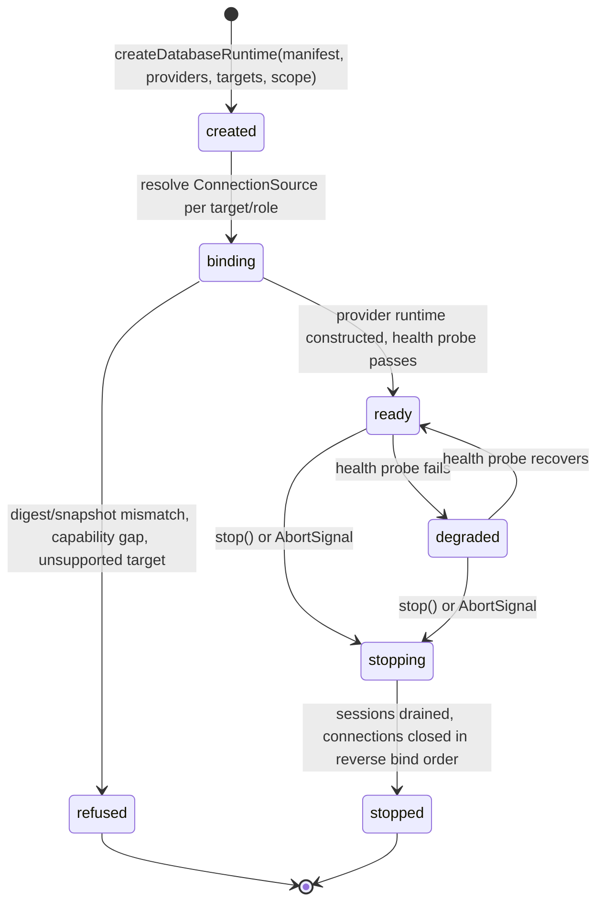
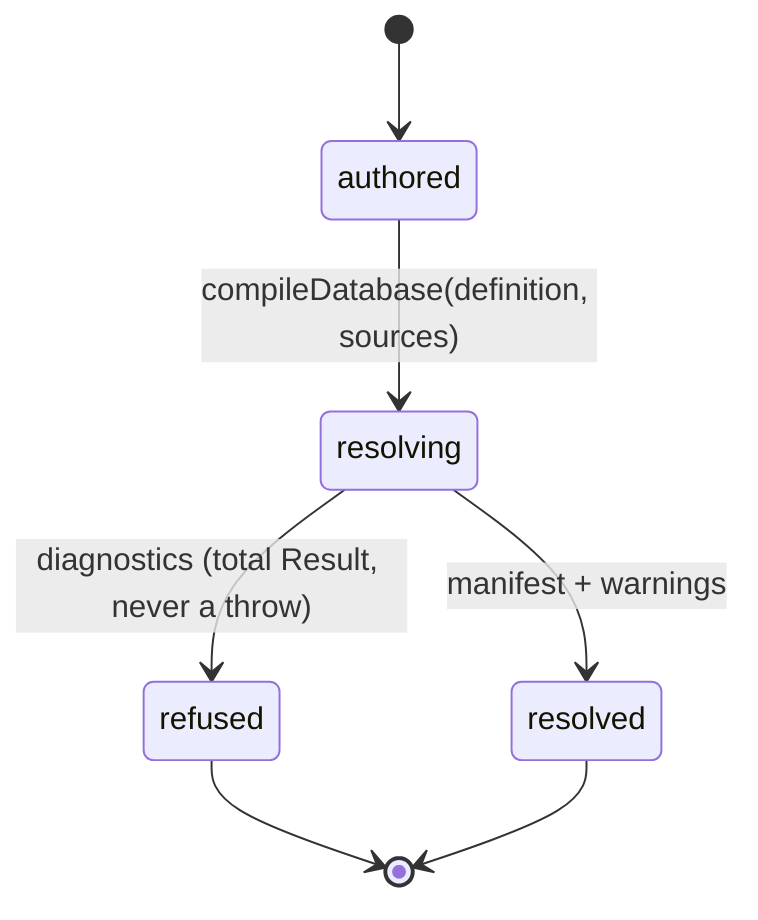
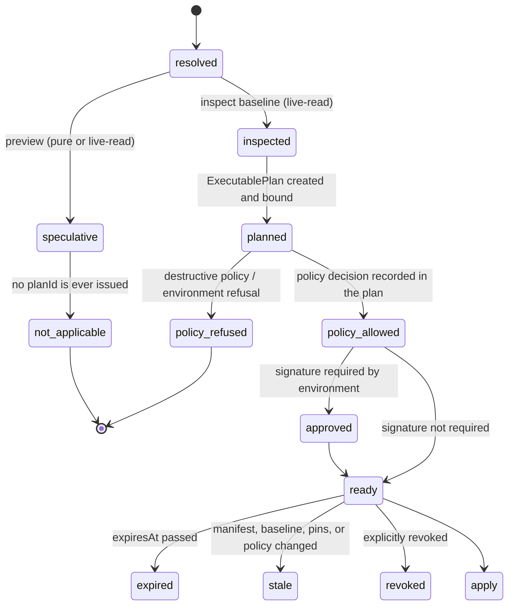
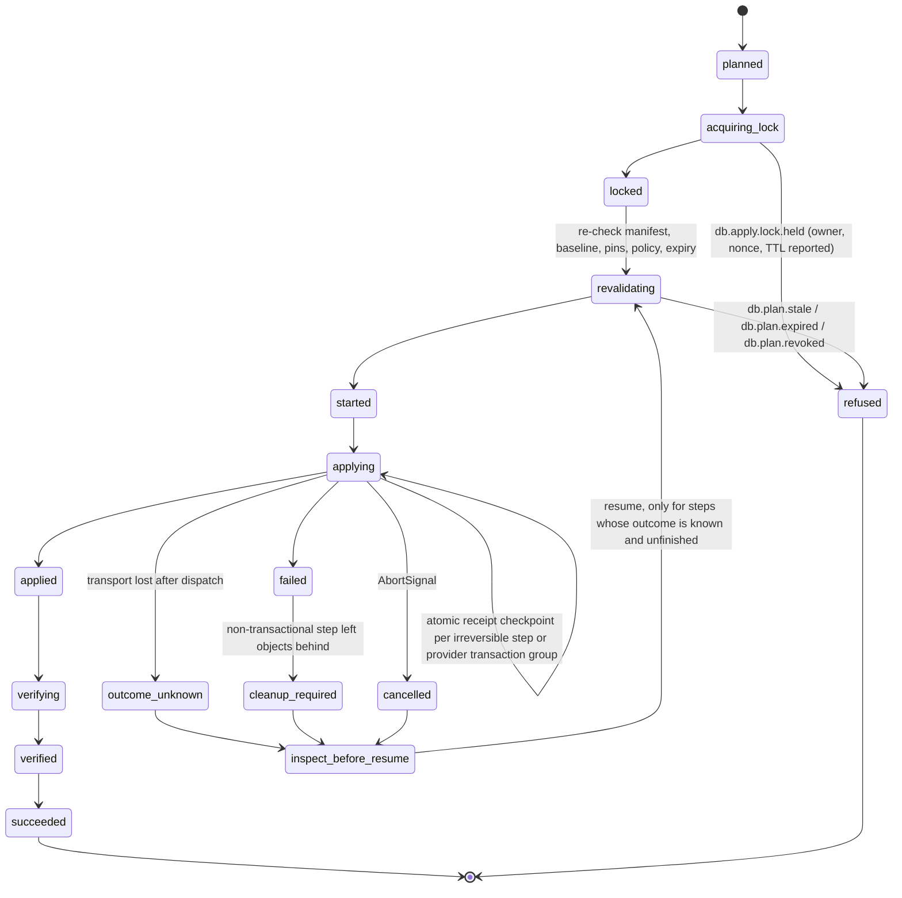
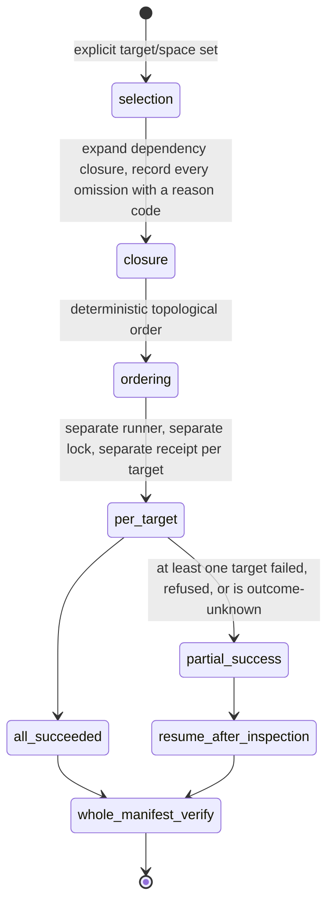

# Database architecture — a provider-neutral composition and operations kernel, with Prisma 8 PostgreSQL as the first certified adapter

> **Process and front-matter notes.**
>
> - This draft lives at `rfcs/0000-database-architecture.md` and keeps the `0000` number until a
>   maintainer assigns one at acceptance, per [`rfcs/README.md`](./README.md) § Numbering.
> - `tracking-issue` currently points at
>   [issue #313](https://github.com/rickylabs/netscript/issues/313). #313 is carried as **historical
>   problem evidence only**: its compatibility-first, additive solution is explicitly superseded by
>   the clean-break directive in this RFC. The companion `rfc:` tracking issue is opened together
>   with the draft PR (`rfcs/README.md` § Lifecycle step 1) and replaces this field at that point.
> - `target-milestone` is `Backlog / Triage` because no release milestone is committed yet. An
>   accepted RFC's tracking issue moves to a `0.0.x` milestone when the implementation program is
>   scheduled.
> - This RFC is **breaking**. The tracking issue and PR carry the `breaking` label.

## How to read this RFC

This document proposes a replacement for NetScript's database foundation. It is written to be
implementation-grade: an implementer should be able to derive package boundaries, public types,
state transitions, test matrices, refusal behaviour, and release gates from it without inventing
architecture.

Because the proposal sits on top of a moving upstream project, every material claim carries an
explicit evidence class. These tags are used consistently and mean exactly what they say:

| Tag           | Meaning                                                                                                                           |
| ------------- | --------------------------------------------------------------------------------------------------------------------------------- |
| `[NS-SRC]`    | Current NetScript source fact, at baseline `origin/main@cd720529333328bcba5e1a308ce7632f4350efdf`.                                |
| `[RC1]`       | Prisma source fact at the pinned release candidate `v8.0.0-rc.1@a76a6c5` (`a76a6c5ad627ceaf1d78e874757cb2ca43e93ff5`).            |
| `[POST-RC]`   | Prisma source fact at the audited post-RC object `71e2e0d9ee1f306b5a11435cd1973023cb33866a`. Never a statement about RC1 or GA.   |
| `[PRIMARY]`   | Official primary source: an upstream release, README, ADR, scorecard, issue, pull request, or product documentation page.         |
| `[EXCHANGE]`  | The owner/Prisma-maintainer conversation. **Exploratory direction, not an upstream commitment.**                                  |
| `[INFERENCE]` | Reasoning that reconciles the facts above. Not an implemented capability.                                                         |
| `[PROPOSAL]`  | NetScript design proposed by this RFC. Not implemented.                                                                           |
| `[COND]`      | Conditional or unproven implementation capability. It is withheld until a named gate passes, and it is never claimed as shipping. |

Three rules govern how those classes combine, and they are load-bearing rather than stylistic:

1. **Post-RC code is never presented as RC1 behaviour, and RC1 behaviour is never presented as a GA
   guarantee.** Prisma 8 RC1 is Early Access and its release notes state that RC respins may break,
   remove, or rename APIs and the contract format ([RC1 release][rc1-release]) `[PRIMARY]`.
2. **Local research reports are a claim index, not an authority.** Every material external claim in
   this RFC is source-linked to a primary source or to a pinned source object. The run's research
   corpus under
   [`.llm/runs/docs-database-architecture-rfc--prisma-8-rfc/`](../.llm/runs/docs-database-architecture-rfc--prisma-8-rfc/research.md)
   is where the derivation is recorded; it is not a substitute for the upstream citation.
   Independent model reports in that corpus are adversarial evidence, and where they conflict with
   executed verification the executed result wins (Appendix B records both).
3. **Unknowns are labelled, and an attractive inference is never promoted to a supported
   capability.** Everything that implementation must decide appears in
   [Unresolved questions](#unresolved-questions) with the wave that owns it.

## Summary

NetScript replaces its inherited database foundation with a single provider-neutral composition and
operations kernel, and certifies exactly one adapter first: Prisma 8 on PostgreSQL. Applications and
plugins author their schema in **native Prisma TypeScript** — the current model-first
`defineContract(scaffold, callback)` form — and pass that exact native value into thin NetScript
definitions that add identity, ownership, capability, lifecycle, and policy without touching the
provider's entity vocabulary or widening its inference. A pure two-phase composition compiles those
definitions into canonical `ContractArtifact`s and one deterministic, content-addressed
`DatabaseManifest`. The manifest is the durable join point for everything downstream: generated
application-local bindings and typed sessions, bounded contract-derived Standard Schema validators,
programmatic preview/plan/apply/verify operations, provider locks and ledgers, immutable operation
receipts, and generated CLI, documentation, and agent surfaces.

The design is a clean break. There is no compatibility API, no Prisma 7 fallback, no dual runtime,
no legacy adapter facade, and no application that composes both stacks. Data continuity is
nevertheless absolute: `netscript db adopt` is a temporary migration tool that introspects live
databases, proposes ownership, writes provider marker metadata only, and performs **zero** table or
data DDL/DML before verification. The kernel deliberately refuses to become a second ORM: it defines
no query DSL, no repository abstraction, no portable client facade, no runtime capability
negotiation, and no hosted control plane. Where a capability cannot be made sound — multi-namespace
end-to-end typing, full Prisma operation validation derived from contract data alone, destructive
plugin removal, non-PostgreSQL providers — this RFC withholds the claim and names the gate that
would release it, rather than casting around the gap.

## Motivation

### The problem is not a Prisma version

NetScript does not currently have one database architecture. It has five partially-overlapping
systems whose identities and ownership rules do not line up `[NS-SRC]`:

1. an appsettings/Aspire database-resource model;
2. a fixed CLI engine registry and operation runner;
3. a generated per-engine Prisma workspace and task graph;
4. a runtime adapter wrapper around user-constructed Prisma clients; and
5. an install-time plugin Prisma-fragment copier.

The happy path works only when those systems agree about config keys, engine directory names,
environment variables, generated files, Prisma CLI behaviour, adapter packages, and a live Aspire
resource graph. The framework makes that agreement a developer and CI responsibility, then adds
post-generation repair scripts where upstream output does not fit Deno expectations. There is no
canonical value joining the five views, so every fix lands in one of them and the failure moves.

Substituting Prisma 8 for Prisma 7 under that structure would preserve every one of those seams. The
missing foundation is a NetScript-owned, typed, inspectable composition from which resource
provisioning, schema composition, client construction, generated imports, migrations, validation,
plugin contributions, diagnostics, and CI plans are all derived.

### Identity collapses into provider and engine names

The single most consequential defect is that **provider identity has replaced target identity**
`[NS-SRC]`:

- The generated workspace directory is computed as `join('database', provider.dirName)` from a
  closed engine enum (`packages/cli/src/kernel/adapters/database/workspace-resolver.ts:51`). Two
  PostgreSQL databases therefore share one schema tree, one migration history, one generated client,
  and one task set. `db add postgres --name analytics` creates another configuration entry but still
  renders and resolves `database/postgres/`; the public second-database guide currently claims
  otherwise.
- `resolveTarget` defaults only when exactly one target is enabled and never consults
  `NetScript.PrimaryDatabase` (`workspace-resolver.ts:66-91`; independently re-verified during
  PLAN-EVAL cycle 2). With more than one enabled target and no `--db`, resolution throws
  `Unknown database target: (default)`, which contradicts documentation stating that a bare command
  targets the primary database.
- Engine selection is a `switch` over `'postgres' | 'mysql' | 'sqlite' | 'mssql'`
  (`workspace-resolver.ts:96+`), which is the literal counter-example doctrine records as AP-24
  ([`09-anti-patterns-and-fitness-functions.md`](../docs/architecture/doctrine/09-anti-patterns-and-fitness-functions.md)).

`[INFERENCE]` Every downstream artifact — output root, migration lineage, runtime binding, lock,
receipt — inherits that collapse. No amount of new tooling repairs it while the identity of a
logical database has no representation.

### Generation is a repair pipeline, not an emission

Executing `generateDatabaseDenoJson` for each of PostgreSQL, SQLite, MySQL, and SQL Server produces
**42 `db:*` task keys in every generated engine workspace** `[NS-SRC]` (executed by the PLAN-EVAL
evaluator at commit `383170bbc` against
`packages/cli/src/kernel/templates/database/generate-db-deno-json.ts`). The current-state audit's
description of "more than twenty database tasks" was accurate; the executed count is the precise
figure and is the one this RFC uses. Generated templates additionally pin `npm:prisma@^7.4.2`
(`generate-db-deno-json.ts:36,56,59,61,67`) while the root catalog carries caret ranges `^7.8.0`
(`deno.json:231-236`) `[NS-SRC]`.

The nominal `db:generate` pipeline performs placeholder removal, Prisma client generation, a second
generation through a Zod wrapper, generated-import rewriting, circular-reference rewriting,
getter-pattern rewriting, decimal-compatibility rewriting, a generated CRUD alias barrel, Prisma
client renaming/facade patching, and a further repair pass `[NS-SRC]`. The result is non-atomic
generated source that NetScript mutates based on upstream textual output. A developer can edit the
schema, skip the pipeline, and keep compiling against stale types.

### Plugin schema contribution has no ownership semantics

Plugins ship plain `database/**/*.prisma` files. On install the CLI discovers or downloads
fragments, chooses one database target, copies each fragment into the consumer's schema tree, scans
top-level `model|enum|type|view` blocks with a regex/balanced-brace parser
(`packages/cli/src/kernel/adapters/plugin/prisma-declaration-scanner.ts:13`), removes
byte-normalised identical declarations, and rejects same-name declarations with different bodies
(`prisma-schema-writer.ts:19,100-122`) `[NS-SRC]`.

That model cannot express a contribution contract or schema version, supported providers or
capabilities, target selection policy, dependency ordering, declaration ownership or allowed
augmentation, migration ownership and rollout, uninstall data policy, deterministic provenance, or a
contributor test kit. Its historical failure modes are on record: dependency-mode installs reported
success while omitting every plugin table ([#1014][ns-1014]) `[PRIMARY]`, and model-name clashes
broke authentication installs until namespacing plus a custom collision guard landed
([PR #1059][ns-1059]) `[PRIMARY]`. Removal deletes the copied directory; it plans no database
migration at all.

### The recurrent failure classes are architectural, not incidental

| Failure class                                                                            | Primary evidence                      | Architectural lesson                                                                         |
| ---------------------------------------------------------------------------------------- | ------------------------------------- | -------------------------------------------------------------------------------------------- |
| Prisma schema-engine crash/hang on Windows                                               | [PR #98][ns-98], [PR #145][ns-145]    | NetScript CI ended up owning an upstream subprocess lifecycle and flake classification.      |
| A facade compiled only against a placeholder client, then failed after a real generation | [#173][ns-173]                        | Stubs and generated-client contracts diverge; every capability axis needs generated proof.   |
| Plugin schema silently absent in dependency installs                                     | [#1014][ns-1014]                      | Source-layout discovery is not a contribution contract.                                      |
| Plugin/base model collision                                                              | [PR #1059][ns-1059]                   | A global declaration namespace needs explicit ownership and conflict semantics.              |
| A read-only database command killed the resident AppHost                                 | [PR #1088][ns-1088]                   | Database operations lacked a stable lifecycle owner.                                         |
| An ephemeral AppHost leaked and masked the real host                                     | [#1196][ns-1196], [PR #1301][ns-1301] | Fixing lifecycle symptoms without one operation model moves the failure.                     |
| A second AppHost mounted live `PGDATA` and corrupted it                                  | [#1310][ns-1310], [PR #1311][ns-1311] | Resource reconstruction is unsafe; operations must bind an authoritative resolved value.     |
| A stale allocated PostgreSQL endpoint                                                    | [#1202][ns-1202], [PR #1393][ns-1393] | Connection provenance must be inspectable and validated against the live allocation.         |
| Headless migrate returned success without producing an artifact                          | [#1327][ns-1327], [PR #1393][ns-1393] | An exit code is not a result; operations need typed plans and artifact/state postconditions. |
| A multi-model Zod alias hid symbols, and its repair then broke startup                   | [#1254][ns-1254], [#1290][ns-1290]    | Generated symbol paths cannot be the framework contract.                                     |
| Split Zod module instances broke schema interoperability                                 | [#1295][ns-1295]                      | Validation needs a standards-facing contract and a controlled dependency boundary.           |

`[NS-SRC]` `[PRIMARY]` The most severe lifecycle bug cost a measured pilot several hours, two
database resets, and a privileged host scrub; the final artifact-proof repair took six serialized
`scaffold.runtime` attempts as successive harness assumptions surfaced. This RFC exists to retire
those classes structurally rather than to fix another instance of them.

### Two recorded architecture-debt entries are closed by this design

`[NS-SRC]` `DB-GENERATE-ASPIRE-COUPLING` is open and documents that pure code generation still boots
Aspire, so generation fails where the Aspire CLI or .NET is absent. `packages/database — AP-17`
remains open; its `interfaces/` → `ports/` rename half is stale because `packages/database/ports/`
already exists, while its composition-root finding is still current. Auth roadmap item R1
independently requires deterministic plugin-aware schema and migration automation, which this design
must satisfy as an ordinary contribution rather than an auth-specific escape hatch.

### Why Prisma 8 changes the calculus

`[RC1]` `[PRIMARY]` Prisma 8 is not Prisma 7 with a new generator. Its RC source is arranged as a
canonical contract plus separate control and execution planes: PSL or a TypeScript contract builder
lowers into a canonical `contract.json` and a `contract.d.ts`, a small versioned runtime consumes
the contract, a programmatic control client exposes emit/inspect/plan/apply operations, migrations
are content-addressed graph edges with per-space markers and a ledger, and **contract spaces** make
one contributor's `(contract, migration graph, head ref)` a first-class disjoint tuple
([ADR 212][adr-212]).

That direction attacks NetScript's pain points at the root: generated executable client source can
disappear, source-rewriting and validator repair passes can disappear, schema ownership can be
modelled instead of inferred from copied files, migrations can be planned and verified
programmatically, structured results can replace log scraping, and family/target/adapter/driver/
extension become distinct axes instead of one `engine` string.

It is also not yet a safe surface to expose directly, and this RFC treats that as a design input
rather than a caveat:

- Prisma 8 RC1 is Early Access and is explicitly not recommended for production workloads
  ([RC1 README][rc1-readme]) `[PRIMARY]`. PostgreSQL is the sole database intended for the 8.0 GA
  target set; MongoDB is Early Access, SQLite is a proof of concept, MySQL follows later, and SQL
  Server is absent from the RC feature matrix ([scorecard][rc1-scorecard]) `[PRIMARY]`.
- `@prisma/orm-postgres` — described as the one package an application installs — publishes **138**
  top-level export subpath keys at the pin, spanning adapters, control internals, contract
  internals, migration tooling, query ASTs, runtime, target planning, and utilities `[RC1]`
  (independently recounted during PLAN-EVAL cycle 2; an earlier independent report's figure of
  approximately 275 is superseded). A framework that re-exported that surface would convert upstream
  Early-Access internals into NetScript public API.
- The integration seam moved materially within six days of the RC tag `[POST-RC]`: the `prisma-next`
  CLI stopped being published in favour of a unified CLI ([`3dc98cb`][pn-3dc98cb]), migration and
  database commands were routed through the control API ([`d0c8333`][pn-d0c8333]), config
  diagnostics and a ControlClient test double landed ([`15308c6`][pn-15308c6]), contract JSON Schema
  became generated from ArkType ([`92b6ee3`][pn-92b6ee3]), the PostgreSQL floor dropped from 17 to
  15 ([`5d4a4db`][pn-5d4a4db]), aggregate number semantics changed ([`a900bc1`][pn-a900bc1]), and
  command output channels were made explicit ([`71e2e0d`][pn-71e2e0d]).

`[INFERENCE]` The correct response to a good architecture on a moving surface is to adopt its
_semantics_ through a very small, allowlisted adapter, and to keep NetScript's own vocabulary,
artifacts, and operations stable across the churn. That is what this RFC specifies.

### What it costs to not do this

`[INFERENCE]` Without this change: two logical PostgreSQL databases remain unrepresentable; plugin
schema stays a regex file copy with no version, ownership, or removal semantics; CI keeps paying for
Aspire on pure code generation; success keeps being reported by exit code; generated source keeps
being textually repaired; and the auth roadmap's deterministic plugin-aware migration requirement
has nowhere to land except an auth-specific generator. Each of those has already produced at least
one recorded production-shaped incident in the table above.

### What it unlocks

`[PROPOSAL]` A developer declares targets and spaces once, authors schema in native Prisma
TypeScript, and then receives — without a copied schema, a hand-synchronised type, a hand-written
adapter, a textual repair, or an implicit target choice — query types, lifecycle-owned sessions,
Standard Schema validators at trust boundaries, migrations with plans and receipts, plugin schema
ownership with independent history, CI evidence, and a generated agent surface. Section
[Guide-level explanation](#guide-level-explanation) is that experience end to end.

## Guide-level explanation

This section describes the system as if it had shipped. It is the developer experience the rest of
the RFC exists to make true.

> **Example status.** Every example whose imports are `@netscript/*` is intended to be executable
> exactly as written once the packages in [§ Package graph](#the-package-graph-and-archetypes)
> exist. Every example that imports `@prisma/*` shows the **RC1 authoring shape** `[RC1]` and its
> exact module specifier is an adapter-pinned, implementation-time decision (D-41, wave W3): treat
> those specifiers as illustrative pseudocode until the W3 spike pins them. This distinction is
> deliberate — Prisma's own public CLI package name changed six days after the RC tag `[POST-RC]`,
> so freezing an upstream specifier in a NetScript contract would be a design error.

### The one story

Everything in this architecture is one pipeline of distinct, separately-named values. No stage is
allowed to impersonate another:

```text
native authored TypeScript contracts + NetScript definitions/contributions
  → pure two-phase composition
  → canonical ContractArtifacts
  → deterministic DatabaseManifest
  → generated app-local AppBinding
  → runtime sessions + bounded validators
  → inspected baseline
  → bound ExecutablePlan
  → provider apply/ledger
  → immutable OperationReceipts
  → verify/recovery
```

Read that as a promise about _confusability_: a source definition is not a resolved manifest, a
speculative preview is not an executable plan, an executable plan is not a provider ledger, and a
receipt is not desired state. Most of the operational failures in
[Motivation](#the-recurrent-failure-classes-are-architectural-not-incidental) are what happens when
two of those collapse into one thing.

### Step 1 — author the contract natively

Schema authoring is Prisma's job, and NetScript does not add a vocabulary in front of it. The
current authoring API is model-first: `defineContract(scaffold, callback)`, where the callback
receives a composed helper surface and returns native `types`, `models`, and `enums` `[RC1]`
(`packages/3-extensions/postgres/src/contract/define-contract.ts:46-121`; the callback overload
preserves its returned literal types at
`packages/2-sql/2-authoring/contract-ts/src/contract-builder.ts:437-462`).

```ts
// database/app.contract.ts — provider-native authoring. Specifier pinned in W3.
import pgvector from '@prisma/orm-extension-pgvector/pack';
import { defineContract, rel } from '@prisma/orm-postgres/contract-builder';

export const appContract = defineContract(
  { extensions: { pgvector }, namespaces: ['app'] },
  ({ field, model, type }) => {
    const types = { Embedding: type.pgvector.Vector(1536) } as const;

    const User = model('User', {
      namespace: 'app',
      fields: {
        id: field.id.uuidv4String(),
        email: field.text().unique(),
        createdAt: field.timestamp().defaultNow(),
      },
    });

    const Post = model('Post', {
      namespace: 'app',
      fields: {
        id: field.id.uuidv4String(),
        userId: field.uuidString(),
        title: field.text(),
        embedding: field.namedType(types.Embedding).optional(),
      },
    });

    return {
      types,
      models: {
        User: User.relations({ posts: rel.hasMany(Post, { by: 'userId' }) }),
        Post: Post.relations({ user: rel.belongsTo(User, { from: 'userId', to: 'id' }) }),
      },
    };
  },
);
```

`[PROPOSAL]` Three things NetScript will **not** do to that code. It will not recreate the older
fluent `target(...).table(...).column(...)` chain — that API was real at commit `fd88abf4` but was
replaced by the model-first redesign ([PR #261][pn-261], commit [`27ccefc3`][pn-27ccefc3]) and the
legacy implementation was removed ([`e1e5ab2c`][pn-e1e5ab2c], PR #317) `[PRIMARY]`. It will not
introduce a NetScript model DSL that lowers into the same contract. And it will not vendor or
re-export Prisma's builder as though NetScript owned it.

### Step 2 — declare targets and spaces

NetScript's own authoring surface adds identity, ownership, capability requirements, policy, and
lifecycle around that native value — and nothing else. This is the baseline API (decision D-07,
"Candidate A"):

```ts
// database/database.ts
import { defineDatabase, defineDatabaseSpace, defineDatabaseTarget } from '@netscript/database';
import { fromAspire, fromEnv } from '@netscript/database/connection';
import { prismaPostgres } from '@netscript/database-prisma-postgres';
import { authSpace } from '@netscript/plugin-auth-core/database';
import { appContract } from './app.contract.ts';

const primary = defineDatabaseTarget({
  id: 'primary',
  provider: prismaPostgres({ minVersion: 15 }),
  connection: fromAspire('netscript-db'),
  namespaces: { app: 'public', auth: 'auth' },
  roles: { writer: {}, 'reader:reporting': { readOnly: true } },
  policy: { destructive: 'deny', defaultOwnership: 'managed' },
});

const analytics = defineDatabaseTarget({
  id: 'analytics', // same provider, different database, zero shared state
  provider: prismaPostgres({ minVersion: 15 }),
  connection: fromEnv('ANALYTICS_DATABASE_URL'),
  namespaces: { warehouse: 'warehouse' },
  policy: { destructive: 'plan-only', defaultOwnership: 'adopted' },
});

export default defineDatabase({
  targets: { primary, analytics },
  spaces: {
    app: defineDatabaseSpace({
      id: 'app',
      ownership: 'app',
      owner: 'app',
      version: '1.0.0',
      target: 'primary', // type error unless it is a key of `targets`
      namespace: 'app',
      contract: appContract, // `typeof appContract` is preserved exactly
      dependencies: [],
      policy: { removal: 'retain' },
    }),
    auth: authSpace({ target: 'primary', namespace: 'auth' }),
  },
});
```

`[PROPOSAL]` The important property is what `defineDatabaseSpace` does to `appContract`: nothing. It
stores the value and preserves `typeof appContract` unchanged. NetScript never reinterprets models,
never copies Prisma overloads, and never widens the contract into a generic record. Everything
NetScript adds — `id`, `owner`, `version`, `target`, `namespace`, `dependencies`, capability
requirements, ownership, retention — is plain data that survives a provider replacement.

The second property is that `target: 'primary'` is checked against `keyof targets`. Misrouting a
space is a type error at the authoring site rather than an install-time surprise. Today's installer
resolves a target through a fallback chain that can end at a **disabled** target `[NS-SRC]`; under
this design there is no fallback chain anywhere in the system.

### Step 3 — the generated binding and typed sessions

Composition emits canonical artifacts and one manifest, and the emitter writes a small
application-local binding module. That module is where inferred Prisma types live — never inside a
published NetScript package:

```ts
// .netscript/database/primary.binding.ts — GENERATED. Do not edit.
// manifest: nsdb1:9f3c… · contract: cs:7ab2… · provider: @prisma/orm-postgres@<pin>
import type { AppContract } from './primary/contract.d.ts';
import type { QueryOf } from '@netscript/database-prisma-postgres/runtime';
import type { ProcessTargetSession } from '@netscript/database-runtime';

export type PrimaryQuery = QueryOf<AppContract>;
export type PrimarySession = ProcessTargetSession<'primary', PrimaryQuery>;
export const PRIMARY_MANIFEST_DIGEST = 'nsdb1:9f3c…' as const;
export declare const primaryBinding: AppBinding<'primary', AppContract>;
```

```ts
// composition-root.ts — hand-written, small, and the only place a target is bound by name
import { createDatabaseRuntime } from '@netscript/database-runtime';
import { prismaPostgres } from '@netscript/database-prisma-postgres';
import database from './database/database.ts';
import { primaryBinding, type PrimarySession } from './.netscript/database/primary.binding.ts';

await using runtime = await createDatabaseRuntime({
  definition: database,
  manifest,
  providers: [prismaPostgres],
  targets: ['primary'],
  scope: 'process',
  connections,
});

const primary: PrimarySession = runtime.bind(primaryBinding);
const accounts: AccountStore = new PrismaAccountStore(primary);
```

`[PROPOSAL]` Feature code receives `AccountStore` — an application-owned port — not the runtime.
`runtime.bind` is reachable only from declared composition-root and generated files, enforced as an
`arch:check` rule, because a database handle reachable from anywhere is a service locator with a
domain name. NetScript does not generate repositories and does not define what `AccountStore` looks
like; that is application architecture.

Inside the session, the query surface is Prisma's own:

```ts
const recent = await primary.query.orm.post.findMany({
  where: { userId: input.userId },
  select: { id: true, title: true },
});

await primary.transaction(async (tx) => {
  await tx.orm.user.create({ data: { email: input.email } });
  await tx.orm.post.create({ data: { userId: input.userId, title: 'Hello' } });
});
```

There is no NetScript query language wrapping that call, and there never will be. Interactive
transactions exist only on process-scoped sessions; a request-scoped session is `AsyncDisposable`,
carries no cached collaborators, and its type does not expose `transaction`.

### Step 4 — validation at trust boundaries

The same contract that types the query surface produces Standard Schema validators, without a
generated validator file anywhere in the repository:

```ts
import { primaryBinding } from './.netscript/database/primary.binding.ts';

const users = primaryBinding.space('app').model('User');

// Whole-model values, in either public representation.
const runtimeUser = users.value({ representation: 'runtime' });
const jsonUser = users.value({ representation: 'json' });

// Selection-aware results. The schema is for the shape actually selected.
const publicUser = users.result({ select: { id: true, email: true } }, { representation: 'json' });
```

Those values implement `StandardSchemaV1`, so they drop into two independent consumers unchanged:

```ts
// 1. an oRPC route contract
const createAccount = baseContract
  .route({ method: 'POST', path: '/accounts' })
  .input(users.operation('create', { representation: 'json' }))
  .output(publicUser);

// 2. a Fresh form/action boundary consuming the same value
const parsed = await publicUser['~standard'].validate(payload);
if (parsed.issues) return renderFieldErrors(parsed.issues);
```

`[PROPOSAL]` Two honest limits are visible in that snippet, and they are enforced rather than
documented. First, `users.operation('create', …)` succeeds **only** when the provider or an
extension has contributed exact operation metadata for that operation; otherwise it throws
`DB_VALIDATION_UNSUPPORTED` while the schema is being constructed, naming the missing metadata.
Second, invalid user data never throws: it returns Standard Schema issues with a field path, a
stable code, and the contract coordinates. Construction failures and validation failures are
different events with different audiences.

### Step 5 — a second PostgreSQL database

```ts
// database/warehouse.contract.ts + a second space bound to `analytics`
spaces: {
  app: /* … bound to 'primary' … */,
  warehouse: defineDatabaseSpace({
    id: 'warehouse',
    ownership: 'app',
    owner: 'app',
    version: '1.0.0',
    target: 'analytics',
    namespace: 'warehouse',
    contract: warehouseContract,
    dependencies: [],
    policy: { removal: 'retain' },
  }),
}
```

`[PROPOSAL]` `primary` and `analytics` are both PostgreSQL and share nothing: separate output roots,
contract artifacts, migration lineages, provider markers, runtime bindings, locks, and receipts. A
relation from a `primary` model to an `analytics` model is refused at composition with
`db.compose.cross-target-relation`, and no multi-target operation is ever described as atomic. Those
are not limitations of the adapter; they are honest statements about two separate databases.

### Step 6 — install a plugin that owns its schema

```ts
// consumer side: one line, and an explicit target
spaces: {
  auth: authSpace({ target: 'primary', namespace: 'auth' });
}
```

```ts
// plugins/auth/core: the plugin owns a full space, not a fragment
import { defineDatabaseSpace } from '@netscript/plugin/database';
import { CAP } from '@netscript/database-contract/capabilities';

export const authSpace = defineDatabaseSpace.factory({
  id: 'plugin:@netscript/plugin-auth',
  owner: '@netscript/plugin-auth',
  version: '0.0.7',
  ownership: 'space',
  contractFormat: '>=1 <2',
  requires: [CAP.sqlFamily, CAP.nativeUuid],
  dependencies: [],
  owns: { entries: ['user', 'session', 'account', 'verification'] },
  augmentation: {
    grants: [{ entry: 'user', kind: 'add-optional-column', prefix: 'x_' }],
    denies: ['drop-column', 'change-type', 'add-required-column'],
  },
  policy: { removal: 'retain', allowed: ['retain'] },
  artifact: pinnedArtifactRef('./artifacts/contract.json'),
});
```

`[PROPOSAL]` The `SpaceId` is the plugin's stable **published plugin identity**
(`plugin:@netscript/plugin-auth`), while the authoring module and generated artifacts ship from that
plugin's `-core` package — identity never follows an install path or a package layout.

Installing that plugin copies nothing into the application's schema. It writes a **pinned mirror**
under the application's generated root containing the descriptor snapshot, the space's canonical
contract artifact, its lineage, and its provenance. Production apply and verify read the mirror, so
a deployment does not need the plugin's package graph resolvable at all. Two plugins that both
define a `User` table do not collide, because ownership is checked over
`(target, namespace, entryKind, name)` rather than over declaration text, and namespaces make the
separation physical.

Uninstalling is a planned operation, not a directory delete. The guaranteed behaviour in the first
release is **detach-and-retain**: the runtime binding goes away, the data and the marker stay, a
tombstone records the history, and the objects' ownership is downgraded from `managed` to `adopted`
so that `verify` keeps noticing drift instead of going blind. Archiving and dropping are defined in
this RFC but are `[COND]` capabilities that ship only if provider conformance proves them.

### Step 7 — one extension, registered once

`[RC1]` Today a single logical extension such as pgvector must be registered independently in schema
authoring (`/pack`), in control/config (`/control`), and at runtime construction (`/runtime`)
(`examples/prisma-8-demo/prisma/contract.ts:1,18`, `prisma-next.config.ts:1-10`,
`src/prisma-no-emit/context.ts:1-11`). Half-registering it is silent until something fails.

```ts
// one bundle, one identity, four facets
export const pgvectorExtension = defineDatabaseExtension({
  id: 'pgvector',
  version: '0.4.0',
  provider: 'prisma-postgres',
  authoring: pgvectorPack,
  control: pgvectorControl,
  runtime: pgvectorRuntime,
  validation: pgvectorValidation,
});
```

`[PROPOSAL]` The generated composition root fans that single declaration into every phase. A
missing, mismatched, or half-installed facet is a composition error naming the facet and both
versions.

### Step 8 — the operational journey

Every operation is a typed programmatic call first. The CLI is a projection of the same catalog, and
so are the docs and the agent surface.

```ts
import { createDatabaseControl } from '@netscript/database-control';

const control = createDatabaseControl({ manifest, providers: [prismaPostgres], connections });

const emitted = await control.emit({ targets: ['primary'], runId }); // pure: no connection at all
const baseline = await control.inspect({ targets: ['primary'], runId }); // live-read
const plan = await control.plan({ targets: ['primary'], baseline, policy, runId });
const applied = await control.apply({ plan, policy, runId }); // mutating: lock + revalidate
const verified = await control.verify({ targets: ['primary'], runId });
```

```console
$ netscript db plan --target primary --json
{
  "operation": "plan",
  "runId": "01JYZ…",
  "outcome": "succeeded",
  "perTarget": [
    {
      "target": "primary",
      "status": "succeeded",
      "spaces": [
        { "space": "app", "status": "planned", "steps": 3, "destructive": 0 },
        { "space": "plugin:@netscript/plugin-auth", "status": "planned", "steps": 1, "destructive": 0 }
      ],
      "plan": { "planId": "plan:4c19…", "expiresAt": "2026-08-13T18:42:00Z" }
    }
  ],
  "diagnostics": [],
  "nextAction": { "operation": "apply", "args": { "plan": "plan:4c19…" } }
}
```

`[PROPOSAL]` Four properties are guaranteed by the shape of that output. Every requested target
appears with a status — there is no silent skip and no implicit "all". `nextAction` is structured
data, so the CLI, CI annotations, and an agent render the same remediation without any of them
parsing prose. Human text is never a contract; gates assert on codes. And the exit code is a
projection of `outcome` (`succeeded` → 0, `refused`/`failed` → non-zero, `partial-success` →
non-zero with a resume token), never the result itself.

When something goes wrong, the vocabulary is equally explicit:

```console
$ netscript db apply --plan plan:4c19…
error db.plan.stale: plan plan:4c19… was bound to manifest nsdb1:9f3c…, current manifest is nsdb1:12ab…
  target: primary
  next:   netscript db plan --target primary
```

### What you stop doing

`[PROPOSAL]` Under this architecture the following stop existing as developer-visible work: copying
a plugin's `.prisma` file into your schema; running a generate pipeline whose later steps repair the
output of its earlier steps; keeping a generated Zod mirror in sync; importing a client by its
generated filesystem path; discovering that a command silently used the first target; starting
Aspire in order to compile; reading terminal logs to find out whether a migration produced an
artifact; and hand-maintaining an agent instruction file that describes commands that have since
changed.

### What you will be refused

`[PROPOSAL]` Equally important is what the system declines to do, loudly and early:

| You try to…                                                                | You get                                                                                      |
| -------------------------------------------------------------------------- | -------------------------------------------------------------------------------------------- |
| Bind a space to a target that does not exist                               | A **type error** at the authoring site                                                       |
| Declare a relation between models in two different targets                 | `db.compose.cross-target-relation` at composition                                            |
| Let two spaces manage the same object                                      | `db.compose.ownership.conflict`, naming both spaces                                          |
| Use a capability the bound target does not declare                         | `db.compose.capability.missing`, naming capability, space, and target                        |
| Apply a speculative preview                                                | Refusal: a preview has no `planId` and `apply` accepts only bound plans                      |
| Apply a plan after the manifest, baseline, provider set, or policy changed | `db.plan.stale`; after its expiry, `db.plan.expired`                                         |
| Migrate a read replica                                                     | Refusal: replicas are roles, and no migration operation can address a role                   |
| Run a destructive step in production with an interactive "yes"             | Refusal: production requires an approved, signed plan                                        |
| Build a validator for an operation with no contributed grammar             | `DB_VALIDATION_UNSUPPORTED` while constructing the schema                                    |
| Target Prisma SQLite, MongoDB, MySQL, or SQL Server                        | `db.target.unsupported` — structured, with no fallback and no Prisma 7 path                  |
| Use multiple PostgreSQL namespaces with end-to-end typing                  | The kernel accepts the namespace axis; the adapter withholds the capability claim (see D-37) |
| Drop a plugin's tables on uninstall in v1                                  | Refusal: `retain` is the guaranteed mode; `archive`/`drop` are conditional on conformance    |

## Reference-level explanation

### Locked vocabulary

`[PROPOSAL]` These terms are used with exactly these meanings throughout the implementation program.
Similar-looking values are intentionally distinct, and conflating any two of them is a review
finding.

| Term                                | Kind and owner                         | Locked meaning and invariant                                                                                                                      |
| ----------------------------------- | -------------------------------------- | ------------------------------------------------------------------------------------------------------------------------------------------------- |
| `DatabaseDefinition`                | Public TypeScript value · NetScript    | Authored composition of targets, spaces, connection-source references, capability requirements, and policy. Pure; performs no IO. Not a manifest. |
| `NativeContract`                    | Provider-native authored value         | A Prisma `defineContract` result, or another provider's equivalent. NetScript never translates its entity/query vocabulary.                       |
| `SpaceContribution`                 | Public declarative record              | Owner, version, target binding, dependencies, ownership, capabilities, artifact refs, provenance, and retention policy for one contract space.    |
| `ContractArtifact`                  | Versioned generated data · provider    | Canonical provider contract data plus declaration and lineage artifacts, pinned per space and content-addressed.                                  |
| `DatabaseManifest`                  | Public generated data · NetScript      | The deterministic, versioned, content-addressed resolved snapshot. **The durable join point.** A graph exists only as private compiler IR.        |
| `AppBinding`                        | App-local generated TypeScript         | Minimal inferred bridge from native contract declarations to sessions, validators, and consumers. Never a published framework export.             |
| `TargetRef` / `TargetSession`       | Public value/handle · NetScript        | Explicit target reference and process/request lifecycle shell. The concrete query type is an application-local generic argument.                  |
| `SpeculativePreview`                | Public structured value · control      | Advisory offline or live preview. **Cannot be approved or applied.**                                                                              |
| `ExecutablePlan`                    | Public versioned value · control       | Expiring plan bound to manifest digest, target/space closure, live baseline, provider pins, policy, environment, and secret references.           |
| `ProviderMarker` / `ProviderLedger` | Provider-owned database state          | The authoritative record of applied space heads and edges. NetScript reads and cites it and never maintains a second mutable copy.                |
| `OperationReceipt`                  | Immutable append-only evidence         | What was attempted, observed, checkpointed, verified, skipped, refused, failed, or left uncertain. Never desired state.                           |
| `OperationCatalog`                  | Public machine-readable data           | Operation names, classes, request/result/diagnostic schemas, and next actions. CLI, help, docs, and agent surfaces are projections of it.         |
| `ValidationIR`                      | **Internal** bounded algebra · runtime | Provider-decoded value/selection algebra used to produce Standard Schema values. Never a second entity or query model, never public.              |

### Identity model

`[PROPOSAL]` Identity is declared, never derived. Provider names, engine names, filesystem paths,
configuration aliases, array order, traversal order, and discovery order are **never** identities
and never dependency edges.

| Identity              | Shape                                                    | Stability                          | Notes                                                                                         |
| --------------------- | -------------------------------------------------------- | ---------------------------------- | --------------------------------------------------------------------------------------------- |
| `TargetId`            | `'primary'`, `'analytics'`                               | Permanent; renaming is a migration | Author's choice. Owns connection, output root, runtime binding, lineage, locks, and receipts. |
| `RoleRef`             | `(TargetId, 'writer' \| 'reader:<name>')`                | Derived                            | A replica is a role of a target, never a target. No migration operation can address a role.   |
| `NamespaceRef`        | `(TargetId, namespace)`                                  | Permanent                          | A physical namespace inside one target. A kernel identity axis (see D-37 for the adapter).    |
| `SpaceId`             | `'app'`, `'plugin:@netscript/plugin-auth'`               | Permanent per contributor          | One schema owner.                                                                             |
| `ObjectKey`           | `(TargetId, namespace, entryKind, name)`                 | Derived                            | The unit of ownership. Exactly one `managed` owner.                                           |
| `ContractSnapshotId`  | Content hash of one space's canonical contract           | Derived                            | Addresses one `ContractArtifact`.                                                             |
| `ManifestDigest`      | Content hash over the canonical manifest                 | Derived                            | The determinism anchor. Distinct from any provider hash.                                      |
| `PlanId`              | Hash of manifest digest, closure, baseline, pins, policy | Derived                            | Binds a plan to everything that could invalidate it.                                          |
| `RunId` / `ReceiptId` | Sortable unique ids supplied at the edge                 | Per execution                      | Receipts are addressable and resumable.                                                       |

`[NS-SRC]` This directly repairs the observed collapse:
`workspaceDir = join('database', provider.dirName)` made `TargetId` inexpressible, `resolveTarget`
made the default target ambiguous, and the plugin installer's target chain could select a disabled
target.

### The package graph and archetypes

`[PROPOSAL]` Six new units and four changed existing units. Each has exactly one doctrine archetype,
per the one-archetype-per-package law
([`.llm/harness/archetypes/README.md`](../.llm/harness/archetypes/README.md)); where two archetypes
genuinely apply, the remedy is two packages, not one package with two shapes.

```text
                    @netscript/database-contract            (A1, leaf, zero dependencies)
                      ^          ^            ^          ^
                      |          |            |          |
        @netscript/database   -runtime     -control   @netscript/plugin
              (A4)              (A3)         (A2)          (A4)
                      ^          ^            ^
                      |          |            |
                      +----------+------------+
                                 |
              @netscript/database-prisma-postgres           (A2, sole Prisma boundary)
                                 ^
                                 |
              @netscript/database-testkit                   (A6, depends on all; nothing depends on it)

application composition root -> definition + runtime + control + one provider + generated AppBinding
application/plugin build input -> Prisma public authoring builder (controlled build phase only)
@netscript/aspire -> ConnectionSource SPI only
@netscript/cli    -> OperationCatalog + control only
first-party plugin -> @netscript/plugin + @netscript/database-contract only
```

Dependency law, each clause mechanically checkable:

1. `@netscript/database-contract` imports nothing from this family and no provider. Every other
   member may depend on it.
2. `@netscript/database` depends on `-contract` only.
3. `-runtime` and `-control` depend on `-contract`, and on `-database` for definition types they
   must not redeclare. They never import each other and never import a provider.
4. Provider packages depend on `-contract` (and on `-database`/`-runtime`/`-control` types they
   implement) plus upstream. **No framework package depends on a provider.** A provider is a value
   supplied at the application composition root.
5. `@netscript/plugin` depends on `-contract` only. This is the rule that keeps a database driver
   out of every plugin's dependency graph.
6. The testkit may depend on every public surface; no runtime package may depend on the testkit.
7. **No framework package re-exports Prisma.** Only `@netscript/database-prisma-postgres` may import
   Prisma runtime or control modules, through a single `upstream.ts` facade module and an explicit
   import allowlist. Application and plugin schema-authoring modules may import Prisma's **public
   authoring builder** directly during the controlled build phase; that is provider-native
   authoring, not a NetScript re-export, and it may not reach Prisma runtime or control internals.

#### `@netscript/database-contract` — Archetype 1 (small contract)

| Property                | Value                                                                                                                                                                                                                                                                                |
| ----------------------- | ------------------------------------------------------------------------------------------------------------------------------------------------------------------------------------------------------------------------------------------------------------------------------------ |
| Owns                    | Branded identities; `DatabaseManifest`, `ContractArtifact`, `SpaceContribution`, `SpeculativePreview`, `ExecutablePlan`, `OperationReceipt`, `OperationCatalog`, diagnostics; capability and ownership vocabularies; provider pins; the small SPIs shared by more than one consumer. |
| Must not own            | Any IO, any lifecycle, any query type, any provider import, any inferred contract generic.                                                                                                                                                                                           |
| Dependencies            | None. `@standard-schema/spec` only if a schema type is genuinely needed at this layer.                                                                                                                                                                                               |
| Public vs adapter-local | Everything here is public plain data. No adapter-local concept appears.                                                                                                                                                                                                              |
| Runtime permissions     | None. The package must be importable with zero Deno permissions.                                                                                                                                                                                                                     |
| Publication             | Public on JSR from W1.                                                                                                                                                                                                                                                               |
| Archetype gates         | A1 profile of F-1…F-19 per [`archetype-gate-matrix.md`](../.llm/harness/gates/archetype-gate-matrix.md); root export surface within the F-5 symbol cap; `deno publish --dry-run` **without** `--allow-slow-types`; `deno doc --lint` clean.                                          |
| Kill / split criteria   | Split into focused subpaths if the root surface approaches the F-5 cap. If any symbol here requires a provider generic, it belongs in the adapter instead.                                                                                                                           |

#### `@netscript/database` — Archetype 4 (public DSL/builder)

| Property                | Value                                                                                                                                                                                                                                                                      |
| ----------------------- | -------------------------------------------------------------------------------------------------------------------------------------------------------------------------------------------------------------------------------------------------------------------------- |
| Owns                    | `defineDatabase`, `defineDatabaseTarget`, `defineDatabaseSpace`, `defineDatabaseExtension`, fragment definition, connection-source references, policy types, and the **pure** compiler that resolves a definition into a `DatabaseManifest` with total `Result` semantics. |
| Must not own            | Connections, Aspire, Docker, network, provider imports, migration execution, any live state.                                                                                                                                                                               |
| Dependencies            | `-contract`.                                                                                                                                                                                                                                                               |
| Public vs adapter-local | Public: definitions, compiler, diagnostics. Internal: the compiler's graph IR, resolution order, and digest computation.                                                                                                                                                   |
| Runtime permissions     | Source reads only through an injected `ContractArtifactSource`; the package itself declares no ambient filesystem or network access.                                                                                                                                       |
| Publication             | Public on JSR from W2.                                                                                                                                                                                                                                                     |
| Archetype gates         | A4 profile; `defineX` returns frozen definitions; determinism/property tests; an AP-25 scan proving no IO is reachable from a pure path.                                                                                                                                   |
| Kill / split criteria   | If the compiler needs live state to resolve a manifest, the architecture — not the package — is wrong (see [Kill criteria](#kill-and-switch-criteria)).                                                                                                                    |

#### `@netscript/database-runtime` — Archetype 3 (runtime/behaviour)

| Property                | Value                                                                                                                                                                                                                                                                         |
| ----------------------- | ----------------------------------------------------------------------------------------------------------------------------------------------------------------------------------------------------------------------------------------------------------------------------- |
| Owns                    | Process and request scope; binding a manifest plus a provider to live connections; connection ownership and graceful close ordering; health/readiness; `AbortSignal` propagation; `{ stop() }` handles; validation cache and interpreter coordination; small session handles. |
| Must not own            | Migration orchestration, plan/apply logic, CLI rendering, provider query vocabulary, any Prisma import.                                                                                                                                                                       |
| Dependencies            | `-contract`, `-database` (definition/manifest types).                                                                                                                                                                                                                         |
| Public vs adapter-local | Public: scope types, lifecycle, health, cancellation, transaction capability markers, validation requests. Adapter-local: `sql`/`orm`/`raw`/`prepare`, driver and pool types.                                                                                                 |
| Runtime permissions     | Network at bind time only, through a `ConnectionSource`. No filesystem writes.                                                                                                                                                                                                |
| Publication             | Public on JSR from W4.                                                                                                                                                                                                                                                        |
| Archetype gates         | **All F-1…F-19 and the required runtime gates** — A3 makes the runtime column mandatory, which is why runtime is its own package. Leak tests across repeated start/stop and request lifecycles; cancellation and scope tests.                                                 |
| Kill / split criteria   | If a session type must name a provider type to be useful, the design has failed the app-local binding rule and must be reworked before publication.                                                                                                                           |

#### `@netscript/database-control` — Archetype 2 (integration)

| Property                | Value                                                                                                                                                                                                                                                                  |
| ----------------------- | ---------------------------------------------------------------------------------------------------------------------------------------------------------------------------------------------------------------------------------------------------------------------- |
| Owns                    | The `OperationCatalog` and the programmatic operations classify/compose/emit/preview/inspect/plan/apply/verify/resume/adopt/inventory; provider ports; policy evaluation; lock coordination; receipts; recovery; cross-target saga sequencing; diagnostic translation. |
| Must not own            | Provider SQL, ASTs, or migration diff mechanics; terminal text; CLI rendering; any Prisma import.                                                                                                                                                                      |
| Dependencies            | `-contract`, `-database`.                                                                                                                                                                                                                                              |
| Public vs adapter-local | Public: operation classes, plan binding, policy, lock requirements, results, receipts, diagnostics. Adapter-local: upstream control client paths/options, upstream plan and progress representations.                                                                  |
| Runtime permissions     | `pure` operations receive no connection resolver at all. `live-read`/`mutating` receive an explicit connection; `resident` additionally receives an orchestration binding.                                                                                             |
| Publication             | Public on JSR from W5.                                                                                                                                                                                                                                                 |
| Archetype gates         | A2 profile; exhaustive negative/failure-injection matrix; atomic emission test; an offline test proving a `pure` operation cannot reach an orchestrator.                                                                                                               |
| Kill / split criteria   | If a port grows past four cohesive methods it is an AP-3 god port and must be split (see [Ports](#consumed-ports)).                                                                                                                                                    |

#### `@netscript/database-prisma-postgres` — Archetype 2 (integration)

| Property                | Value                                                                                                                                                                                                                                                             |
| ----------------------- | ----------------------------------------------------------------------------------------------------------------------------------------------------------------------------------------------------------------------------------------------------------------- |
| Owns                    | The **only** framework runtime/control Prisma import boundary; the PostgreSQL capability descriptor; the native-contract/artifact adapter; the control adapter; the runtime factory; the `ValidationIR` decoder; the upstream compatibility allowlist and window. |
| Must not own            | Re-exporting Prisma as NetScript's generic API; exposing upstream private or deep-import types in a public declaration; a hand-written low-level driver adapter.                                                                                                  |
| Dependencies            | `-contract`, `-database`, `-runtime`, `-control`, and exactly one resolved Prisma component set.                                                                                                                                                                  |
| Public vs adapter-local | Public: capability descriptor, provider value for the composition root, `QueryOf<TContract>`-style app-binding helpers. Adapter-local: every concrete Prisma contract, control, runtime, codec, and AST type.                                                     |
| Runtime permissions     | Network and environment through the ports it is given; no ambient filesystem writes outside the artifact publisher.                                                                                                                                               |
| Publication             | **Experimental and unpublished until every W3 gate passes.** Independently versioned so an upstream break is a provider patch release, not a framework break.                                                                                                     |
| Archetype gates         | A2 profile plus runtime gates; import allowlist; exactly one resolved Prisma component set in a packed consumer; Deno import purity; real PostgreSQL conformance; no `--allow-slow-types`.                                                                        |
| Kill / switch criteria  | The provider-specific criteria in [Kill and switch criteria](#kill-and-switch-criteria). Killing this package costs an adapter, not the architecture.                                                                                                             |

#### `@netscript/database-testkit` — Archetype 6 (CLI/tooling)

| Property                | Value                                                                                                                                            |
| ----------------------- | ------------------------------------------------------------------------------------------------------------------------------------------------ |
| Owns                    | Runnable provider **and space** conformance certification against real services, negative fixtures, and machine-readable conformance reports.    |
| Must not own            | Any application runtime responsibility.                                                                                                          |
| Dependencies            | All public SPIs.                                                                                                                                 |
| Public vs adapter-local | Public: fixtures, suites, report schema.                                                                                                         |
| Runtime permissions     | Whatever a certification run needs, declared explicitly and never inherited by consumers.                                                        |
| Publication             | Public tooling; **conditional on a justified binary.**                                                                                           |
| Archetype gates         | A6 profile plus the F-CLI family; deliberately broken fixtures must fail.                                                                        |
| Kill / split criteria   | If implementation proves no runnable binary is needed, fold it into `./testing` subpaths — **decided before W1 and never after public release.** |

#### Changed existing units

| Unit                    | Archetype | Change                                                                                                                                                                                            | Constraint                                                                                                       |
| ----------------------- | --------- | ------------------------------------------------------------------------------------------------------------------------------------------------------------------------------------------------- | ---------------------------------------------------------------------------------------------------------------- |
| `@netscript/plugin`     | A4        | Adds a `defineDatabaseSpace` contribution seam typed only by `-contract`; **removes** the hollow legacy database/migration contribution abstracts and their contribution-axis members `[NS-SRC]`. | Plain descriptor types only; no runtime/control/provider dependency; breaking-surface accounting required at W7. |
| First-party `plugins/*` | A5        | Thin descriptors plus pinned generated contract/lineage/provenance assets sourced from their `-core` package.                                                                                     | No copied application schema; no convention-bearing database implementation; provider requirements declared.     |
| `@netscript/aspire`     | A2        | Adds one narrow `ConnectionSource`/provisioning adapter and a resource projection from the manifest.                                                                                              | **Must never be required by a `pure` operation.** This is what closes `DB-GENERATE-ASPIRE-COUPLING`.             |
| `@netscript/cli`        | A6        | Projects the `OperationCatalog`; hosts the adoption codemod and generated help/agent assets.                                                                                                      | No database or provider business logic; no engine switch.                                                        |

#### Doctrine obligations

`[NS-SRC]` Doctrine currently codifies the model this RFC removes: Archetype 5 states that plugin
database contributions are plain `*.prisma` files referenced from `database/`
([`06-archetypes.md`](../docs/architecture/doctrine/06-archetypes.md)), and neither
`06-archetypes.md` nor
[`10-codebase-verdict-and-handoff.md`](../docs/architecture/doctrine/10-codebase-verdict-and-handoff.md)
contains any of the proposed packages — and the verdict table is what gates a path at all.

`[PROPOSAL]` Wave W0 therefore amends both files, registers every new unit in the gated denominator,
replaces the plain-fragment rule, and records the archetype-count consequence. This RFC records that
obligation; it does not mutate doctrine before acceptance. No database package inherits the
oRPC-only `--allow-slow-types` carve-out
([`02-public-surface.md`](../docs/architecture/doctrine/02-public-surface.md)) — see
[Type propagation](#end-to-end-type-propagation).

### The definition layer: exact public signatures

`[PROPOSAL]` Every signature below is written to satisfy repo-wide `isolatedDeclarations`
`[NS-SRC]`: each exported symbol has an explicit type, and no published declaration names a provider
type.

```ts
// @netscript/database

/** Author-chosen target. `TId` is preserved as a literal by the `const` type parameter. */
export declare function defineDatabaseTarget<const TId extends string>(
  input: DatabaseTargetInput<TId>,
): DatabaseTargetDefinition<TId>;

/**
 * Wraps an already-authored native contract. `TContract` is inferred from the passed value and is
 * never widened, re-keyed, or re-interpreted: `SpaceDefinition['contract']` has type `TContract`.
 */
export declare function defineDatabaseSpace<
  const TId extends string,
  const TTarget extends string,
  TContract,
>(
  input: DatabaseSpaceInput<TId, TTarget, TContract>,
): DatabaseSpaceDefinition<TId, TTarget, TContract>;

/** Composes targets and spaces into a frozen definition. Pure; performs no IO. */
export declare function defineDatabase<
  const TTargets extends Readonly<Record<string, DatabaseTargetDefinition<string>>>,
  const TSpaces extends Readonly<Record<string, DatabaseSpaceDefinition<string, string, unknown>>>,
>(
  input: DatabaseInput<TTargets, TSpaces>,
): DatabaseDefinition<TTargets, TSpaces>;

/** One extension bundle with a single verified identity and four phase facets. */
export declare function defineDatabaseExtension<const TId extends string>(
  input: DatabaseExtensionInput<TId>,
): DatabaseExtension<TId>;

/** Pure resolution. Total: it returns diagnostics, it does not throw for authoring mistakes. */
export declare function compileDatabase(
  definition: DatabaseDefinition<
    Readonly<Record<string, DatabaseTargetDefinition<string>>>,
    Readonly<Record<string, DatabaseSpaceDefinition<string, string, unknown>>>
  >,
  sources: ContractArtifactSource,
): Promise<CompileResult>;

export type CompileResult =
  | {
    readonly ok: true;
    readonly manifest: DatabaseManifest;
    readonly warnings: readonly Diagnostic[];
  }
  | { readonly ok: false; readonly diagnostics: readonly Diagnostic[] };
```

The input types carry the checked relationships:

```ts
export interface DatabaseSpaceInput<TId extends string, TTarget extends string, TContract> {
  readonly id: TId;
  /** `'app'` composes into the application's contract; `'space'` owns a full contract space. */
  readonly ownership: SpaceOwnershipMode;
  /** Stable owner identity: `'app'` or a package identity. Never a path. */
  readonly owner: string;
  readonly version: string;
  /** Checked against `keyof DatabaseInput['targets']` by `defineDatabase`. */
  readonly target: TTarget;
  readonly namespace: string;
  /** The exact native value. Stored as-is; never widened. */
  readonly contract: TContract;
  readonly requires?: readonly CapabilityId[];
  readonly dependencies?: readonly string[];
  readonly extensions?: readonly DatabaseExtensionRef[];
  readonly augmentation?: AugmentationPolicy;
  readonly policy?: SpacePolicy;
  readonly provenance?: ProvenanceRef;
}

export interface DatabaseInput<
  TTargets extends Readonly<Record<string, DatabaseTargetDefinition<string>>>,
  TSpaces extends Readonly<
    Record<string, DatabaseSpaceDefinition<string, Extract<keyof TTargets, string>, unknown>>
  >,
> {
  readonly targets: TTargets;
  readonly spaces: TSpaces;
  readonly policy?: DatabasePolicy;
}
```

#### Inference law

`[PROPOSAL]` Four rules, each with a conformance fixture:

1. **Literal preservation.** `TId`, `TTarget`, and namespace keys stay literal through `const` type
   parameters. `keyof definition['targets']` is a union of literals, which is what makes
   `target: 'primary'` a type error when `primary` is not declared.
2. **Contract identity.** `typeof definition.spaces.app.contract` is exactly `typeof appContract`. A
   fixture asserts the two are mutually assignable and that no property was added, removed, or
   widened.
3. **No structural widening.** No NetScript signature accepts a contract as
   `Record<string, ModelLike>` or reduces a collection of contracts through `Array.reduce`. A
   deliberately-widened fixture must **fail** its type-soundness gate.
4. **No upstream leakage.** No published NetScript declaration names a Prisma type. `TContract` is
   an opaque type parameter inside the kernel; only the application-local binding resolves it.

#### The oRPC precedent, transferred precisely

`[NS-SRC]` NetScript has already solved a structurally identical problem for oRPC: start from the
real upstream builder (`packages/contracts/src/application/contract-primitives.ts`), apply NetScript
policy around it, let precise types flow from the upstream value into implementation
(`implement<typeof contract>()`), consume Standard Schema structurally through `~standard`
(`packages/contracts/src/domain/schema-types.ts`), and fan one const-generic root into several
surfaces (`packages/sdk/src/presets/define-services.ts`), with compile-failure soundness tests
(`plugins/workers/services/src/routers/workers-contract-soundness_test.ts`).

`[PROPOSAL]` What transfers: the `defineX` → frozen definition → composition-root binding pattern;
versioned contribution with skew detection; Standard Schema as the interop boundary; and per-package
subpath discipline.

What must **not** transfer, stated so it cannot be reintroduced by analogy:

| oRPC mechanism                                                   | Why it must not transfer                                                                                                                                                                                                                                                                                                         |
| ---------------------------------------------------------------- | -------------------------------------------------------------------------------------------------------------------------------------------------------------------------------------------------------------------------------------------------------------------------------------------------------------------------------- |
| The `--allow-slow-types` carve-out                               | The oRPC carve-out is defensible because the inferred contract **is the product** of those packages. A database contract is derived from the _application's_ own schema, so no framework package ever needs to export it. Extending the carve-out converts an app-local inference problem into permanent framework publish debt. |
| Global builder ownership / a `baseContract` equivalent           | NetScript must not own the entry point into Prisma's builder; the application imports it directly.                                                                                                                                                                                                                               |
| Transport concepts (routes, methods, links, error maps)          | A database space has no transport. Importing that vocabulary would be the first step of a portable client facade.                                                                                                                                                                                                                |
| Upstream re-export from a kernel package                         | Doctrine AP-14, and the publish constraint above.                                                                                                                                                                                                                                                                                |
| Cross-package implementation inheritance (a base contract class) | AP-4. Spaces **register** against an extension axis; they do not subclass.                                                                                                                                                                                                                                                       |
| Type-erasure workarounds with phantom markers                    | The erasure that CRUD contracts had to repair is exactly what rule 3 above forbids up front.                                                                                                                                                                                                                                     |

#### Two contribution modes

`[PROPOSAL]` The mode decides migration ownership, and it is explicit:

| Mode                 | Who owns migrations | Shape                                                                                                                                     | Default for                                                                        |
| -------------------- | ------------------- | ----------------------------------------------------------------------------------------------------------------------------------------- | ---------------------------------------------------------------------------------- |
| `ownership: 'app'`   | The application     | A fragment function receiving the exact composed native helpers and returning const-preserved native `types`/`models`/`enums`/`entities`. | Application-owned schema, including schema an application chooses to own outright. |
| `ownership: 'space'` | The contributor     | A complete native contract, canonical artifact, migration lineage, and head, published as pinned data.                                    | **All plugin-owned tables** (D-38).                                                |

```ts
// @netscript/database — app-owned fragment, application-local by construction
export interface ContractFragment<TId extends string, THelpers, TResult> {
  readonly id: TId;
  readonly ownership: 'app';
  readonly requires: readonly DatabaseExtensionRef[];
  readonly dependencies: readonly string[];
  readonly build: (helpers: THelpers, deps: FragmentDependencies) => TResult;
}

export declare function defineContractFragment<
  const TId extends string,
  THelpers,
  TResult,
>(input: ContractFragmentInput<TId, THelpers, TResult>): ContractFragment<TId, THelpers, TResult>;
```

`[PROPOSAL]` **Publication rule for fragments.** A fragment's `build` parameter necessarily names
the provider's composed helper type. Under `isolatedDeclarations` and the no-slow-types rule, a
**published** package therefore cannot export a fragment: doing so would put a Prisma type in a
published declaration. Fragments are an application-local facility, and this is the concrete reason
plugin-owned tables default to full spaces whose published surface is plain data plus pinned
artifacts. A published package exporting a fragment is a gate failure, not a style preference.

#### Two-phase composition

`[RC1]` Extension packs are part of the scaffold and determine the composed helper object's static
and runtime shape **before** Prisma invokes the callback
(`packages/2-sql/2-authoring/contract-ts/src/composed-authoring-helpers.ts:43-102,132-154`, with
collision checks at `:214-233,272-306`). `[INFERENCE]` "Register an extension while a fragment is
executing" therefore cannot be sound.

`[PROPOSAL]` Composition is two-phase, and the phases are named operations:

```text
Phase 1 — collect (pure, no helpers exist yet)
  contribution manifests · required extension bundles · dependency edges
  · target/namespace requirements · ownership · capability requirements
        │  resolve extension identity/version, detect facet mismatch,
        │  topologically order fragments, refuse cycles and overlaps
        ▼
Phase 2 — build (pure, helpers now fully composed)
  one scaffold → exact composed native helper surface
  → invoke app-owned fragments in dependency order with explicit calls
  → canonicalize → atomically publish ContractArtifacts
```

The generated composition root is explicit and const-preserving:

```ts
// .netscript/database/primary.contract-root.ts — GENERATED. Do not edit.
export const primaryContract = defineContract(scaffold, (h) => {
  const auth = authFragment.build(h, {});
  const app = appFragment.build(h, { auth });

  return {
    types: { ...auth.types, ...app.types },
    models: { ...auth.models, ...app.models },
    enums: { ...auth.enums, ...app.enums },
  } as const;
});
```

`[PROPOSAL]` Explicit calls and object spreads, in a deterministic order the generator computes from
declared dependencies. Never a runtime registry, never `Array.reduce`, never a value typed
`Record<string, ModelLike>`. Fragment order must not change the canonical contract digest; that is a
conformance case, not an aspiration.

#### The optional policy factory, and its kill criterion

`[PROPOSAL]` A convenience factory that pre-applies NetScript policy (naming strategy, default
control policy, a fixed extension set) and then forwards Prisma's exact composed helpers **may**
exist:

```ts
const postgresContract = createPrismaContractFactory({
  naming: { tables: 'snake_case', columns: 'snake_case' },
  defaultControlPolicy: 'managed',
  extensions: [pgvectorExtension],
});

export const appContract = postgresContract.define((h) => {/* `h` is Prisma's exact surface */});
```

**Kill criterion, stated directly:** this factory is deleted if implementing it requires copying
Prisma's overloads, importing a private or deep upstream path, re-declaring its generic model/type
machinery, inserting a cast, or widening inference in any measurable way. In that case Candidate A —
native `defineContract` plus a thin `defineDatabaseSpace` — is the complete public authoring API,
and it is already sufficient. The factory is a convenience, never a foundation, and no other part of
this design depends on it.

### End-to-end type propagation

```text
native defineContract(...) value                       ← application/plugin build input
  │  typeof contract  (editor + compiler inference; never crosses a published boundary)
  ▼
defineDatabaseSpace({ contract, ownership, target, … }) ← NetScript identity/policy, inference intact
  ▼
DatabaseDefinition ──compileDatabase──▶ DatabaseManifest + pinned contract.json / contract.d.ts
  │                                            │
  │                                            └─▶ bounded ValidationIR ─▶ StandardSchemaV1<T>
  ▼
generated app-local AppBinding<'primary', AppContract>
  ├─▶ ProcessTargetSession<'primary', QueryOf<AppContract>>   (queries, transactions)
  ├─▶ RequestTargetSession<'primary', QueryOf<AppContract>>   (disposable, no cached collaborators)
  ├─▶ model value / operation input / selection-aware result schemas
  ├─▶ oRPC procedures, Fresh routes and actions, form adapters, SSR payload checks
  └─▶ application-owned stores bound at the composition root
```

`[PROPOSAL]` Two tracks run in parallel and must never be merged:

- **The inference track** is `typeof contract`. It may contain complex provider generics, it is only
  valid inside the application's own compilation, and it terminates in generated app-local files.
- **The identity track** is `ContractSnapshotId` and `ManifestDigest`. It is plain data used by
  plans, markers, receipts, validators, caches, agents, and stale-artifact checks, and it crosses
  every boundary freely.

Conflating them is how a system ends up unable to answer "is this database consistent with this
build?" without type-checking. Every generated binding records the manifest digest and the exact
provider pin; runtime startup refuses a binding/manifest/contract mismatch with `db.artifact.stale`
or `db.contract.version-mismatch` and a structured `nextAction`.

#### The acceptance condition

`[PROPOSAL]` This is the condition on which both primary axes of this RFC stand or fall, and it is
binding on implementation:

> Accept the native integration only if it preserves Prisma's exact contract inference without
> private imports, copied overloads, casts, or declaration widening, and accept contract-derived
> validation only where the canonical contract plus contributed codec, operation, and selection
> metadata can produce sound fail-closed Standard Schema validators; otherwise narrow or kill the
> affected layer rather than pretending parity.

Stronger, operationally: each clause has a conformance fixture and a named owner wave. A failure of
the first clause kills the affected authoring convenience and, in the limit, the Prisma adapter — it
never authorises a cast. A failure of the second clause narrows the validation algebra to the subset
that remains sound — it never authorises a pass-through or an `unknown`.

#### The one deliberate soundness seam

`[PROPOSAL]` Honesty requires naming the single place where the kernel cannot check what it is
given. `runtime.bind` returns a session whose query type is supplied by generated code:

```ts
export interface DatabaseRuntime {
  bind<TId extends string, TQuery>(
    binding: AppBinding<TId, TQuery>,
  ): ProcessTargetSession<TId, TQuery>;
  bindRequest<TId extends string, TQuery>(
    binding: AppBinding<TId, TQuery>,
  ): RequestTargetSession<TId, TQuery>;
  health(signal: AbortSignal): Promise<readonly HealthReport[]>;
  stop(): Promise<void>;
}
```

The kernel cannot prove that the runtime value the provider constructs matches `TQuery`, because
`TQuery` is erased. Three mitigations make that seam safe, and all three are gates rather than
conventions: the `AppBinding` value is **generated** from the same manifest and provider declaration
artifact that produced the session (hand-writing one is an `arch:check` failure); the binding
carries `ManifestDigest` and `ContractSnapshotId`, which the provider verifies at bind time and
refuses on mismatch; and a conformance case asserts that a deliberately mismatched binding fails at
bind rather than at first query. This seam is preferred over the alternative — publishing a
contract-typed value from a framework package — which `isolatedDeclarations` and the slow-types rule
forbid outright.

### Artifacts and public contracts

#### Identities

```ts
// @netscript/database-contract
export type TargetId = string & { readonly __targetId: unique symbol };
export type SpaceId = string & { readonly __spaceId: unique symbol };
export type CapabilityId = string & { readonly __capability: unique symbol };
export type ContractSnapshotId = string & { readonly __snapshot: unique symbol };
export type ManifestDigest = string & { readonly __manifestDigest: unique symbol };
export type PlanId = string & { readonly __planId: unique symbol };
export type RunId = string & { readonly __runId: unique symbol };
export type ReceiptId = string & { readonly __receiptId: unique symbol };

export interface RoleRef {
  readonly target: TargetId;
  readonly role: 'writer' | `reader:${string}`;
}
export interface NamespaceRef {
  readonly target: TargetId;
  readonly namespace: string;
}
export interface ObjectKey {
  readonly target: TargetId;
  readonly namespace: string;
  /** Open provider/pack entry kind: `table`, `native_enum`, `value_set`, a pack-contributed kind. */
  readonly entryKind: string;
  readonly name: string;
}

export type OwnershipPolicy = 'managed' | 'adopted' | 'external' | 'ignored';
export type SpaceOwnershipMode = 'app' | 'space';
export type RuntimeScope = 'process' | 'request';
export type ValidationRepresentation = 'runtime' | 'json';
export type OperationClass = 'pure' | 'live-read' | 'mutating' | 'resident';
```

#### The artifact contract, at a glance

| Artifact                            | Producer                         | Consumers                                       | Authority for                         | Identity / digest inputs                                                                    | Encoding & persistence                                        | Atomicity                                  | Provenance & redaction                                             | Stale / mismatch behaviour                                     |
| ----------------------------------- | -------------------------------- | ----------------------------------------------- | ------------------------------------- | ------------------------------------------------------------------------------------------- | ------------------------------------------------------------- | ------------------------------------------ | ------------------------------------------------------------------ | -------------------------------------------------------------- |
| `DatabaseDefinition`                | Author (TypeScript)              | Compiler only                                   | Intent                                | None — it is source                                                                         | TypeScript in the repository                                  | n/a                                        | Git history                                                        | Compile diagnostics                                            |
| `ContractArtifact`                  | Provider emit (controlled build) | Compiler, control, runtime, validation, mirrors | Provider contract content             | `ContractSnapshotId` = hash of the canonicalized provider contract                          | Canonical JSON + declaration file, per space, per output root | Staged then atomically committed           | Emitting provider pin, source space, emit run id                   | `db.artifact.stale`; refuse to plan or bind                    |
| `DatabaseManifest`                  | `compileDatabase` (pure)         | Control, runtime, CLI, agents, CI               | Resolved desired composition          | `ManifestDigest` = hash of the full canonical manifest incl. provider pins and snapshot ids | Canonical JSON, format-versioned, in the generated root       | Written by the same atomic publisher       | Definition source refs, contributor provenance                     | Any consumer with a different digest refuses and names both    |
| `AppBinding`                        | Emitter (generated TS)           | Application composition root                    | App-local inferred types              | Records `ManifestDigest` + `ContractSnapshotId`                                             | Generated TypeScript, never hand-edited, never text-patched   | Replaced atomically with its artifact root | Header comment carries digests and provider pin                    | Bind-time refusal `db.artifact.stale`                          |
| `SpeculativePreview`                | Control (`pure`/`live-read`)     | Humans, CI comments                             | Nothing                               | Advisory id only; **never** a `PlanId`                                                      | JSON result; not persisted as an apply input                  | n/a                                        | Records whether a baseline was read                                | Cannot be applied — there is no code path that accepts it      |
| `ExecutablePlan`                    | Control (`live-read`)            | Policy, approval, `apply`                       | What will be executed                 | `PlanId` = hash(manifest digest, closure, baseline fingerprint, provider pins, policy)      | JSON, versioned, storable, reviewable                         | Immutable once created                     | Environment, policy decision, signature, **secret refs only**      | `db.plan.stale`, `db.plan.expired`, `db.plan.revoked`          |
| `ProviderMarker` / `ProviderLedger` | Provider (in the database)       | Control (read), verify, resume                  | **Applied state — the authority**     | Provider-owned; NetScript records it as opaque versioned attributes                         | Provider tables in the target database                        | Provider's own transactional coupling      | Provider version, space, head                                      | Divergence from the manifest is drift, classified by ownership |
| `OperationReceipt`                  | Control (`ReceiptSink`)          | Humans, CI, resume, audit                       | Evidence of attempts and observations | `ReceiptId` per run, checkpoints ordered                                                    | Append-only atomic JSON per checkpoint                        | Each checkpoint written atomically         | Tool versions, environment, run id; **redacted** connection values | Never used as desired state; a resume reads it plus live state |
| `OperationCatalog`                  | Control (generated data)         | CLI, docs, agents, tests                        | The operation surface                 | Versioned with the control package                                                          | Checked-in deterministic TypeScript constants                 | Regenerated and diffed in CI               | Package version                                                    | A freshness gate fails the build on drift                      |

#### `DatabaseManifest`

```ts
export interface DatabaseManifest {
  /** Public format version. Evolution policy is a W1 decision; the field is not optional. */
  readonly formatVersion: 1;
  readonly digest: ManifestDigest;
  readonly targets: readonly ManifestTarget[];
  readonly spaces: readonly ManifestSpace[];
  /** Topological order over spaces, recorded so review sees it rather than inferring it. */
  readonly spaceOrder: readonly SpaceId[];
  readonly providerPins: readonly ProviderPin[];
  readonly policy: DatabasePolicy;
  readonly provenance: ManifestProvenance;
}

export interface ManifestTarget {
  readonly id: TargetId;
  readonly family: string;
  readonly provider: ProviderPin;
  readonly namespaces: readonly string[];
  readonly roles: readonly RoleRef[];
  readonly capabilities: readonly CapabilityId[];
  /** Reference only. A resolved connection value never participates in manifest identity. */
  readonly connection: ConnectionSourceRef;
  readonly outputRoot: string;
  readonly migrationRoot: string;
  readonly policy: TargetPolicy;
}

export interface ManifestSpace {
  readonly id: SpaceId;
  readonly owner: string;
  readonly version: string;
  readonly mode: SpaceOwnershipMode;
  readonly target: TargetId;
  readonly namespace: string;
  readonly ownership: OwnershipPolicy;
  readonly requires: readonly CapabilityId[];
  readonly dependencies: readonly SpaceId[];
  readonly owns: readonly ObjectKey[];
  readonly augmentation: AugmentationPolicy;
  readonly snapshot: ContractSnapshotId;
  readonly extensions: readonly DatabaseExtensionPin[];
  readonly removal: RemovalPolicy;
  readonly provenance: ProvenanceRef;
}
```

| Field                    | Contract                                                                                                          |
| ------------------------ | ----------------------------------------------------------------------------------------------------------------- |
| `formatVersion`          | Public. A consumer that does not understand the version refuses rather than best-effort parsing.                  |
| `digest`                 | Hash over the full canonical manifest **including** provider pins and contract snapshot ids. Not a provider hash. |
| `targets[].connection`   | A **reference**. Environment values, URLs, and secrets never enter the manifest or its digest.                    |
| `targets[].capabilities` | Static declared data from the provider descriptor. Never negotiated at runtime.                                   |
| `spaces[].owns`          | The complete owned `ObjectKey` set. Exactly one `managed` owner per key across the whole manifest.                |
| `spaces[].dependencies`  | Declared semantic edges. Array position, file path, and discovery order are never edges.                          |
| `spaceOrder`             | The topological order actually used by planning and apply, recorded for review.                                   |
| `provenance`             | Which definition sources, contributor packages, mirrors, and emit runs produced this snapshot.                    |

#### `ExecutablePlan` and `SpeculativePreview`

```ts
export interface SpeculativePreview {
  readonly kind: 'speculative';
  readonly manifestDigest: ManifestDigest;
  readonly targets: readonly TargetId[];
  readonly summary: readonly PreviewStep[];
  /** True when a live baseline was read; still not applicable either way. */
  readonly baselineObserved: boolean;
  readonly diagnostics: readonly Diagnostic[];
}

export interface ExecutablePlan {
  readonly kind: 'executable';
  readonly planId: PlanId;
  readonly manifestDigest: ManifestDigest;
  readonly target: TargetId;
  readonly spaceClosure: readonly SpaceId[];
  readonly baseline: BaselineFingerprint;
  readonly providerPins: readonly ProviderPin[];
  readonly steps: readonly PlanStep[];
  readonly destructive: readonly DestructiveOperation[];
  readonly capabilitiesUsed: readonly CapabilityId[];
  readonly policy: PolicyDecision;
  readonly environment: string;
  /** References only; a plan never contains a secret value. */
  readonly secretRefs: readonly SecretRef[];
  readonly createdAt: string;
  readonly expiresAt: string;
  readonly signature?: PlanSignature;
}

export interface DestructiveOperation {
  readonly kind:
    | 'drop-entry'
    | 'drop-column'
    | 'narrow-type'
    | 'add-required-without-default'
    | 'unique-over-existing-data'
    | 'namespace-drop';
  readonly object: ObjectKey;
  readonly dataLossRisk: 'certain' | 'possible' | 'none';
  /** Present only when the provider proved it. Absence is not evidence of safety. */
  readonly observedRowCount?: number;
}
```

| Field        | Contract                                                                                                                                          |
| ------------ | ------------------------------------------------------------------------------------------------------------------------------------------------- |
| `kind`       | The type-level separation of preview and plan. `apply` accepts `'executable'` only; there is no coercion.                                         |
| `planId`     | Binds manifest digest, space closure, baseline fingerprint, provider pins, and policy. Any change invalidates the plan.                           |
| `baseline`   | A fingerprint of the inspected live state and provider ledger at planning time. Re-checked under the lock before mutation.                        |
| `secretRefs` | References only, so a plan is safe to commit, attach to a PR, and archive.                                                                        |
| `expiresAt`  | Mandatory. Applying after it yields `db.plan.expired`.                                                                                            |
| `signature`  | Required in production. Algorithm and key custody are a pre-implementation decision (D-35, W5/W10); the field and the policy port are locked now. |

#### `OperationReceipt`

```ts
export interface OperationReceipt {
  readonly receiptId: ReceiptId;
  readonly runId: RunId;
  readonly operation: OperationName;
  readonly manifestDigest: ManifestDigest;
  readonly startedAt: string;
  readonly finishedAt?: string;
  readonly phases: readonly ReceiptPhase[];
  readonly artifacts: readonly ArtifactAssertion[];
  readonly environment: string;
  readonly toolVersions: readonly ProviderPin[];
  readonly outcome: ReceiptOutcome;
}

export type ReceiptOutcome =
  | 'succeeded'
  | 'refused'
  | 'skipped'
  | 'failed'
  | 'partial-success'
  | 'cleanup-required'
  | 'outcome-unknown'
  | 'cancelled';

/** A postcondition the operation proved — not a log line claiming it. */
export interface ArtifactAssertion {
  readonly path: string;
  readonly expected: 'created' | 'unchanged' | 'replaced' | 'absent';
  readonly digestBefore?: string;
  readonly digestAfter?: string;
}
```

`[PROPOSAL]` A receipt is append-only evidence. It is never consulted as desired state, never
compared against instead of the provider ledger, and never repaired. `cleanup-required` and
`outcome-unknown` are separate outcomes from `failed` precisely because "the ledger was repaired"
must never be read as "the database was repaired" — a lesson Flyway's `repair` documents explicitly
([Flyway repair][flyway-repair]) `[PRIMARY]`.

#### `SpaceContribution`

```ts
export interface SpaceContribution {
  readonly id: SpaceId;
  readonly owner: string;
  readonly version: string;
  readonly contractFormat: string;
  readonly mode: SpaceOwnershipMode;
  readonly requires: readonly CapabilityId[];
  readonly dependencies: readonly SpaceId[];
  readonly owns: readonly ObjectKeyPattern[];
  readonly augmentation: AugmentationPolicy;
  readonly artifact: ContractArtifactRef;
  readonly extensions: readonly DatabaseExtensionPin[];
  readonly validation: readonly ValidationContributionRef[];
  readonly executablePhases: readonly ExecutablePhase[];
  readonly removal: RemovalPolicy;
  readonly provenance: ProvenanceRef;
}
```

| Field              | Contract                                                                                                               |
| ------------------ | ---------------------------------------------------------------------------------------------------------------------- |
| `id` / `owner`     | Logical and stable. **Never** derived from an install path, a package directory, or include order.                     |
| `contractFormat`   | The provider contract-format range the contribution supports. A mismatch is a refusal, not a warning.                  |
| `owns`             | What this space owns, and therefore what no other space may manage.                                                    |
| `augmentation`     | Owner-granted permission for others to extend its objects, with an explicit deny list. Absence of a grant is a denial. |
| `executablePhases` | Which build phases may execute this contributor's code. Composition consumes declarative records by default.           |
| `removal`          | Default `retain`. `archive`/`drop` appear only when the provider capability and conformance evidence exist.            |
| `provenance`       | Package identity, resolved version, integrity hash, and mirror digest — the inputs to skew detection.                  |

#### Diagnostics and results

```ts
export type DiagnosticCode =
  | 'db.compose.ownership.conflict'
  | 'db.compose.capability.missing'
  | 'db.compose.dependency.cycle'
  | 'db.compose.cross-target-relation'
  | 'db.compose.extension.facet-mismatch'
  | 'db.space.skew'
  | 'db.space.dependent-installed'
  | 'db.contract.version-mismatch'
  | 'db.artifact.stale'
  | 'db.plan.stale'
  | 'db.plan.expired'
  | 'db.plan.revoked'
  | 'db.apply.destructive.refused'
  | 'db.apply.lock.held'
  | 'db.apply.outcome-unknown'
  | 'db.verify.drift'
  | 'db.target.unsupported'
  | 'db.target.ambiguous'
  | 'db.validation.unsupported';

export interface Diagnostic {
  readonly code: DiagnosticCode;
  readonly severity: 'error' | 'warning' | 'info';
  readonly subject: ObjectKey | TargetId | SpaceId;
  /** Human text. Never parsed by anything — no gate may assert on it. */
  readonly message: string;
  /** Structured remediation: an operation name plus arguments, not prose. */
  readonly nextAction: NextAction;
}

export interface OperationResult<TOutcome> {
  readonly runId: RunId;
  readonly outcome: 'succeeded' | 'partial-success' | 'failed' | 'refused';
  readonly perTarget: readonly TargetOutcome<TOutcome>[];
  readonly diagnostics: readonly Diagnostic[];
  readonly receipt: OperationReceipt;
  readonly resume?: ResumeToken;
}

export interface TargetOutcome<TOutcome> {
  readonly target: TargetId;
  readonly status: 'succeeded' | 'failed' | 'skipped' | 'not-attempted' | 'refused';
  /** Why a target was skipped or not attempted. There are no silent omissions. */
  readonly reason?: DiagnosticCode;
  readonly spaces: readonly SpaceOutcome[];
  readonly value?: TOutcome;
}
```

`[NS-SRC]` This replaces an operation surface whose entire result type is an exit code
(`packages/cli/src/kernel/adapters/database/operation-runner.ts:85`), under which `--db all` is
sequential and fail-fast with no per-target record and `studio` executes only the first resolved
target (`:90-105,116-117`). `[INFERENCE]` That is why receipts cannot be an additive later slice:
the return type makes structured reporting impossible, so the operation contract is the thing being
replaced.

#### Consumed ports

`[PROPOSAL]` Each port stays at three or four cohesive methods — AP-3 names "a port with every
operation the backend can perform" as the integration-package failure mode, and the current
`DatabaseAdapter<TClient>` (client lifecycle plus health plus status plus raw query plus
`setClient`) is that anti-pattern in shipped code `[NS-SRC]`.

```ts
export interface ContractArtifactSource {
  read(space: SpaceId, snapshot: ContractSnapshotId): Promise<ContractArtifact>;
  resolveHead(space: SpaceId): Promise<ContractSnapshotId>;
  list(): Promise<readonly SpaceId[]>;
}

/** Atomic publication: stage into a temporary root, then commit or abort. Never patch in place. */
export interface ArtifactPublisher {
  stage(root: ArtifactRootRef): Promise<StagedRoot>;
  commit(staged: StagedRoot): Promise<PublishedRoot>;
  abort(staged: StagedRoot): Promise<void>;
}

export interface ProviderRuntimeFactory {
  capabilities(): ProviderCapabilityDescriptor;
  createProcessRuntime(
    input: RuntimeBindInput,
    signal: AbortSignal,
  ): Promise<ProviderRuntimeHandle>;
  createRequestRuntime(
    input: RuntimeBindInput,
    signal: AbortSignal,
  ): Promise<ProviderRuntimeHandle>;
}

export interface ProviderControl {
  emit(request: EmitRequest, signal: AbortSignal): Promise<EmitResult>;
  /** Returns the live baseline **including** provider marker/ledger state. */
  inspect(request: InspectRequest, signal: AbortSignal): Promise<BaselineSnapshot>;
  plan(request: ProviderPlanRequest, signal: AbortSignal): Promise<ProviderPlanResult>;
  apply(plan: BoundProviderPlan, signal: AbortSignal): Promise<ProviderApplyResult>;
}

export interface ConnectionSource {
  describe(target: TargetId): ConnectionDescription;
  resolve(target: TargetId, role: RoleRef, signal: AbortSignal): Promise<ResolvedConnection>;
}

export interface MigrationLock {
  acquire(scope: LockScope, owner: LockOwner, ttlMs: number): Promise<LockLease>;
  renew(lease: LockLease): Promise<LockLease>;
  release(lease: LockLease): Promise<void>;
  inspect(scope: LockScope): Promise<LockState>;
}

export interface ReceiptSink {
  open(run: ReceiptOpenInput): Promise<ReceiptHandle>;
  checkpoint(handle: ReceiptHandle, phase: ReceiptPhase): Promise<void>;
  close(handle: ReceiptHandle, outcome: ReceiptOutcome): Promise<OperationReceipt>;
}
```

`[PROPOSAL]` Deterministic-testing and production-approval seams exist only where they are
justified: a `Clock` (`now()`), an `IdSource` (`newId(kind)`), and a `SignaturePolicy` (`sign(plan)`
/ `verify(plan, signature)`). **Verify is not a provider method.** It is a NetScript operation
composed from `ProviderControl.inspect` plus a manifest comparison plus ownership classification —
which is what keeps drift semantics identical across providers.

Provider registries are immutable composition-root **data**. There is no global registry, no
`register()` call, and no lookup by string from arbitrary code:

```ts
const control = createDatabaseControl({ manifest, providers: [prismaPostgres], connections });
```

### The runtime layer

```ts
// @netscript/database-runtime
export interface TargetRef<TId extends string> {
  readonly target: TId;
  readonly manifestDigest: ManifestDigest;
}

export interface TargetSession<TId extends string, TQuery, TScope extends RuntimeScope> {
  readonly target: TId;
  readonly scope: TScope;
  readonly snapshot: ContractSnapshotId;
  /** The provider's own surface, supplied by generated app-local code. NetScript never names it. */
  readonly query: TQuery;
  health(signal: AbortSignal): Promise<HealthReport>;
}

export interface ProcessTargetSession<TId extends string, TQuery>
  extends TargetSession<TId, TQuery, 'process'> {
  transaction<T>(run: (tx: TQuery) => Promise<T>, options?: TransactionOptions): Promise<T>;
}

/** Request scope is disposable and caches no collaborators. It has no `transaction`. */
export interface RequestTargetSession<TId extends string, TQuery>
  extends TargetSession<TId, TQuery, 'request'>, AsyncDisposable {}

export declare function createDatabaseRuntime(
  options: DatabaseRuntimeOptions,
): Promise<DatabaseRuntime>;
```

`[PROPOSAL]` Scope is a **type**, not a configuration flag. `[RC1]` This mirrors an upstream design
precedent rather than inventing one: the Prisma serverless facade deliberately creates an
async-disposable runtime per request and omits the closure-cached `orm`, `runtime()`, and
`transaction()` surfaces that would be unsafe in that lifecycle. Making the asymmetry a type
prevents the class of bug where a closure caches a per-request handle.

Runtime lifecycle:



`[PROPOSAL]` Guarantees that must be proven by A3 runtime gates:

- **One lifecycle owner.** The runtime constructs the provider runtime; there is no `setClient` and
  no circular assembly in which the caller builds a driver, builds a client, and hands it back
  `[NS-SRC]`.
- **Close ordering.** Sessions drain before connections close, and connections close in reverse bind
  order. Repeated start/stop and request lifecycles are leak-free under test.
- **Cancellation.** Every long-running call takes an `AbortSignal`; cancellation is observable in
  the receipt and never leaves an orphaned connection.
- **Readers cannot migrate.** A `reader:*` role produces a read-only session type and is not
  addressable by any control operation.
- **Redaction.** Connection strings, passwords, and secret references never appear in diagnostics,
  receipts, or logs. This is a conformance case, not a convention.
- **Bind refuses mismatch.** `ManifestDigest` and `ContractSnapshotId` are checked at bind time.

### The runtime validation subsystem

This is the second primary axis of the RFC, and it is the one where an attractive inference is
easiest to over-sell. The design is deliberately bounded and fails closed.

#### What the evidence actually supports

`[EXCHANGE]` The owner/maintainer exchange (public `#prisma-next` channel, 2026-03-05/06) proposed
deriving Standard Schema validation from Prisma's machine-readable contract, and the maintainer's
reply sharpened it toward deriving validators **at runtime** rather than through a generation step.
This is exploratory direction. It is not an upstream roadmap commitment and it is not evidence that
a stable public validation API ships in Prisma 8.

`[RC1]` The pinned source both supports and limits that direction:

- The contract carries a bounded runtime value algebra: scalar codec references, value objects,
  unions, mandatory nullability, `many`, `dict`, and value-set references
  (`packages/1-framework/0-foundation/contract/src/domain-types.ts:5-39`), with relations and
  cross-space coordinates explicit (`:41-75`,
  `packages/1-framework/0-foundation/contract/src/cross-reference.ts:5-14`). SQL storage adds native
  type, codec parameters/references, defaults, nullability, and value sets
  (`packages/2-sql/1-core/contract/src/ir/storage-column.ts:15-25`).
- **The complete operation/result type universe is not runtime data.** SQL field, operation, codec,
  and aggregate type maps are installed under an optional phantom key
  (`packages/2-sql/1-core/contract/src/types.ts:90-139,207-215`) and are emitted into
  `contract.d.ts` (`packages/1-framework/3-tooling/emitter/src/generate-contract-dts.ts:179-221`).
  They are erased at runtime. This is the decisive evidence against "the contract alone has all of
  Prisma's type semantics."
- Plans retain enough for **direct** projections and not more: SQL projections carry alias,
  expression, and an optional codec reference, and the source states outright that the codec is
  absent for computed expressions, subqueries, and raw aliases
  (`packages/2-sql/4-lanes/relational-core/src/ast/types.ts:1480-1505`).
- Prisma's existing Standard Schema usage validates **codec parameters**, not model values
  (`packages/1-framework/1-core/framework-components/src/shared/codec-descriptor.ts:27-54`); a
  `Codec` itself carries conversions only (`shared/codec.ts:16-32,34-51`).
- There are **three** representations, not two: application runtime, database-driver wire, and
  target JSON (`shared/codec.ts:16-30,44-51`).
- Contract spaces are separate identities: the migration aggregate exposes app and extension
  contracts per space rather than merging them
  (`packages/1-framework/3-tooling/migration/src/aggregate/types.ts:32-79,81-123`), and cross-space
  domain checks are deferred to aggregate deployment
  (`packages/1-framework/0-foundation/contract/src/validate-domain.ts:140-147`).
- No existing section hash is a sufficient validator identity: hashing separately covers storage,
  execution, and capability profile
  (`packages/1-framework/0-foundation/contract/src/hashing.ts:74-106`) while domain, roots, and
  extensions can change independently.

`[POST-RC]` The post-RC object adds a generated contract JSON Schema that the source labels
lossy/advisory with ArkType authoritative
(`packages/2-sql/2-authoring/contract-ts/src/data-contract-json-schema.ts:10-15,31-38,68-110`). That
improves validation of `contract.json`. It adds no model-data schemas, no codec value predicates,
and no universal result-shape metadata. It corroborates direction; it does not change RC1
capability.

#### The public API

```ts
// app-local, via the generated AppBinding
const users = binding.space('app').model('User');

/** Whole-model value in a public representation. */
users.value(options: { representation: ValidationRepresentation }): StandardSchemaV1;

/** Operation input. Available only with contributed exact operation metadata. */
users.operation(op: string, options: { representation: ValidationRepresentation }): StandardSchemaV1;

/** Selection-aware result. Available only when every leaf is fully known. */
users.result(selection: SelectionInput, options: { representation: ValidationRepresentation }): StandardSchemaV1;
```

`[PROPOSAL]` The only public representations are `runtime` and `json`. **Driver wire is
adapter-internal** and is never a public option, because calling JSON "wire" is ambiguous against a
codec layer that genuinely has three channels.

#### Three schema classes with different guarantees

| Class           | Guarantee                                                                                                                                | Refusal boundary                                                                                                                         |
| --------------- | ---------------------------------------------------------------------------------------------------------------------------------------- | ---------------------------------------------------------------------------------------------------------------------------------------- |
| Model value     | Validate a named model, value object, or enum in `runtime` or `json` with an explicit object-presence policy.                            | Never implies that database uniqueness, foreign keys, or check constraints are locally satisfied.                                        |
| Operation input | Available **only** when the provider or an extension contributes runtime operation grammar and a typed binding for that exact operation. | Prisma create/update/filter/nested-write/polymorphic semantics absent from runtime contract data fail at construction.                   |
| Result          | Validate a whole model, or a fully-known direct projection whose alias, codec, nullability, and representation are all known.            | Computed, subquery, raw, aggregate, include, and unknown leaves require an explicitly contributed result schema or fail at construction. |

Hiding those three behind one `input()` method would hide materially different guarantees, so the
API does not.

#### The supported `ValidationIR` algebra

`[PROPOSAL]` `ValidationIR` is **internal** — it is never exported, and it is never a second entity
or query model. It is closed per interpreter ABI and supports exactly:

- registered scalar codec leaves;
- nullability;
- `many` lists and `dict` values;
- value objects;
- value sets, domain enums, and resolvable provider native enums (membership resolved from the value
  set or native-enum entity, **not** inferred from a codec id — `[RC1]` the PostgreSQL native-enum
  codec is a string pass-through that does not carry members,
  `packages/3-targets/3-targets/postgres/src/core/codecs.ts:374-388`);
- unions only where branch identity is deterministically discriminable;
- model fields and relations whose cross-space references resolve through an integrity-verified
  aggregate;
- whole-model values with an explicit presence policy; and
- direct-column selection/returning projections with complete alias, codec, nullability, and
  representation metadata.

#### Mandatory fail-closed cases

`[PROPOSAL]` Schema **construction** throws a deterministic `DB_VALIDATION_UNSUPPORTED` with stable
coordinates (target, space, snapshot, model, operation or selection, representation, and the missing
metadata) for at least:

1. an unknown codec, or a codec with no representation-specific value schema;
2. an unknown provider pack entity kind;
3. a corrupt or missing aggregate space, head, hash, cross-space reference, or value set;
4. ambiguous unions, or model variants/discriminators that cannot be resolved for the request;
5. Prisma operation grammar that is absent from runtime data: filters, relation traversal, nested
   writes, polymorphic narrowing, and default/presence semantics with no contributor;
6. computed, subquery, raw, aggregate, include, or unknown result leaves with no explicit result
   shape;
7. opaque SQL index or check expressions, which are information-losing rather than validatable;
8. database-state constraints — uniqueness, foreign keys, exclusion — which are not local value
   validation and are never advertised as such;
9. asynchronous or non-deterministic value predicates where the requested Standard Schema mode
   promises synchronous validation.

No unsupported case becomes `unknown`, a pass-through, or a warning. `[RC1]` This is deliberately
**stricter** than the provider's own decoders, which accept missing codecs and pass through unknown
shapes (`packages/2-sql/5-runtime/src/codecs/decoding.ts:164-186,198-223`) — a decoder's job is
decoding, and a validator's job is refusing.

Invalid **values** behave differently and never throw: they return Standard Schema issues carrying a
stable code, target, space, contract digest, model/operation/selection, representation, field path,
expected class, and observed value class.

#### Codec contributions

`[PROPOSAL]` A built-in or custom codec is supported only when its contributor supplies a
deterministic value schema for **every** advertised public representation:

```ts
defineValidationCodec({
  codecId: 'pgvector.vector@1',
  representations: {
    runtime: vectorRuntimeSchema, // StandardSchemaV1
    json: vectorJsonSchema, // StandardSchemaV1
  },
});
```

`[RC1]` Encode/decode functions are **not** validation: a custom codec requires conversion functions
and a JSON round trip but no value predicate (`mongo-codec/src/codecs.ts:23-42,44-82`), and
conversion success is compatible with arbitrary coercion. The ArkType JSON extension documents the
consequence directly — its no-emit type may be `unknown` and encoding does not validate, so an
invalid write can reach the database and fail only on `RETURNING` decode
(`packages/3-extensions/arktype-json/README.md:7-17,40,74-87`) `[RC1]`. A codec without
representation-specific schemas is unsupported and fails closed.

#### Cache identity

`[PROPOSAL]` A derived validator's cache key is:

```text
digest(canonical full-contract snapshot)
  + contract schema version
  + spaceId
  + target / family
  + operation name or normalized selection shape
  + representation
  + interpreter ABI version
  + codec/pack contributor id and version
  + execution identity where defaults matter
```

`[RC1]` Storage hash alone is insufficient: domain, roots, and extension semantics can change
without storage changing, and the plan metadata carries only storage and profile hashes
(`contract/src/types.ts:223-232`). Invalidation is by construction — the key contains contract
identity, so a contract change produces new keys rather than a stale hit. Plugin spaces cache under
their own `SpaceId`, so upgrading one plugin does not evict the application's schemas.

#### Trust-boundary policy

`[PROPOSAL]`

- Input/model-value validation is **mandatory** at external mutation boundaries wherever a supported
  schema exists.
- Output validation is **mandatory** for declared API/RPC responses, SSR/hydration payloads, and
  external-service messages, and **opt-in** for internal query loops. Validating every row on every
  read is a real cost, and a design that validates everything by default gets disabled wholesale,
  which is worse than one that validates precisely at boundaries.
- An input failure is a client error with field paths. An output failure is a server/contract error
  **and** a drift signal, because the database and the contract have diverged.
- Contract-space plugin fields participate automatically once aggregate integrity is verified.
- oRPC, Fresh, forms, and SSR consume the same Standard Schema values. Adapters must not regenerate
  library-specific mirrors, and NetScript does not re-export Zod, Valibot, ArkType, or Prisma's
  contract-document validators.

#### Optional ahead-of-time projection

`[COND]` An AOT projection **may** ship, under three conditions that keep it an optimisation rather
than a second source of truth: it is content-addressed, target-scoped, atomically replaced, and
never patched; it passes the identical semantic corpus as the runtime interpreter across successes,
issue paths, representation behaviour, unsupported-construction failures, contract-space resolution,
and cache invalidation; and no code path requires it. If mechanical equivalence cannot be
demonstrated, AOT is a mirror validator wearing a different name and is dropped (D-25, D-43).
Nothing in this RFC claims AOT validation exists.

#### What is explicitly not claimed

`[PROPOSAL]` NetScript does **not** claim full Prisma create/update/filter/nested-write/result
parity derived from contract data. Supporting all of it would mean rebuilding Prisma's operation
type system in the validator, which is the "second ORM" failure this architecture exists to avoid.
The supported subset is stated above; everything outside it fails closed.

### The control plane

#### The operation catalog is the source; everything else is a projection

```ts
export interface OperationCatalog {
  readonly version: string;
  readonly operations: readonly OperationDescriptor[];
  readonly diagnostics: readonly DiagnosticDescriptor[];
}

export interface OperationDescriptor {
  readonly name: OperationName;
  readonly class: OperationClass;
  readonly summary: string;
  readonly request: StandardSchemaV1;
  readonly result: StandardSchemaV1;
  /** Serialisable projection used to generate CLI flags, help, docs, and agent instructions. */
  readonly jsonSchema: JsonSchemaDocument;
  readonly diagnostics: readonly DiagnosticCode[];
  readonly nextActions: readonly NextActionDescriptor[];
  readonly examples: readonly ExecutableExample[];
}

export type OperationName =
  | 'classify'
  | 'compose'
  | 'emit'
  | 'inventory'
  | 'preview'
  | 'inspect'
  | 'plan'
  | 'sign'
  | 'apply'
  | 'verify'
  | 'resume'
  | 'seed'
  | 'adopt'
  | 'studio';
```

`[PROPOSAL]` CLI commands, `--help`, generated documentation, and agent instructions are generated
projections of this catalog. A freshness gate regenerates them and fails on any diff, and a
conformance case executes every `ExecutableExample`. `[PRIMARY]` The upstream project's own RC-era
agent skill demonstrates why: it shipped with legacy internal import paths and obsolete error-code
vocabulary, and its references contradict the runtime surface on whether raw SQL and prepared
statements are available. Hand-maintained agent instructions decay within a release; generated ones
cannot.

#### Operation classes

| Class       | Examples                                                                       | May resolve                                                                                                             | Lock     | Receipt          |
| ----------- | ------------------------------------------------------------------------------ | ----------------------------------------------------------------------------------------------------------------------- | -------- | ---------------- |
| `pure`      | `classify`, `compose`, `emit`, `inventory`, offline `preview`                  | Source/artifact readers and the atomic publisher only. **Never** a connection, Aspire, Docker, secrets, or the network. | No       | Artifact receipt |
| `live-read` | `inspect`, live `preview`, `plan`, `verify`                                    | An explicit target connection                                                                                           | No       | Yes              |
| `mutating`  | `apply`, `seed`, `sign`, `adopt` baseline, space retirement                    | An explicit target connection, provider lock/fencing, and a bound plan where applicable                                 | Yes      | Yes              |
| `resident`  | `studio`, and any operation whose connection exists only inside a running host | An explicit target and an orchestration binding                                                                         | Advisory | Yes              |

`[PROPOSAL]` **Aspire is a property of a target's connection source, never an operation class.** The
structural closure of `DB-GENERATE-ASPIRE-COUPLING` is that a `pure` operation is never given a
connection resolver at all, so it cannot reach an orchestrator even by mistake.

#### Composition



Resolution is pure and total. It validates declared identities; output/migration root isolation;
provider pins; target binding of every space; capability subsets; ownership disjointness; dependency
closure and acyclicity; cross-target reference refusal; contribution provenance and contract format;
extension-bundle facet identity; and mirror integrity. Composition invariants, each with a
diagnostic and a negative test:

| ID  | Invariant                                                                                                                   | Diagnostic                            |
| --- | --------------------------------------------------------------------------------------------------------------------------- | ------------------------------------- |
| V-1 | Every space binds to exactly one target. A space never spans databases.                                                     | type error / `db.target.ambiguous`    |
| V-2 | Every `ObjectKey` has exactly one `managed` owner; a managed owner overlapping an `external` declaration fails.             | `db.compose.ownership.conflict`       |
| V-3 | Cross-space references are legal only inside one target and only along a declared dependency edge.                          | `db.compose.cross-target-relation`    |
| V-4 | The space dependency graph is acyclic; its topological order is recorded in the manifest.                                   | `db.compose.dependency.cycle`         |
| V-5 | Every space's required capabilities are a subset of its target's declared capabilities.                                     | `db.compose.capability.missing`       |
| V-6 | No two targets share an output root, a migration root, or a runtime binding key.                                            | `db.compose.ownership.conflict`       |
| V-7 | `ManifestDigest` is a pure function of definition + resolved snapshots + provider pins. Nothing environmental participates. | determinism gate                      |
| V-8 | Every emitted artifact root records the digest that produced it; a mismatch is detectable without a database.               | `db.artifact.stale`                   |
| V-9 | Every extension facet shares one identity and version.                                                                      | `db.compose.extension.facet-mismatch` |

#### Preview, plan, policy, approval



`[PROPOSAL]` A speculative preview is **never** accepted by `apply`; the type has no `planId` and no
code path coerces it. Consent is not an interactive prompt: in CI and production the policy must be
`allow-with-approval` **and** the plan must carry a signature. An interactive "yes" is a development
affordance only.

#### Apply, checkpoints, and recovery



`[PROPOSAL]` The rules that give this diagram teeth:

- **Loss of transport after dispatch produces `outcome-unknown`, never `failed`.** `[PRIMARY]` This
  is Pulumi's documented `pending operation` lesson: the engine cannot know whether the provider
  completed the work, and recovery requires inspecting the provider before acting
  ([interrupted updates][pulumi-interrupted]).
- **Resume always inspects live state and the provider ledger first**, revalidates the plan
  bindings, and then continues only operations whose outcome is known and unfinished. It never
  blindly replays non-idempotent DDL or a data transform.
- **Checkpoint granularity is per irreversible operation or provider transaction group**, never only
  at end-of-target.
- **A ledger repair is not a database repair.** `cleanup-required` is a distinct outcome for exactly
  the case Flyway documents, where a failed non-transactional migration leaves user objects that no
  ledger operation removes `[PRIMARY]`.
- **Lock scope is `(target, physical database)`**, with an owner identity, a nonce, fencing evidence
  where the provider supports it, a TTL, a heartbeat, documented stale-lock inspection, and explicit
  safe force-unlock preconditions. A provider that cannot supply a certified lock is **refused for
  concurrent-safe apply** rather than silently racing. Native advisory versus fenced-row mechanism
  is certified per provider (D-42).
- **No shared stateful runner across targets.** Each target has its own runner instance, so the
  unsupported configuration is unrepresentable rather than documented.

#### Multi-target execution is a saga



`[PROPOSAL]` **Cross-target apply is never atomic and is never described as atomic.** There is no
cross-database transaction and no automatic rollback claim. Selective target/space execution is
recovery machinery, not the normal deployment path: it requires dependency closure, records omitted
work with reason codes, and mandates a subsequent whole-manifest verification. `[PRIMARY]` This is
Terraform's own documented position on `-target` — explicitly exceptional recovery, not a routine
selector ([resource targeting][tf-targeting]).

### Targets, providers, namespaces, ownership, and spaces

| Case                                           | Kernel                               | Prisma 8 PostgreSQL adapter, first release                                               |
| ---------------------------------------------- | ------------------------------------ | ---------------------------------------------------------------------------------------- |
| Two PostgreSQL databases                       | Named targets, fully isolated        | **Required.** Distinct artifacts, runtime, ledger, locks, receipts.                      |
| Multiple namespaces in one target              | First-class kernel identity axis     | **Withheld** `[COND]` — see D-37 below.                                                  |
| Writer / read replicas                         | Roles on one target                  | Conditional runtime capability; a reader is read-only and never migrates.                |
| App plus independently versioned plugin spaces | Required                             | **Required.** Independent artifacts, heads, dependency order, package-free apply/verify. |
| `managed` / `adopted` / `external` / `ignored` | Required                             | **Required.** Ownership-aware plan, verify, and drift.                                   |
| Process / request scope                        | Distinct types and lifecycles        | **Required.**                                                                            |
| Prisma SQLite / MongoDB / MySQL / SQL Server   | Provider and family axes remain open | **Explicitly unsupported.** `db.target.unsupported`; no fallback, no Prisma 7 path.      |
| Cross-target relation or transaction           | Not representable                    | Structured composition refusal.                                                          |
| Provider-specific query features               | Capability-visible                   | Native provider surface, app-local. No portable wrapper.                                 |

#### The namespace capability is withheld, and why

`[RC1]` Prisma's runtime lowering honours per-model namespaces, but the authoring type maps do not:
the source states that the authoring path lumps every model under the default storage namespace and
leaves additional namespace maps empty
(`packages/2-sql/2-authoring/contract-ts/src/contract-types.ts:644-691`; independently re-verified
during PLAN-EVAL cycle 2). `[POST-RC]` The audited post-RC object retains the limitation.

`[PROPOSAL]` `NamespaceRef` therefore stays a first-class **kernel** identity axis — manifests,
ownership, object keys, and plans all carry it — while the adapter **must not advertise a
multi-namespace capability** until exact type/runtime parity passes with **no casts, no private
imports, and no flattening workaround**. If upstream never fixes it, the kernel carries an unused
axis and nothing else needs rework. This is a withheld claim, not a blocked architecture (D-37).

#### Ownership

| Policy     | Planned | Mutated | Verified                              | Typical source                                                       |
| ---------- | ------- | ------- | ------------------------------------- | -------------------------------------------------------------------- |
| `managed`  | Yes     | Yes     | Fully                                 | An app or plugin space that owns the objects.                        |
| `adopted`  | Yes     | Yes     | Against an explicit reviewed baseline | Objects brought under management by `db adopt` or retention.         |
| `external` | No      | No      | Against declared assertions only      | Hosted platforms and upstream extensions that own their own objects. |
| `ignored`  | No      | No      | No                                    | Deliberate exclusion with an auditable recorded reason.              |

`[PROPOSAL]` Rules: exactly one `managed` owner per `ObjectKey`; identical declaration text from two
contributors is still an ownership conflict; namespaces prevent lexical collisions but never replace
ownership checks; cross-space references require the same target plus a declared dependency edge;
and augmentation is an **owner-granted closed permission**, never an implicit merge — the absence of
a grant is a denial, and unsupported modification either asks the owner or becomes an app-owned
migration. `[PRIMARY]` The `external` policy is not an edge case: a hosted database whose tables
evolve outside the framework's knowledge is the normal shape of a managed service, and upstream has
a recorded instance of a pinned extension contract diverging from an externally-evolving database
and failing verification ([prisma#29896][pn-29896]).

#### Plugin and contract-space lifecycle

```mermaid
stateDiagram-v2
    [*] --> declared
    declared --> installed: capabilities, dependencies, ownership, provenance validated; mirror pinned
    declared --> install_refused: overlap, missing/cyclic dependency, contract-format skew, unsupported capability
    installed --> upgraded: lineage path from the pinned head resolves
    upgraded --> installed
    installed --> upgrade_refused: ownership widening, incompatible contract format, capability regression, ambiguous branch
    upgrade_refused --> installed
    installed --> skew_refused: installed package digest != mirror digest (db.space.skew)
    skew_refused --> installed: resynchronise the mirror
    installed --> detached: runtime/package binding removed
    detached --> retained: data, marker, tombstone, and ownership history preserved; managed downgraded to adopted
    detached --> detach_refused: a dependent space is still installed
    retained --> archived: conditional on provider capability and conformance
    retained --> dropped: conditional on destructive policy, approval, dependent closure, verified lineage
    retained --> [*]
```



| Transition      | Guarantee in the first release                                                                                                                                                        | Status                                                             |
| --------------- | ------------------------------------------------------------------------------------------------------------------------------------------------------------------------------------- | ------------------------------------------------------------------ |
| Install         | Validate target, capabilities, dependencies, ownership, provenance; pin the mirror; recompile; produce a plan.                                                                        | Required                                                           |
| Upgrade         | Require a lineage path from the pinned head; pin the new mirror; plan each changed edge.                                                                                              | Required                                                           |
| Skew            | Refuse mutation whenever package, mirror, manifest, and marker identities disagree; the diagnostic names every identity.                                                              | Required                                                           |
| Detach + retain | **The only guaranteed removal.** Data, marker, mirror tombstone, and ownership history are preserved; ownership is downgraded `managed → adopted` so verify keeps seeing the objects. | Required                                                           |
| Archive         | Planned relocation to a quarantine namespace with a restoration path.                                                                                                                 | `[COND]` — conditional on provider capability + conformance (D-46) |
| Drop            | Destructive plan with explicit policy/approval, dependent closure, and verified lineage.                                                                                              | `[COND]` — never a directory delete, never claimed for v1          |

`[PRIMARY]` Contract spaces solve ownership and history; they do not solve removal — extension
removal is not a supported RC capability. This RFC defines the whole vocabulary now and guarantees
only `retain`.

#### The pinned mirror

```text
.netscript/database/spaces/plugin--netscript--plugin-auth/
  space.json      # descriptor snapshot: id, owner, version, requires, dependencies, owns, ownership
  contract.json   # the space's canonical contract artifact at the pinned version
  contract.d.ts   # the space's declaration artifact
  lineage/        # the space's own migration lineage nodes
  PROVENANCE      # package identity, resolved version, integrity hash, mirror digest
```

`[PROPOSAL]` Production apply and verify read the mirror, never the installed package graph, so a
deployment does not need plugin packages resolvable. The mirror digest is comparable against the
installed package digest, which makes version skew detectable rather than latent. Half-installation
— a schema contribution present without its runtime/codec half, or the reverse — is a composition
error, because both halves are named by one contribution record.

### CLI, agents, and CI

`[PROPOSAL]` The CLI is a rendering layer over the operation catalog. It owns argument parsing,
human-readable output, and exit-code projection, and it owns no database logic. Machine output is
the contract; human text never is, and no gate may assert on a message string. `[NS-SRC]` The
current merge-readiness migration fixture asserts on a literal message and refuses to run outside
Linux — both are removed by this design, and Windows coverage becomes a required conformance row.

Exit-code projection is fixed: `succeeded` → 0; `refused` and `failed` → non-zero; `partial-success`
→ non-zero **with** a resume token in the machine result. An exit code is never the result.

How this shortens and stabilises CI:

| Mechanism                                                                      | Effect                                                                                      |
| ------------------------------------------------------------------------------ | ------------------------------------------------------------------------------------------- |
| `pure` compilation and emission with no connection, Aspire, Docker, or network | The most common CI database step stops needing an orchestrator at all.                      |
| Content-addressed `ManifestDigest` as a cache key                              | A job that already emitted for a digest asserts the recorded digest instead of re-emitting. |
| Atomic staged-then-committed artifact roots                                    | An interrupted job leaves a fully old or fully new root; no half-patched tree to diagnose.  |
| Real-service stages bounded to named gates                                     | Expensive PostgreSQL work runs where it is required, not on every step.                     |
| Structured receipts reused across jobs                                         | Evidence is machine-readable and survives log loss.                                         |
| Removal of hand-patching and repair workflows                                  | An entire class of order-dependent, non-idempotent CI steps disappears.                     |

`[PROPOSAL]` **No unmeasured CI reduction is promised.** The implementation program defines the
measurements and their release thresholds instead: wall-clock and orchestrator-start count for the
pure emission path (target: zero orchestrator starts, enforced as a hard gate rather than a
threshold); cache-hit rate for unchanged manifest digests; flake rate of the database gates over a
rolling window; and the number of gates asserting on message strings (target: zero, enforced). A
percentage improvement claim would be a guess, and this RFC does not make one.

### The consolidated refusal boundary

`[PROPOSAL]` These refusals are the architecture. Each is mechanically checkable, and each has a
conformance row in [Appendix D](#appendix-d-conformance-matrix).

1. **No query DSL, repository, ORM, or portable client facade.** The kernel packages contain zero
   query types; the provider's query surface reaches the application as a generic argument.
2. **No compatibility layer.** No Prisma 7 facade, legacy generated module, dual client, `setClient`
   lifecycle, alias barrel, copied schema bridge, dual migration history, or runtime shim.
3. **No false portability.** Capabilities are visible and statically checked; unsupported targets
   and operations fail explicitly rather than degrading.
4. **No runtime capability negotiation.** Capabilities are open namespaced **static declared data**.
5. **No global mutable provider registry and no service locator.** Provider registries are
   composition-root values; `bind` is reachable only from composition roots and generated code.
6. **No hosted control plane.** No RBAC, approval service, registry/promotion, fleet scheduler,
   continuous-drift agent, KMS, notification service, or permanent audit server.
7. **No validation overclaim.** The bounded algebra above, failing closed at construction.
8. **No upstream re-export.** Only the PostgreSQL adapter imports Prisma runtime/control modules,
   through one facade module and an allowlist.
9. **No text-patched generated source.** Artifacts are produced from an IR and replaced atomically,
   or they are not produced.
10. **No implicit target selection.** No primary-ish fallback, no first-available fallback, no
    silent single-target execution of a multi-target command.
11. **No arbitrary TypeScript during production apply.** CI and production consume canonical
    verified artifacts (D-40).
12. **No cross-target atomicity, cross-database relation, or cross-database transaction.**

## Drawbacks

`[INFERENCE]` The honest costs of this proposal, stated without softening.

**It is a large program, and it lands as a break.** Twelve waves, six new packages, changes to four
existing ones, a doctrine amendment, a first-party plugin conversion, and a cutover. No individual
wave is exotic, but the sequence is long, and until W10 the repository carries both the old and the
new foundation (on separate branches or release lines). Anyone who wants a small change here will
find that the smallest coherent unit is still substantial, because the operation contract — not a
missing feature — is what is being replaced.

**It bets on an Early-Access upstream.** Prisma 8 RC1 is explicitly not recommended for production,
its release notes warn that RC respins may break APIs and the contract format, and the integration
seam demonstrably moved within six days of the tag `[PRIMARY]` `[POST-RC]`. The mitigation — one
adapter package, one facade module, an import allowlist, independent versioning, and a kill switch
that costs a provider rather than the architecture — is real but not free: it adds a package
boundary and a translation layer that a direct dependency would not need.

**It adds indirection where a direct call used to be.** A definition compiles to a manifest, which
binds a plan, which yields a receipt. For a solo developer running one PostgreSQL database, this is
more moving parts than `prisma migrate dev`. The pay-off arrives with the second target, the first
plugin space, the first partial failure, and the first production apply — not on day one.

**Six new published packages is a real maintenance surface.** Each carries JSR obligations: export
maps, include lists, module docs, runnable examples, isolated declarations, doc-lint, dry-run,
publish-list inspection, and packed-consumer install. Splitting definition from runtime from control
is correct by archetype and gate profile, but it is four packages where a less disciplined design
would ship one.

**The typed binding is generated, and generation is a step.** `isolatedDeclarations` and the
oRPC-only slow-types carve-out mean the inferred contract type cannot be published from a framework
package `[NS-SRC]`, so it terminates in a generated application-local module. That is a build step,
and a stale one is refused rather than tolerated — correct, but it does mean a developer can be told
"re-emit" at an inconvenient moment. The alternative was a permanent framework publish debt.

**Validation is deliberately narrower than users will initially want.** "Derive all my validators
from the schema" is the intuitive expectation, and this design refuses it for filters, nested
writes, polymorphic narrowing, and computed/raw/aggregate results unless exact metadata is
contributed. Some users will experience `DB_VALIDATION_UNSUPPORTED` as a missing feature. It is a
correct refusal, and the RFC would rather explain it than silently return a schema that accepts
wrong data.

**Some capabilities regress relative to today.** Prisma SQLite, MongoDB, MySQL, and SQL Server are
not carried forward; multi-namespace end-to-end typing is withheld; destructive plugin removal is
not guaranteed. These are deliberate (D-34, D-37, D-46) and each names the gate that would release
it, but a user who has a MySQL target today has no migration path inside this design other than
staying on the old release line until a certified provider exists.

**One soundness seam is accepted rather than eliminated.** `runtime.bind` cannot prove that the
provider's runtime value matches the erased `TQuery`; three gates mitigate it (generation, digest
verification, a mismatch conformance case) but the seam is real and is named in
[the type propagation section](#the-one-deliberate-soundness-seam) rather than hidden.

**The conformance matrix is expensive.** Real PostgreSQL, Windows and Linux, failure injection,
crash and unknown-outcome recovery, packed consumer installs, and a two-consumer Standard Schema
corpus are all required before the adapter is advertised. That cost is the point — it is what turns
"upstream says it is supported" into "NetScript proved it" — but it is a standing CI bill.

## Rationale and alternatives

### Why this shape

`[INFERENCE]` The design follows from four observations that the evidence forces:

1. **The five current systems fail because nothing joins them.** A join point is therefore
   mandatory. It must be a _value_ rather than a live object, because everything the design needs
   from it — inspection, diffing, hashing, review, transport to CI, agent consumption, stale
   detection — are properties of a serialisable value, and a live graph reachable from feature code
   is a service locator with a domain name (D-03).
2. **Provider identity replaced target identity**, so identity must be declared and
   provider-neutral, and every artifact must key off it (D-14, D-15, D-16).
3. **Prisma's contract/space/lineage semantics are genuinely good and its operational layer has
   gaps** — no mature reset/resolve/diff/squash workflow, no general shadow-database workflow, no
   complete advisory-lock story, no row-count-aware data-loss analysis, and no extension removal
   `[PRIMARY]`. Waiting for upstream to close those gates adoption on someone else's roadmap; owning
   them means NetScript keeps them when a second provider arrives (D-29).
4. **The publish constraint decides where types live.** `isolatedDeclarations` plus the oRPC-only
   carve-out is not a style rule; it determines that the inferred binding is generated app-side
   (D-08).

### Alternatives considered and rejected

| Alternative                                                                 | Why rejected                                                                                                                                                                                                                             |
| --------------------------------------------------------------------------- | ---------------------------------------------------------------------------------------------------------------------------------------------------------------------------------------------------------------------------------------- |
| **Keep Prisma 7 and add Prisma 8 as an opt-in pilot** (issue #313's shape)  | It preserves every seam in [Motivation](#the-problem-is-not-a-prisma-version). The current architecture is what a compatibility-first constraint produced; repeating the constraint reproduces the outcome. Owner directive is explicit. |
| **A one-to-one migration of the current design onto Prisma 8**              | Engine-as-identity, the repair pipeline, copied fragments, exit-code results, and Aspire-coupled generation are all independent of the Prisma major version.                                                                             |
| **A proprietary NetScript schema DSL that lowers to the provider contract** | A third schema language that must track every native type, index kind, constraint, and default; permanently lagging; error messages become a translation of a translation. This is the clearest instance of the second-ORM failure.      |
| **Recreate the deleted fluent `target/table/column` builder**               | It was real at `fd88abf4` and was deliberately removed upstream `[PRIMARY]`. Recreating it for familiarity would mean maintaining a dead API against a live one.                                                                         |
| **A live `DatabaseGraph` as the public artifact**                           | A runtime graph accretes traversal APIs and becomes a lookup surface. The manifest gives every property the graph was wanted for, and a graph survives only as private compiler IR (D-03).                                               |
| **A global mutable provider registry**                                      | Publishing a mutable registry is how a service locator is born. Registries are composition-root data (D-13).                                                                                                                             |
| **Re-export Prisma from a NetScript package**                               | Doctrine AP-14, plus the publish constraint, plus 138 upstream export keys at the pin `[RC1]` — a re-export converts Early-Access internals into NetScript public API.                                                                   |
| **A portable query client across providers**                                | A lowest-common-denominator surface weakens every provider and hides real semantics. Provider-specific queries stay native and app-local (D-05).                                                                                         |
| **Generated mirror validators (a schema file per model/input/output)**      | Combinatorially wrong for selection-aware output validation, and it recreates the import-rewriting/circular-reference/getter/decimal repair pipeline that already failed here `[NS-SRC]`.                                                |
| **Claim full operation/result validation from contract data**               | The pinned source shows the operation and result type maps are phantom and erased at runtime `[RC1]`. The claim would be false.                                                                                                          |
| **Copy plugin schema fragments (status quo)**                               | No version, ownership, capability guard, dependency order, provenance, or safe removal — with two recorded production failures.                                                                                                          |
| **CLI as the business logic (status quo)**                                  | An exit-code result type makes structured reporting impossible; the CLI must be a projection (D-27).                                                                                                                                     |
| **Build a hosted control plane (registry, RBAC, approvals, drift agents)**  | Those are persistent products with operators, not local primitives. Atlas Cloud, Pulumi Cloud, and Bytebase demonstrate the value **and** the required services `[PRIMARY]` (D-31, D-47).                                                |
| **Pre-build a direct-SQL contingency provider to prove the SPI**            | It would recreate low-level database machinery to prove a hypothesis. A second **real** provider certifies the SPI when demand and maturity exist (D-44, W11).                                                                           |
| **Extend the `--allow-slow-types` carve-out to database packages**          | It converts an application-local inference problem into permanent framework-wide publish debt, and doctrine records any other package setting it as a finding `[NS-SRC]`.                                                                |

### Market lessons, as architecture rather than a feature list

`[PRIMARY]` Seventeen comparators were examined. What matters is not their feature lists but the
architectural pressure each one applies. The full comparison is in [Prior art](#prior-art); the
lessons that changed this design are:

- **One resolved manifest, not many config files.** Named connections in Adonis, Rails, and Django
  are legible; Atlas proves multiple schema sources can compose. Neither gives a deterministic,
  content-addressed resolved value, and Atlas's composite ordering is load order rather than
  declared semantic edges.
- **Contributor-owned migration spaces.** Django's per-app graphs with declared cross-app
  dependencies and Prisma's contract spaces are the two strong ownership models. Flyway locations
  and Liquibase changelogs merge into one shared history, which is why they cannot express
  contributor isolation regardless of their tooling quality.
- **Native authoring with framework policy around it.** ZenStack v3 is the closest comparator for
  schema/runtime composition and runtime-derived, selection-shaped validators — and its plugin
  surface is preview, its validators are Zod-specific, and schema-time and runtime installation can
  diverge. NetScript binds both halves in one contribution record and keeps Standard Schema as the
  boundary.
- **Apply-bound plans.** Atlas's develop → review → deliver → apply model is the right process
  shape; Terraform and Pulumi add the harder lesson that a preview is not an executable plan and
  that applying a valid plan is not an atomic transaction.
- **Managed versus external ownership.** Rails' `database_tasks: false`, Drizzle's filters, Atlas's
  external sources, and the upstream Supabase drift incident all point the same way: a framework
  that treats every visible object as its own reports permanent false drift.
- **Capability-specific behaviour instead of false portability.** MikroORM and Django document
  provider differences rather than hiding them; Kysely exposes dialect behaviour honestly.
- **A programmatic core with CLI and agent projections.** Adonis, MikroORM, Kysely, and Atlas all
  expose programmatic runners. The CLI should be the thin layer, not the seat of the logic.
- **Separate source, manifest, plan, ledger, and receipt.** Terraform's four-way separation of
  configuration, saved plan, mutable state, and backend is the clearest prior art — and its mutable
  state is precisely what NetScript must **not** build.

`[PROPOSAL]` What a **local** meta-framework must not rebuild, stated as scope law: hosted RBAC;
organisation, workspace, and fleet management; remote schema registries and environment promotion;
policy-as-a-service; approval and issue-tracking engines; and continuous drift control planes. Each
of those is a persistent service with operators and an availability budget. NetScript exposes stable
artifacts and integration events so such a system can be added as an adapter, and integrates with
Bytebase or Atlas optionally rather than reimplementing them (D-31, D-47).

### The impact of not doing this

`[INFERENCE]` Covered in [Motivation](#what-it-costs-to-not-do-this): two same-provider databases
stay unrepresentable, plugin schema stays a regex copy, CI keeps paying for an orchestrator on pure
generation, success keeps being an exit code, generated source keeps being repaired textually, and
the auth roadmap's deterministic plugin-aware migration requirement has nowhere to land.

## Breaking changes and migration

**This is a breaking change.** The tracking issue and the RFC PR carry the `breaking` label.

### The no-compatibility law

`[PROPOSAL]` No backwards compatibility is allowed, and the prohibition is specific so that it
cannot be eroded one convenience at a time. None of the following survives: a Prisma 7 client or
facade; a legacy generated module or alias barrel; a dual client or `setClient` lifecycle; a
deprecated re-export; a dual migration history; a copied schema bridge; a runtime shim; or any code
path that selects between the old and new stacks.

Old and new stacks may coexist **in the repository**, on separate branches or release lines, while
features are developed. A single application composition may never load both. That is a branch
strategy, not a public API, and it does not authorise a dual runtime.

### What breaks

| Surface                                                                                                  | Break                                                                                                                                   |
| -------------------------------------------------------------------------------------------------------- | --------------------------------------------------------------------------------------------------------------------------------------- |
| `@netscript/database` (current adapters, `setClient`, scripts)                                           | Replaced wholesale by the new package graph. Removed at W10.                                                                            |
| `@netscript/prisma-adapter-mysql`                                                                        | Retired. A hand-written low-level driver adapter is exactly the maintenance surface the redesign removes.                               |
| Generated engine workspaces `database/<engine>/`                                                         | Deleted, along with the **42** generated `db:*` task keys per workspace, the repair scripts, and the generated Zod pipeline `[NS-SRC]`. |
| Generated client deep imports                                                                            | Removed. Applications consume the generated `AppBinding`, never a filesystem path into generated output.                                |
| `@netscript/plugin` legacy database/migration contribution abstracts and their contribution-axis members | Removed at W7 with breaking-surface accounting; the seam is replaced by `defineDatabaseSpace` `[NS-SRC]`.                               |
| Plugin `database/**/*.prisma` fragments                                                                  | Replaced by plugin-owned spaces with pinned artifacts. Copying stops.                                                                   |
| The fourteen `db` CLI verbs                                                                              | Replaced by operation-catalog projections; see the disposition table below.                                                             |
| Implicit target defaulting and silent single-target execution                                            | **Deliberately removed.** There is no fallback chain anywhere.                                                                          |
| Prisma SQLite / MySQL / SQL Server targets                                                               | Not carried forward (D-34). Structured `db.target.unsupported`, no fallback.                                                            |

### The adoption protocol

`[PROPOSAL]` `netscript db adopt` is a temporary migration codemod and tool. It is **not** a
compatibility layer, it is not a permanent command, and it is deleted after the migration window.

| Step | Operation                                                                                                                                                                                        | Mutates the database? | Failure behaviour                                                                               |
| ---- | ------------------------------------------------------------------------------------------------------------------------------------------------------------------------------------------------ | --------------------- | ----------------------------------------------------------------------------------------------- |
| 1    | Read legacy configuration and generated layout (`appsettings.json` targets, engine mapping, workspace layout)                                                                                    | No                    | Refuse on ambiguous or duplicate config keys                                                    |
| 2    | Generate explicit target identities — **`TargetId` comes from config keys, never from provider or engine names**                                                                                 | No                    | Refuse when two config keys resolved to the same engine directory; the author must name them    |
| 3    | Introspect every reachable target                                                                                                                                                                | No                    | Report unreachable targets; adoption proceeds for reachable ones only                           |
| 4    | Propose object ownership: one space per attributable owner (`app`, one per installed plugin) plus `external`/`adopted` classifications                                                           | No                    | Objects that cannot be attributed are reported, never guessed                                   |
| 5    | **Hard-stop on unattributed or conflicting objects**                                                                                                                                             | No                    | The author must resolve every unattributed object before continuing                             |
| 6    | Compile the manifest and atomically emit canonical artifacts and bindings                                                                                                                        | No                    | Standard composition diagnostics                                                                |
| 7    | Establish one baseline/root lineage node per space, matching the **observed** live state                                                                                                         | No                    | Pure artifact work                                                                              |
| 8    | Write provider marker metadata **only** — zero table or data DDL/DML                                                                                                                             | **Yes, markers only** | Idempotent and re-runnable; produces a receipt                                                  |
| 9    | Verify live state against the manifest and baseline; require zero drift                                                                                                                          | No                    | Any diff here is a genuine finding: an unattributed object or an incorrect ownership assignment |
| 10   | Delete legacy engine workspaces, the 42 per-workspace generated `db:*` task keys, copied plugin fragments, repair scripts, old adapters, and old dependencies — **only after verified adoption** | No                    | Reversible by reverting the commit                                                              |

`[PROPOSAL]` The load-bearing property is step 8: **no table is created, altered, or dropped during
adoption.** That is what makes the migration safe on production data, and it is what makes step 10
the only irreversible-looking step — while in fact touching only the repository.

### Data-safety gates

Every one of these is required before a release-class cutover:

| Gate                | Requirement                                                                                                                                                                                                                                                                                                                                |
| ------------------- | ------------------------------------------------------------------------------------------------------------------------------------------------------------------------------------------------------------------------------------------------------------------------------------------------------------------------------------------ |
| Rehearsal           | A seeded, production-shaped rehearsal proves adoption performs zero schema/data mutation, with the receipt as evidence.                                                                                                                                                                                                                    |
| Backup              | A verified restorable backup exists before the first `mutating` operation in each environment.                                                                                                                                                                                                                                             |
| Ownership preflight | A committed CI artifact listing every target with reachability and provider version, every `ObjectKey` with owner and policy, every unattributable object, every required capability against what each target declares, and every plugin fragment that cannot be attributed to an installed package. Unattributed objects are a hard stop. |
| Destructive consent | Destructive operations require a policy decision; in CI and production, an approved and signed plan. An interactive "yes" is never sufficient outside development.                                                                                                                                                                         |
| Partial outcome     | Multi-target adoption records per-target and per-space outcomes; `partial-success` is first class and carries a resume token.                                                                                                                                                                                                              |
| Crash               | A crash-fault injection run proves checkpoints, `outcome-unknown`, and inspect-before-resume behave as specified.                                                                                                                                                                                                                          |
| Marker              | Marker writes are idempotent and independently removable before the first new `apply`.                                                                                                                                                                                                                                                     |
| Secret              | No secret value appears in any plan, receipt, diagnostic, or log; a redaction conformance case proves it.                                                                                                                                                                                                                                  |
| Lock                | Lock acquisition, contention, TTL expiry, holder death, and safe force-unlock preconditions are exercised.                                                                                                                                                                                                                                 |
| Release window      | The migration window, the legacy release-line end date, and the rollback runbook are agreed before W10 begins.                                                                                                                                                                                                                             |

### Rollback boundaries

| Point                                                  | Rollback                                                               | Cost                                                                        |
| ------------------------------------------------------ | ---------------------------------------------------------------------- | --------------------------------------------------------------------------- |
| Before step 8                                          | Delete generated artifacts                                             | None; nothing was written to any database                                   |
| After step 8, before the cutover commit                | Remove the adopted spaces' marker rows where provider semantics permit | Trivial; markers are metadata                                               |
| After the cutover commit, before the first new `apply` | Revert the commit                                                      | Repository-only; the database is untouched                                  |
| After the first new `apply`                            | **Forward only** — through lineage, the provider ledger, and receipts  | Ordinary migration recovery; the receipt identifies exactly which steps ran |

`[PROPOSAL]` There is deliberately no "run both stacks" rollback. It would require the compatibility
layer this design refuses, and it would double the failure surface during precisely the window when
the system is least understood.

### Verb disposition

`[NS-SRC]` The fourteen current verbs map as follows. Parity is claimed only where the new operation
is a superset; everything else is stated as a deliberate removal or a behaviour change.

| Current verb | Disposition                                                                                                                 |
| ------------ | --------------------------------------------------------------------------------------------------------------------------- |
| `add`        | Replaced by editing the definition file. Scaffolding becomes a codemod, not a config rewrite plus helper regeneration.      |
| `list`       | `inventory` — superset: targets, spaces, ownership, capabilities, heads, and drift status as structured output.             |
| `remove`     | Replaced by the space retirement protocol. **Behaviour change:** removal produces a plan; it no longer deletes a directory. |
| `init`       | `apply` against an empty baseline.                                                                                          |
| `generate`   | `emit` — **now `pure`**, and structurally unable to reach an orchestrator. This closes `DB-GENERATE-ASPIRE-COUPLING`.       |
| `migrate`    | `plan` + `apply`, separated. **Behaviour change:** planning and applying are distinct operations with distinct policies.    |
| `seed`       | `seed`, a `mutating` operation with a receipt.                                                                              |
| `status`     | `verify` + `inventory`, structured.                                                                                         |
| `studio`     | Retained as `resident`, but **must take an explicit target**; the silent first-target selection is removed.                 |
| `introspect` | `introspect`, feeding `adopt`.                                                                                              |
| `reset`      | Retained, `mutating`, destructive-policy gated; refused in production regardless of consent.                                |
| `deploy`     | `apply` with a signed plan and a production environment.                                                                    |
| `validate`   | `compose` — a `pure` operation returning complete diagnostics rather than a first error.                                    |
| `resolve`    | Replaced by explicit lineage operations against named nodes.                                                                |

Two capabilities are removed on purpose and are stated as removals rather than gaps: **implicit
target defaulting**, and **silent single-target execution of a multi-target command**.

## Prior art

`[PRIMARY]` Seventeen comparators, examined for the framework-level problem rather than for ORM
popularity. Each row states the strongest transferable idea and the limitation that stops it being a
template.

| Product                           | Strongest relevant idea                                                                                          | Limitation for NetScript                                                                                                                 |
| --------------------------------- | ---------------------------------------------------------------------------------------------------------------- | ---------------------------------------------------------------------------------------------------------------------------------------- |
| [Wasp][wasp]                      | Framework-owned commands and generated auth schema produce a coherent happy path                                 | One framework-managed schema/client; schema combination is a special case, not an ownership protocol                                     |
| [RedwoodJS][redwood]              | Structural and data migrations are recognised as different concerns, with a data-migration ledger                | Two sequences the developer must coordinate; replay ordering is a known hazard                                                           |
| [Payload][payload]                | A thin internal database contract with official adapters in separate packages                                    | The adapter is shaped around CMS collections; third-party schema gets no independent migration ownership                                 |
| [Better Auth][better-auth]        | Typed plugin schema declarations plus an adapter factory that centralises mechanics                              | With Prisma or Drizzle the user still generates ORM schema and merges/migrates it manually                                               |
| [AdonisJS Lucid][lucid]           | Named typed connections, framework-owned lifecycle, a programmatic runner, locks, dry runs                       | Ownership is configuration, not versioned contributor spaces; cross-connection apply is not atomic                                       |
| [Drizzle][drizzle]                | Broad dialects, inspectable SQL, schema filters that exclude externally-managed objects                          | Multiple configs are the composition mechanism; exported-declaration aggregation is a convention                                         |
| [MikroORM][mikroorm]              | Clean core/driver/extension split; programmable migration runner; documented provider caveats                    | One instance does not span independent connections; schema fan-out has stateful caveats                                                  |
| [Kysely][kysely]                  | Small open dialect/driver/plugin interfaces; honest typed raw SQL; migration-lock hooks                          | Type generation, schema source, and migration authoring are intentionally external and can drift                                         |
| [Flyway][flyway]                  | Mature history states, checksum validation, database locks, structured repair, programmatic runner               | Locations merge into one history; **repair does not clean objects left by a failed non-transactional migration**                         |
| [Liquibase][liquibase]            | Changeset ledger and lock, preview, rollback, a broad extension surface                                          | Path/order composition and one shared ledger; `update-sql` explicitly does not prove correctness                                         |
| [Terraform][tf-state]             | Explicit separation of configuration, saved plan, mutable state, and backend; honest partial-apply recovery      | State is a mutable binding database, not a manifest or a receipt; saved plans are opaque and can carry secrets; targeting is exceptional |
| [Pulumi][pulumi-state]            | Frequent checkpoints and first-class recovery for interrupted, outcome-unknown operations                        | Plan completeness is weakened by arbitrary program execution; robust checkpoint backends are a hosted concern                            |
| [Atlas][atlas-projects]           | Composite schema sources, semantic lint, plan/review/deliver/apply, destructive-change policy                    | Composition is load order; registry, promotion, fleet history, and continuous drift are Cloud services                                   |
| [Bytebase][bytebase-plan]         | Plan → issue → rollout with stages, per-database tasks, SQL review, explicit skip reasons                        | A persistent control plane; **automatic schema drift detection was removed in 3.14.0** ([changelog][bytebase-3140])                      |
| [ZenStack v3][zenstack-multifile] | Explicit schema imports, schema/CLI/runtime plugins, [runtime-derived selection-shaped validators][zenstack-zod] | One aggregate history; plugins are preview; validators are Zod-specific; schema-time and runtime installation can diverge                |
| [Django][django-multidb]          | Per-app migration graphs with declared cross-app dependencies; routing as a policy surface                       | Multiple databases are operated one at a time; router mistakes can silently skip migrations                                              |
| [Rails][rails-multidb]            | Named databases, per-database migration roots, role/shard switching, `database_tasks: false`                     | Ownership is configuration and folder convention, not a typed contribution protocol                                                      |

`[INFERENCE]` No product is a template to copy. The distinctive combination this RFC proposes — one
deterministic resolved manifest, contributor-owned spaces with independent lineage, native upstream
authoring with framework policy around it, apply-bound plans with receipts and
inspect-before-resume, ownership-aware drift, capability-specific behaviour, a programmatic core
with CLI/agent projections, and a runtime Standard Schema boundary — does not exist as a single
local product today. ZenStack v3 is the closest on schema/runtime composition and validator
ergonomics; Atlas and Bytebase are closest on delivery, and both put the interesting parts in a
hosted service.

### NetScript's own prior art

`[NS-SRC]` The oRPC integration is the internal precedent for composing an upstream type system:
real upstream builder, NetScript policy around it, precise types flowing from upstream values,
Standard Schema consumed structurally, one const-generic root fanning into several surfaces, and
compile-failure soundness tests. [The transfer analysis](#the-orpc-precedent-transferred-precisely)
states exactly which parts transfer and which must not. The contribution-axis pattern with versioned
contributions and skew detection is the precedent for pinned mirrors and `db.space.skew`.

## Unresolved questions

`[PROPOSAL]` These are recorded honestly and by category. **No must-resolve-now architecture
question remains**; the plan gate verified that independently. Nothing below can force a
package-boundary rewrite.

### Locked — not open

For the avoidance of doubt: the vocabulary, identity model, package graph and archetypes, artifact
taxonomy, refusal boundary, ownership model, plan/apply/recovery semantics, validation bounds, and
clean-break law are **locked** by decisions D-01–D-40 (Appendix A). Reopening one requires the
architecture kill criteria in [Kill and switch criteria](#kill-and-switch-criteria), not a
preference.

### Implementation-time decisions, by owning wave

| ID   | Question                                                                                        | Wave             | Why deferral is safe                                                                                      |
| ---- | ----------------------------------------------------------------------------------------------- | ---------------- | --------------------------------------------------------------------------------------------------------- |
| U-1  | Canonical manifest/digest encoding and the public format-version evolution policy               | W1               | `formatVersion` exists and consumers refuse unknown versions; the encoding is internal to that contract.  |
| U-2  | Exact Prisma import allowlist, module specifiers, and the supported compatibility window (D-41) | W3               | Adapter-local by construction; pinning a specifier now would design against a surface that moved post-RC. |
| U-3  | Whether the multi-namespace capability can be claimed at all (D-37)                             | W3               | Withholds a claim, not a boundary. If upstream never fixes it, the kernel carries an unused axis.         |
| U-4  | Extension facet mapping onto the provider's authoring/control/runtime/validation locations      | W3               | The bundle identity contract is fixed; only the mapping is version-specific.                              |
| U-5  | Concrete request/process scope shapes and transaction capability types                          | W4               | The scope split and its guarantees are locked; the concrete option shapes are adapter-facing.             |
| U-6  | Plan signature format and production key custody (D-35)                                         | W5 / W10         | The `SignaturePolicy` port and the signed-plan requirement are locked now; only the mechanism is open.    |
| U-7  | Provider lock mechanism: native advisory versus fenced row (D-42)                               | W5, per provider | Public lock semantics — owner, nonce, fencing evidence, TTL, force-unlock preconditions — are locked.     |
| U-8  | Receipt storage location and retention policy, and the crash-fault harness                      | W5               | The receipt contract and outcomes are locked; where they are stored is operational.                       |
| U-9  | The initial augmentation grant vocabulary and the executable contribution-phase allowlist       | W7               | Grants are already closed-by-default; adding a grant kind is additive.                                    |
| U-10 | Whether the testkit needs a runnable binary, or folds into `./testing` subpaths                 | Before W1        | Explicitly bounded and pre-publication. It cannot rework another unit.                                    |
| U-11 | Migration window, legacy release-line end date, rollback runbook, and remote release evidence   | W10              | Release operations, not architecture.                                                                     |

### Conditional on upstream

| ID  | Question                                                                                   | Status                                                                                                                         |
| --- | ------------------------------------------------------------------------------------------ | ------------------------------------------------------------------------------------------------------------------------------ |
| C-1 | Does Prisma's namespace type map stop flattening non-default namespaces?                   | `[COND]` Blocks the multi-namespace **capability claim** only. No cast workaround is permitted.                                |
| C-2 | Do prepared-statement, transaction, raw-SQL, and numeric/aggregate semantics settle by GA? | `[COND]` `[POST-RC]` Aggregate number semantics already changed after RC1. No public NetScript guarantee until proven per pin. |
| C-3 | Does upstream ship an extension/space removal primitive?                                   | `[COND]` If not, `retain` is the product behaviour and archive/drop stay unclaimed (D-46).                                     |
| C-4 | Does the contract format stabilise across releases?                                        | `[COND]` NetScript records its own digest meanwhile; more than one format break without a migration path is a kill trigger.    |
| C-5 | Is the Deno platform matrix clean without vendoring or patching?                           | `[COND]` A named W3 gate. Failure kills the adapter, not the kernel.                                                           |
| C-6 | Is the runtime-derived validation direction sustained upstream?                            | `[EXCHANGE]` Exploratory only. NetScript's bounded interpreter does not depend on an upstream commitment.                      |

### Safe to defer

Second provider; Prisma SQLite, MongoDB, MySQL, and SQL Server; runtime capability negotiation
(rejected until a concrete case exists); AOT validation; archive/drop removal beyond retain; public
raw/prepared/aggregate conveniences; hosted approval, registry, promotion, fleet, drift, and secret
services. Cross-database relations and transactions are **explicitly unsupported**, not deferred
parity debt (D-43–D-47).

### Discussion questions for reviewers

1. Is `retain` as the only guaranteed removal acceptable for the first release, given that
   archive/drop are specified but unclaimed?
2. Is the generated-`AppBinding` seam the right trade against the alternative of a
   framework-published contract-typed value, which the publish constraint forbids?
3. Should the optional policy factory be specified at all, or should Candidate A be the entire
   authoring API from the start?
4. Is `@netscript/database-testkit` a package or a subpath — decided before W1 and never after
   publication?

## Future possibilities

`[PROPOSAL]` Natural extensions this architecture enables and this RFC deliberately excludes:

- **A second certified provider (W11).** The narrow provider SPI is proven by a real second adapter
  when demand and maturity exist — never by a speculative fallback built to prove a port.
- **The multi-namespace capability**, released by the parity gate rather than by a workaround.
- **AOT validation**, released only by mechanical corpus equivalence with the runtime interpreter.
- **Archive and drop retirement**, released by provider conformance and a destructive-plan policy.
- **Delivery-backend adapters** that export plans, receipts, and diagnostics to Atlas, Bytebase, or
  a hosted approval system — as adapters over stable artifacts, never as a local reimplementation.
- **Richer data-transform authoring** on top of invariant-guarded transitions, with descriptor
  wiring generated from the manifest rather than left as planner placeholders.
- **Deeper agent capability**: an allowlisted operation surface with policy metadata, derived from
  the operation catalog, so an agent gets structured operations rather than unrestricted query
  access.
- **Additional first-party spaces** beyond auth, workers, sagas, triggers, and streams, once the
  contribution seam is certified.
- **Read-replica-aware routing helpers**, if a concrete need appears — as an application-composition
  affordance, never as a hidden runtime router that could silently send a write to a reader.

## Appendix A: decision trace D-01–D-47

`[PROPOSAL]` Every locked decision and its definitive section in this RFC. Nothing is silently
dropped or weakened; where a decision is conditional or deferred, the status column says so and the
gate is named in Appendix F or in [Unresolved questions](#unresolved-questions).

### Clean break, data continuity, artifact separation, no query abstraction (D-01–D-05)

| ID   | Decision                                                                           | Status | Definitive section                                                             |
| ---- | ---------------------------------------------------------------------------------- | ------ | ------------------------------------------------------------------------------ |
| D-01 | Clean break; no backward-compatibility API or runtime surface.                     | Locked | Breaking changes and migration → The no-compatibility law; Refusal boundary §2 |
| D-02 | Data continuity and mechanical migration are mandatory.                            | Locked | Breaking changes and migration → The adoption protocol; Data-safety gates      |
| D-03 | The durable join point is `DatabaseManifest`; a graph is private compiler IR only. | Locked | Locked vocabulary; Artifacts → `DatabaseManifest`                              |
| D-04 | Definition, manifest, executable plan, provider ledger, and receipt stay separate. | Locked | The one story; Artifacts → The artifact contract, at a glance                  |
| D-05 | NetScript defines no query DSL, repository, or portable client facade.             | Locked | Refusal boundary §1; Runtime layer                                             |

### Native authoring, Candidate A, inference, app-local binding (D-06–D-08, D-36)

| ID   | Decision                                                                                                                                      | Status                                 | Definitive section                                                        |
| ---- | --------------------------------------------------------------------------------------------------------------------------------------------- | -------------------------------------- | ------------------------------------------------------------------------- |
| D-06 | Current model-first native Prisma authoring is primary; the obsolete fluent chain is not recreated.                                           | Locked; import spelling adapter-pinned | Guide § Step 1; Rationale → Alternatives rejected                         |
| D-07 | Candidate A (native contract + thin definition) is the baseline; the optional factory dies on private imports, copied overloads, or widening. | Locked                                 | The definition layer; The optional policy factory, and its kill criterion |
| D-08 | The app-specific inferred binding is generated app-local, never a kernel export.                                                              | Locked                                 | End-to-end type propagation; Package graph (`-runtime`)                   |
| D-36 | Model-first callback, Candidate A, two-phase collection, const-preserving root, no re-export.                                                 | Locked; exact RC/GA path in W3         | The definition layer; Two-phase composition                               |

### Packages, provider boundary, targets, replicas, capabilities (D-09–D-16)

| ID   | Decision                                                                            | Status | Definitive section                                        |
| ---- | ----------------------------------------------------------------------------------- | ------ | --------------------------------------------------------- |
| D-09 | The package/archetype graph is exact; runtime is A3.                                | Locked | The package graph and archetypes                          |
| D-10 | The kernel is provider-neutral; the first certified adapter is Prisma 8 PostgreSQL. | Locked | Package graph (`-prisma-postgres`); Targets and providers |
| D-11 | Unsupported providers fail explicitly; no Prisma 7 fallback.                        | Locked | Targets and providers; Refusal boundary §3                |
| D-12 | Capabilities are static declared tags, never runtime negotiation.                   | Locked | Identity model; Refusal boundary §4                       |
| D-13 | The provider registry is composition-root data, never global mutable state.         | Locked | Consumed ports (closing note)                             |
| D-14 | A stable target id owns connection, output, runtime, migrations, locks, receipts.   | Locked | Identity model                                            |
| D-15 | Target selection is explicit and dependency-closed, and records every omission.     | Locked | Multi-target execution is a saga                          |
| D-16 | Replicas are roles of a target, never migration targets.                            | Locked | Identity model; Runtime layer guarantees                  |

### Spaces, ownership, extensions, mirrors, lifecycle (D-17–D-20, D-38–D-40)

| ID   | Decision                                                                                    | Status | Definitive section                                    |
| ---- | ------------------------------------------------------------------------------------------- | ------ | ----------------------------------------------------- |
| D-17 | Provider-native contract spaces plus NetScript policy replace copied fragments.             | Locked | Plugin and contract-space lifecycle; Guide § Step 6   |
| D-18 | One `managed` owner per `ObjectKey`; augmentation requires an owner grant.                  | Locked | Ownership                                             |
| D-19 | Pinned mirrors make apply/verify independent of installed plugin code.                      | Locked | The pinned mirror                                     |
| D-20 | Detach-and-retain is the guaranteed removal; archive/drop are conditional.                  | Locked | Plugin and contract-space lifecycle                   |
| D-38 | App-owned fragments and plugin-owned spaces are distinct; plugin tables default to a space. | Locked | Two contribution modes; the fragment publication rule |
| D-39 | One extension bundle supplies identity-matched authoring/control/runtime/validation facets. | Locked | Guide § Step 7; Two-phase composition; V-9            |
| D-40 | CI and production consume canonical verified artifacts, never arbitrary schema TypeScript.  | Locked | Two-phase composition; Refusal boundary §11           |

### Bounded Standard Schema interpretation (D-21–D-25)

| ID   | Decision                                                                             | Status | Definitive section                                   |
| ---- | ------------------------------------------------------------------------------------ | ------ | ---------------------------------------------------- |
| D-21 | Standard Schema is public; bounded runtime interpretation is the default.            | Locked | The runtime validation subsystem → The public API    |
| D-22 | Public representations are `runtime` and `json`; driver wire is adapter-internal.    | Locked | The public API                                       |
| D-23 | Full Prisma operation validation is not contract-derived; contributors are required. | Locked | Three schema classes; What is explicitly not claimed |
| D-24 | Unknown validation metadata fails at schema construction.                            | Locked | Mandatory fail-closed cases                          |
| D-25 | Optional AOT validation is corpus-equivalent only and never required.                | Locked | Optional ahead-of-time projection                    |

### Operations, catalog, plans, control ownership, receipts, artifacts, agents (D-26–D-33)

| ID   | Decision                                                                                               | Status | Definitive section                               |
| ---- | ------------------------------------------------------------------------------------------------------ | ------ | ------------------------------------------------ |
| D-26 | Pure operations cannot resolve connections, Aspire, Docker, secrets, or the network.                   | Locked | Operation classes                                |
| D-27 | The programmatic operation catalog is primary; CLI, docs, and agents are projections.                  | Locked | The operation catalog; CLI, agents, and CI       |
| D-28 | A preview is not an executable plan; `apply` accepts only bound, revalidated plans.                    | Locked | Preview, plan, policy, approval                  |
| D-29 | NetScript owns policy, locks, recovery, receipts, and the saga; the provider owns diff/lineage/marker. | Locked | Consumed ports; Apply, checkpoints, and recovery |
| D-30 | Cross-target apply is never atomic; partial and unknown outcomes are first class.                      | Locked | Multi-target execution is a saga                 |
| D-31 | The local kernel does not rebuild hosted registry/RBAC/fleet/drift products.                           | Locked | Refusal boundary §6; Market lessons              |
| D-32 | Generated artifacts are minimal, content-addressed, atomic, and never text-patched.                    | Locked | The artifact contract; Refusal boundary §9       |
| D-33 | Agent instructions and catalogs are generated, and every example executes.                             | Locked | The operation catalog; CLI, agents, and CI       |

### Legacy provider parity and signed production plans (D-34–D-35)

| ID   | Decision                                                                            | Status                    | Definitive section                             |
| ---- | ----------------------------------------------------------------------------------- | ------------------------- | ---------------------------------------------- |
| D-34 | Existing MySQL/SQL Server/SQLite support is not carried through compatibility code. | Locked                    | Breaking changes → What breaks; Targets matrix |
| D-35 | Production plans require signatures; mechanism and key custody are chosen later.    | Pre-implementation W5/W10 | `ExecutablePlan`; Unresolved U-6               |

### Withheld capability (D-37)

| ID   | Decision                                                                                                   | Status                     | Definitive section                            |
| ---- | ---------------------------------------------------------------------------------------------------------- | -------------------------- | --------------------------------------------- |
| D-37 | The multi-namespace adapter capability is withheld while type maps flatten namespaces; no cast workaround. | Conditional upstream block | The namespace capability is withheld, and why |

### Implementation-time pin, import, and lock choices (D-41–D-42)

| ID   | Decision                                                                    | Status                           | Definitive section                      |
| ---- | --------------------------------------------------------------------------- | -------------------------------- | --------------------------------------- |
| D-41 | The exact Prisma control/runtime import allowlist and compatibility window. | Pre-implementation W3            | Package graph (`-prisma-postgres`); U-2 |
| D-42 | Native advisory versus fenced-row lock is certified per provider.           | Pre-implementation, per provider | Apply, checkpoints, and recovery; U-7   |

### Explicitly deferred optional capabilities (D-43–D-47)

| ID   | Decision                                                                   | Status   | Definitive section                                      |
| ---- | -------------------------------------------------------------------------- | -------- | ------------------------------------------------------- |
| D-43 | Whether AOT validation ships at all.                                       | Deferred | Optional ahead-of-time projection; Future possibilities |
| D-44 | A real second provider.                                                    | Deferred | Alternatives rejected; Appendix C wave W11              |
| D-45 | Public raw/prepared/aggregate conveniences stay deferred or adapter-local. | Deferred | Unresolved → Safe to defer; C-2                         |
| D-46 | Archive/drop plugin retirement in v1.                                      | Deferred | Plugin and contract-space lifecycle                     |
| D-47 | Remote approval, registry, and continuous-drift integrations.              | Deferred | Refusal boundary §6; Future possibilities               |

## Appendix B: claim and source trace

`[PROPOSAL]` Every load-bearing fact this RFC relies on, with its class, its pin, and its
verification status. This table is the RFC's own claim ledger; a reviewer should be able to falsify
any row from the cited source alone.

| #  | Claim                                                                                                                                            | Class       | Pin / source                                                                                                                                                                                           | Verification                                                                                                                                                   |
| -- | ------------------------------------------------------------------------------------------------------------------------------------------------ | ----------- | ------------------------------------------------------------------------------------------------------------------------------------------------------------------------------------------------------ | -------------------------------------------------------------------------------------------------------------------------------------------------------------- |
| 1  | Executing `generateDatabaseDenoJson` for PostgreSQL, SQLite, MySQL, and SQL Server yields **42 `db:*` task keys per generated engine workspace** | `[NS-SRC]`  | `packages/cli/src/kernel/templates/database/generate-db-deno-json.ts` at `383170bbc`                                                                                                                   | **Executed** by the PLAN-EVAL evaluator for all four providers. Supersedes an independent report's figure of 30.                                               |
| 2  | The current-state audit's phrase "more than twenty database tasks" was **accurate**                                                              | `[NS-SRC]`  | Same generator                                                                                                                                                                                         | Confirmed: 42 > 20. An independent report's "correction" to exactly 30 was itself wrong and is dispositioned.                                                  |
| 3  | `@prisma/orm-postgres` publishes **138** top-level export subpath keys                                                                           | `[RC1]`     | `packages/9-public/@prisma/orm-postgres/package.json` at `a76a6c5`                                                                                                                                     | Recounted independently during PLAN-EVAL cycle 2. Supersedes an independent report's "~275".                                                                   |
| 4  | `resolveTarget` defaults only with exactly one enabled target and never consults `PrimaryDatabase`                                               | `[NS-SRC]`  | `packages/cli/src/kernel/adapters/database/workspace-resolver.ts:66-91`                                                                                                                                | Re-verified during PLAN-EVAL cycle 2.                                                                                                                          |
| 5  | The generated workspace directory is `join('database', provider.dirName)`                                                                        | `[NS-SRC]`  | `workspace-resolver.ts:51`                                                                                                                                                                             | Re-verified.                                                                                                                                                   |
| 6  | Plugin schema contribution is file copy plus regex declaration scanning                                                                          | `[NS-SRC]`  | `prisma-declaration-scanner.ts:13`; `prisma-schema-writer.ts:19,100-122`                                                                                                                               | Re-verified during PLAN-EVAL cycle 2.                                                                                                                          |
| 7  | Generated templates pin `npm:prisma@^7.4.2` while the root catalog uses caret ranges `^7.8.0`                                                    | `[NS-SRC]`  | `generate-db-deno-json.ts:36,56,59,61,67`; root `deno.json:231-236`                                                                                                                                    | Re-verified during PLAN-EVAL cycle 2.                                                                                                                          |
| 8  | The operation runner's result type is `Promise<number>`; `studio` uses the first target; `--db all` is fail-fast                                 | `[NS-SRC]`  | `operation-runner.ts:85,90-105,116-117`                                                                                                                                                                | Verified by the independent architecture review; consistent with the current-state audit.                                                                      |
| 9  | `isolatedDeclarations: true` is repo-wide and the slow-types carve-out is oRPC-only                                                              | `[NS-SRC]`  | root `deno.json:174`; `docs/architecture/doctrine/02-public-surface.md:217-240`                                                                                                                        | Re-verified during PLAN-EVAL cycle 2.                                                                                                                          |
| 10 | Doctrine codifies plain `*.prisma` plugin fragments and does not register the proposed packages                                                  | `[NS-SRC]`  | `06-archetypes.md:209-211`; `10-codebase-verdict-and-handoff.md`                                                                                                                                       | Re-verified during PLAN-EVAL cycle 2; the W0 amendment obligation follows.                                                                                     |
| 11 | `DB-GENERATE-ASPIRE-COUPLING` is open; `packages/database — AP-17` is open with a stale rename half                                              | `[NS-SRC]`  | `.llm/harness/debt/arch-debt.md`                                                                                                                                                                       | Re-verified during PLAN-EVAL cycle 2 (`packages/database/ports/` exists).                                                                                      |
| 12 | Prisma 8 RC1 is Early Access and not recommended for production; RC respins may break or rename APIs                                             | `[PRIMARY]` | [RC1 release][rc1-release]; [RC1 README][rc1-readme]                                                                                                                                                   | Primary source.                                                                                                                                                |
| 13 | PostgreSQL is the sole database intended for the 8.0 GA target set; MongoDB EA, SQLite proof-of-concept, MySQL later, SQL Server absent          | `[PRIMARY]` | [scorecard][rc1-scorecard]; [supported versions][rc1-versions]                                                                                                                                         | Primary source.                                                                                                                                                |
| 14 | Authoring is model-first `defineContract(scaffold, callback)` with literal-preserving overloads                                                  | `[RC1]`     | `packages/3-extensions/postgres/src/contract/define-contract.ts:46-121`; `contract-builder.ts:437-462`                                                                                                 | Re-verified during PLAN-EVAL cycle 2.                                                                                                                          |
| 15 | The fluent `target/table/column` builder existed at `fd88abf4`, was replaced by PR #261 / `27ccefc3`, and removed by `e1e5ab2c`                  | `[PRIMARY]` | [PR #261][pn-261]; [`27ccefc3`][pn-27ccefc3]; [`e1e5ab2c`][pn-e1e5ab2c]                                                                                                                                | Primary source.                                                                                                                                                |
| 16 | Authoring type maps flatten non-default namespaces while runtime lowering honours them                                                           | `[RC1]`     | `packages/2-sql/2-authoring/contract-ts/src/contract-types.ts:644-691`                                                                                                                                 | Re-verified during PLAN-EVAL cycle 2. Retained `[POST-RC]` at `71e2e0d9…`.                                                                                     |
| 17 | Operation/result type maps are phantom and emitted to `contract.d.ts`, not retained as runtime data                                              | `[RC1]`     | `packages/2-sql/1-core/contract/src/types.ts:90-139,207-215`; `generate-contract-dts.ts:179-221`                                                                                                       | Pinned-source audit.                                                                                                                                           |
| 18 | SQL projections carry no codec for computed, subquery, and raw aliases                                                                           | `[RC1]`     | `packages/2-sql/4-lanes/relational-core/src/ast/types.ts:1480-1505`                                                                                                                                    | Pinned-source audit.                                                                                                                                           |
| 19 | Codecs have three representations: application runtime, driver wire, target JSON                                                                 | `[RC1]`     | `framework-components/src/shared/codec.ts:16-30,44-51`                                                                                                                                                 | Pinned-source audit. Public NetScript representations are therefore `runtime` and `json`.                                                                      |
| 20 | Prisma's Standard Schema slot validates codec **parameters**, not model values                                                                   | `[RC1]`     | `shared/codec-descriptor.ts:27-54`                                                                                                                                                                     | Pinned-source audit.                                                                                                                                           |
| 21 | Contract hashing covers storage, execution, and profile separately; domain/roots/extensions are excluded                                         | `[RC1]`     | `contract/src/hashing.ts:74-106`; `canonicalization.ts:250-277`                                                                                                                                        | Pinned-source audit — the reason for the full-contract validator cache key.                                                                                    |
| 22 | The migration aggregate keeps spaces separate and defers cross-space domain checks                                                               | `[RC1]`     | `migration/src/aggregate/types.ts:32-79,81-123`; `validate-domain.ts:140-147`                                                                                                                          | Pinned-source audit.                                                                                                                                           |
| 23 | A custom codec requires conversions and a JSON round trip but no value predicate; encoding does not validate                                     | `[RC1]`     | `mongo-codec/src/codecs.ts:23-42,44-82`; `arktype-json/README.md:7-17,40,74-87`                                                                                                                        | Pinned-source audit — the reason codec contributions must carry value schemas.                                                                                 |
| 24 | Contract spaces define one `(contract, migration graph, head ref)` tuple per contributor                                                         | `[PRIMARY]` | [ADR 212][adr-212]                                                                                                                                                                                     | Primary source.                                                                                                                                                |
| 25 | Data transforms are invariant-guarded transitions                                                                                                | `[PRIMARY]` | [ADR 176][adr-176]                                                                                                                                                                                     | Primary source.                                                                                                                                                |
| 26 | The integration seam moved materially within six days of the RC tag                                                                              | `[POST-RC]` | [`3dc98cb`][pn-3dc98cb], [`d0c8333`][pn-d0c8333], [`15308c6`][pn-15308c6], [`92b6ee3`][pn-92b6ee3], [`c4a5875`][pn-c4a5875], [`5d4a4db`][pn-5d4a4db], [`a900bc1`][pn-a900bc1], [`71e2e0d`][pn-71e2e0d] | All eight verified as descendants of the RC tag by an independent review.                                                                                      |
| 27 | Generated contract JSON Schema is labelled lossy/advisory with ArkType authoritative                                                             | `[POST-RC]` | `data-contract-json-schema.ts:10-15,31-38,68-110` at `71e2e0d9…`                                                                                                                                       | Pinned-source audit. Corroborates direction; changes no RC1 capability.                                                                                        |
| 28 | An externally-evolving hosted database can break `db verify` against a pinned extension contract                                                 | `[PRIMARY]` | [prisma#29896][pn-29896]                                                                                                                                                                               | Primary source — the motivation for `external`/`adopted` ownership.                                                                                            |
| 29 | A published type can be accepted and then ignored at runtime                                                                                     | `[PRIMARY]` | [prisma#29932][pn-29932]                                                                                                                                                                               | Primary source — the reason conformance rows must cross type → plan → SQL → result.                                                                            |
| 30 | An introspection schema selector could be silently ignored                                                                                       | `[PRIMARY]` | [prisma#29923][pn-29923] / [PR #29944][pn-29944]                                                                                                                                                       | Primary source — the reason a silently-ignored namespace selector is a conformance failure.                                                                    |
| 31 | An exact CLI-engine peer is needed to prevent duplicate engine copies                                                                            | `[PRIMARY]` | [PR #30009][pn-30009]                                                                                                                                                                                  | Primary source — the reason for the one-resolved-component-set gate.                                                                                           |
| 32 | Upstream "proven" for PostgreSQL includes PGlite-backed integration tests                                                                        | `[PRIMARY]` | [scorecard][rc1-scorecard]                                                                                                                                                                             | Reported by an independent review against the RC scorecard; **re-verify at W3**. It is why "one real PostgreSQL service, not only PGlite" is a NetScript gate. |
| 33 | Flyway's `repair` realigns the ledger and does not clean objects left by a failed non-transactional migration                                    | `[PRIMARY]` | [Flyway repair][flyway-repair]                                                                                                                                                                         | Primary source — the reason `cleanup-required` is a distinct outcome.                                                                                          |
| 34 | Pulumi cannot know whether an interrupted create completed, and recovery inspects the provider first                                             | `[PRIMARY]` | [interrupted updates][pulumi-interrupted]                                                                                                                                                              | Primary source — the reason for `outcome-unknown` and inspect-before-resume.                                                                                   |
| 35 | Terraform targeting is documented as exceptional recovery, not a routine selector                                                                | `[PRIMARY]` | [resource targeting][tf-targeting]                                                                                                                                                                     | Primary source.                                                                                                                                                |
| 36 | Bytebase removed automatic schema drift detection in 3.14.0                                                                                      | `[PRIMARY]` | [Bytebase 3.14.0 changelog][bytebase-3140]                                                                                                                                                             | Primary source — no current Bytebase drift capability is claimed here.                                                                                         |
| 37 | ZenStack v3 derives selection-shaped validators from its runtime schema, Zod-specific                                                            | `[PRIMARY]` | [ZenStack Zod factory][zenstack-zod]                                                                                                                                                                   | Primary source — prior art for ergonomics, not for choosing Zod as the boundary.                                                                               |

### Claims deliberately **not** used as evidence

| Claim                                                                                  | Why it is excluded                                                                                                                                                                         |
| -------------------------------------------------------------------------------------- | ------------------------------------------------------------------------------------------------------------------------------------------------------------------------------------------ |
| Counts of legacy `@internal/*` roots or `PN-*` error codes in the upstream agent skill | Two independent measurements disagreed materially and the totals vary with the counting pattern. The qualitative conclusion (a hand-maintained agent surface decays) is used; no count is. |
| "Approximately 275 `@prisma/orm-postgres` export keys"                                 | Superseded by the recounted 138 (row 3).                                                                                                                                                   |
| "Exactly 30 generated `db:*` tasks"                                                    | Superseded by the executed 42 per workspace (row 1).                                                                                                                                       |
| Exact upstream scorecard verdict tallies                                               | The methodology is cited (row 32); the tallies are not load-bearing and are re-measured at W3 rather than argued.                                                                          |
| A live `DatabaseGraph` as the public join point                                        | Rejected in favour of a durable plain `DatabaseManifest` (D-03).                                                                                                                           |
| Broad "derive all validation from the contract" claims                                 | Narrowed by the pinned-source audit (rows 17–23).                                                                                                                                          |
| Provider re-export proposals                                                           | Rejected; only the adapter imports Prisma, and applications import the public authoring builder directly.                                                                                  |
| "Contract spaces solve plugin removal"                                                 | Overclaim. Spaces solve ownership and history; removal beyond `retain` stays conditional (D-20, D-46).                                                                                     |

## Appendix C: implementation and release plan (W0–W11)

`[PROPOSAL]` Each wave lands independently, has a gate that can fail, and depends only on earlier
waves. No production code, doctrine mutation, package publication, provider certification, plugin
conversion, legacy deletion, or release operation is authorised by this RFC; acceptance authorises
the program.

| Wave | Scope                                                                                                                                                                                                                              | Depends on | Exit evidence                                                                                                                                                                          |
| ---- | ---------------------------------------------------------------------------------------------------------------------------------------------------------------------------------------------------------------------------------- | ---------- | -------------------------------------------------------------------------------------------------------------------------------------------------------------------------------------- |
| W0   | RFC acceptance; doctrine amendments to `06-archetypes.md` and `10-codebase-verdict-and-handoff.md`; register every new unit in the gated denominator; replace the plain-fragment rule                                              | —          | Accepted RFC; `arch:check` discovers the new roots; the archetype-count consequence resolved or carried as an explicit debt entry                                                      |
| W1   | `@netscript/database-contract` (A1): identities, artifact schemas, capability/ownership vocabularies, diagnostics, operation/receipt types, space descriptor, ports                                                                | W0         | A1 gates; zero dependencies; `deno doc --lint` clean; `deno publish --dry-run` **without** `--allow-slow-types`; packed consumer install                                               |
| W2   | `@netscript/database` (A4): definitions, two-phase composition, the pure compiler, invariants V-1…V-9, diagnostics                                                                                                                 | W1         | A4 gates; determinism/property tests; every invariant has a negative test with the right code; an AP-25 scan proving no IO is reachable                                                |
| W3   | **Experimental** `@netscript/database-prisma-postgres` (A2) spike: native builder integration, artifacts, control adapter, runtime factory, spaces, extension bundles, `ValidationIR` decoder, Deno matrix, namespace parity check | W1, W2     | Real PostgreSQL (**not** PGlite only); packed Deno consumer; import allowlist; exactly one resolved Prisma component set; a recorded kill/switch review; **no public stability claim** |
| W4   | `@netscript/database-runtime` (A3) and the Aspire `ConnectionSource` adapter                                                                                                                                                       | W1–W3      | **All F-1…F-19 plus required runtime gates**; lifecycle, leak, cancellation, and scope tests; redaction case; bind-mismatch refusal                                                    |
| W5   | `@netscript/database-control` (A2): catalog, preview/plan/apply/verify, locks, receipts, recovery, cross-target saga                                                                                                               | W1–W4      | A2 gates; failure-injection matrix; atomic emission; an offline test proving a `pure` operation cannot reach an orchestrator                                                           |
| W6   | `@netscript/database-testkit` (A6): provider **and** space conformance suites with machine reports                                                                                                                                 | W1–W5      | A6 + F-CLI gates; deliberately broken provider and space fixtures must fail; real-service machine report                                                                               |
| W7   | `@netscript/plugin` contribution seam; remove the legacy contribution abstracts; first plugin-core fixture                                                                                                                         | W1–W6      | Breaking-surface accounting for a published package; plugin thinness/seam gates; a contribution that carries no provider dependency                                                    |
| W8   | CLI, agent surface, and adoption codemod as projections                                                                                                                                                                            | W2, W5–W7  | Generated example and catalog freshness; every generated example compiles and runs; a populated adoption preflight; zero text-log assertions                                           |
| W9   | First-party spaces: auth, workers, sagas, triggers, streams                                                                                                                                                                        | W7–W8      | Each space certified by the space conformance kit; package-free apply/verify; runtime parity in a generated project                                                                    |
| W10  | Clean cutover and legacy deletion                                                                                                                                                                                                  | W1–W9      | Full release-gate class; Windows and Linux; production-shaped adoption rehearsal on seeded data; remote published E2E against exact JSR versions; no compatibility remnant             |
| W11  | A second real provider — only on demonstrated demand and maturity                                                                                                                                                                  | W10        | The same provider conformance suite passes; **no kernel or public manifest rewrite**                                                                                                   |

`[PROPOSAL]` W3 is deliberately a spike **before** public runtime/control stabilisation, so that a
failed Prisma adapter does not invalidate W1–W2. No old package is deleted before W10, and that
temporary repository coexistence never authorises a dual runtime composition.

## Appendix D: conformance matrix

`[PROPOSAL]` Every behavioural feature must cross **type → composition/plan → provider artifact or
SQL → result → lifecycle/evidence**. A type-only pass or an exit-code-only pass is never evidence.
Negative paths are first-class rows.

### D.1 Archetype and package gates

| Row | Requirement                                                                                                                                                                                 |
| --- | ------------------------------------------------------------------------------------------------------------------------------------------------------------------------------------------- |
| A-1 | Each new unit passes the F-1…F-19 subset its archetype requires, per the archetype gate matrix.                                                                                             |
| A-2 | `@netscript/database-runtime` (A3) passes **all** F-1…F-19 and the **required** runtime gates.                                                                                              |
| A-3 | First-party plugins (A5) pass thinness, base-seam, golden-emitter, doctor, contract-soundness, and `scaffold.runtime` parity.                                                               |
| A-4 | The testkit (A6) passes the F-CLI family.                                                                                                                                                   |
| A-5 | Scoped check, lint, and format wrappers; `quality:scan`; `arch:check`; public surface and subpath audit; naming/folder/layering/inheritance/upstream-re-export/permission/test-shape gates. |

### D.2 Composition, typing, and artifacts

| Row  | Case                                                                             | Passes when                                                                                  |
| ---- | -------------------------------------------------------------------------------- | -------------------------------------------------------------------------------------------- |
| T-1  | A space requires a capability its bound target lacks                             | Composition fails with `db.compose.capability.missing`, naming capability, space, target     |
| T-2  | A space is bound to an undeclared target                                         | **Type error** at the authoring site, not a runtime diagnostic                               |
| T-3  | Two spaces manage one `ObjectKey`                                                | `db.compose.ownership.conflict`, naming both spaces                                          |
| T-4  | A cyclic dependency between spaces                                               | `db.compose.dependency.cycle`, with the cycle path                                           |
| T-5  | A cross-target relation is declared                                              | Refused at composition, never emitted                                                        |
| T-6  | Native contract inference survives to the app binding                            | Model, query, and result types are preserved end to end                                      |
| T-7  | App fragment composition under reordering                                        | Literal model/field/relation names preserved; the canonical digest is unchanged              |
| T-8  | A deliberately widened fragment registry fixture                                 | **Fails** its type-soundness gate                                                            |
| T-9  | No private import, cast, copied overload, or declaration widening in the adapter | An allowlist and a source scan prove it; a violation fails the build                         |
| T-10 | Namespace type/runtime parity                                                    | Either exact parity with no casts, or the capability remains unclaimed — never a workaround  |
| T-11 | A 500-model representative application                                           | Type-check and editor latency inside the agreed budget                                       |
| T-12 | A published package exports a fragment naming provider helper types              | **Fails** the publish gate                                                                   |
| T-13 | Extension bundle facet identity                                                  | Identical id/version across all four facets; a missing or mismatched facet fails composition |

### D.3 Deterministic and atomic emission

| Row | Case                                                           | Passes when                                                      |
| --- | -------------------------------------------------------------- | ---------------------------------------------------------------- |
| E-1 | Emit twice from clean inputs                                   | Byte-identical artifacts and an identical `ManifestDigest`       |
| E-2 | Emit two targets concurrently into distinct roots              | Both succeed with no interleaving                                |
| E-3 | Emit interrupted mid-write                                     | The artifact root is fully old or fully new — never half-written |
| E-4 | Schema edited without re-emitting                              | `db.artifact.stale` at bind time, naming the exact command       |
| E-5 | Every artifact root records its manifest digest                | Present and matching                                             |
| E-6 | CI re-run with an unchanged digest                             | Emission skipped; the recorded digest asserted instead           |
| E-7 | Migration apply with application/plugin TypeScript unavailable | Succeeds from canonical artifacts alone                          |

### D.4 Runtime, platform, and validation

| Row | Case                                                     | Passes when                                                                                                                                                                                                                                            |
| --- | -------------------------------------------------------- | ------------------------------------------------------------------------------------------------------------------------------------------------------------------------------------------------------------------------------------------------------ |
| R-1 | Full runtime suite against a **real** PostgreSQL service | Connect, query, relations, raw, codecs, transactions, prepared statements, streaming, cancellation, close — never satisfied by PGlite alone                                                                                                            |
| R-2 | Connection injection and an external pool                | Correct behaviour under concurrency                                                                                                                                                                                                                    |
| R-3 | Error mapping and redaction                              | No connection string, password, or secret in any diagnostic, receipt, or log                                                                                                                                                                           |
| R-4 | Repeated start/stop and request lifecycles               | Leak-free; close ordering respected                                                                                                                                                                                                                    |
| R-5 | Request-scoped session used after disposal               | Prevented by type where possible; a runtime error otherwise                                                                                                                                                                                            |
| R-6 | A transaction handle escaping its callback               | Rejected; a transaction handle does not expose transaction-opening members                                                                                                                                                                             |
| D-1 | Deno import graph of runtime paths                       | No undeclared Node globals; no CLI or toolchain module reachable                                                                                                                                                                                       |
| D-2 | Packed-artifact install into a blank fixture             | Every used export and peer resolves exactly once; exactly one Prisma component set                                                                                                                                                                     |
| D-3 | Upstream deep-import allowlist                           | Any newly-introduced off-allowlist import fails the build                                                                                                                                                                                              |
| V-1 | `runtime`/`json` corpus                                  | Strings, numbers, booleans, `Date`, bigint, numeric string, bytes, JSON, domain enum, value set, native enum, null, list, dict, value object, union, and one custom codec — each representation tested separately with round trips and malformed cases |
| V-2 | Every mandatory unsupported case                         | Fails at **schema construction** with stable coordinates; never `unknown`, never pass-through                                                                                                                                                          |
| V-3 | Invalid values                                           | Return path-rich Standard Schema issues; never throw                                                                                                                                                                                                   |
| V-4 | Direct selection/result shapes                           | Strict; computed, raw, aggregate, include, and unknown leaves never pass through                                                                                                                                                                       |
| V-5 | App plus two extension spaces                            | Aggregate resolution correct; duplicate model names across spaces never collide                                                                                                                                                                        |
| V-6 | Two independent Standard Schema consumers                | The same schema values consumed by two integrations with no generated mirror files                                                                                                                                                                     |
| V-7 | Cache invalidation                                       | Domain-only, extension-only, execution-default, codec-version, representation, selection, and space changes each invalidate correctly                                                                                                                  |
| V-8 | Custom codec without representation schemas              | Unsupported, fails closed                                                                                                                                                                                                                              |
| V-9 | AOT projection, **if it exists**                         | Passes the identical semantic corpus and invalidation suite; otherwise it does not ship                                                                                                                                                                |

### D.5 Control, migration, ownership, and recovery

| Row  | Case                                                        | Passes when                                                                                          |
| ---- | ----------------------------------------------------------- | ---------------------------------------------------------------------------------------------------- |
| M-1  | Offline emit with no Aspire, .NET, Docker, or network       | Succeeds                                                                                             |
| M-2  | Greenfield apply                                            | Succeeds with a complete receipt                                                                     |
| M-3  | Adoption of a populated database                            | Marker rows only; **zero DDL/DML**; `verify` clean                                                   |
| M-4  | Externally-introduced drift                                 | `db.verify.drift` classifies managed, adopted, external, and ignored correctly                       |
| M-5  | Destructive change under a deny policy                      | Refused with the destructive operation list                                                          |
| M-6  | Destructive change in production with an unsigned plan      | Refused regardless of interactive consent                                                            |
| M-7  | Apply after the manifest, baseline, pins, or policy changed | `db.plan.stale`                                                                                      |
| M-8  | Apply after plan expiry                                     | `db.plan.expired`                                                                                    |
| M-9  | Apply fails mid-run                                         | The receipt names the exact failed step; resume revalidates the baseline before continuing           |
| M-10 | Transport lost after dispatch                               | `outcome-unknown`; resume inspects marker and live state before acting                               |
| M-11 | Two concurrent applies on one target                        | The second receives `db.apply.lock.held` with owner and TTL; no interleaved DDL                      |
| M-12 | The lock holder dies                                        | TTL/fencing releases it; no permanent wedge; force-unlock preconditions enforced                     |
| M-13 | A data transform with an unsatisfied invariant              | Fails, reports remaining work, and does not advance the head                                         |
| M-14 | A non-default namespace selector                            | Honoured; a silently ignored selector is a **failure**                                               |
| M-15 | Two same-provider targets                                   | Fully isolated output, lineage, markers, locks, receipts, and runtime bindings                       |
| M-16 | Cross-target failure                                        | Complete per-target and per-space outcomes; `partial-success`; resume continues only unfinished work |
| M-17 | Selective target/space execution                            | Dependency closure expanded, omissions recorded with reasons, whole-manifest verification afterwards |
| M-18 | Migration on Windows **and** Linux                          | Both run; no gate asserts on a human message string                                                  |
| P-1  | Two plugin spaces with declared ordering                    | Applied in the manifest's recorded topological order                                                 |
| P-2  | Plugin object-name collision across spaces                  | Namespaced and non-conflicting; no lexical prefix convention required                                |
| P-3  | Cross-space reference along a declared edge                 | Allowed; refused without the edge                                                                    |
| P-4  | Plugin upgrade with a lineage step                          | Only that space's head advances                                                                      |
| P-5  | Installed package digest ≠ mirror digest                    | `db.space.skew`, naming both digests and the sync action                                             |
| P-6  | Apply/verify with **no plugin package installed**           | Succeeds from the pinned mirror alone                                                                |
| P-7  | Uninstall with retention                                    | Objects retained; ownership downgraded to `adopted`; verify still sees them                          |
| P-8  | Uninstall with a dependent space installed                  | Refused, naming the dependent                                                                        |
| P-9  | Archive or drop                                             | **Excluded** until individually certified; never claimed by default                                  |
| P-10 | A plugin requiring a capability its target lacks            | Install refused at composition                                                                       |
| P-11 | Augmentation outside a granted axis                         | Refused, naming the grant that would be required                                                     |
| P-12 | An upstream extension owning its own space                  | Recorded as `external`; never reported as drift                                                      |

### D.6 Journeys, generated surfaces, and release

| Row | Case                                                                                         | Passes when                                                                                                              |
| --- | -------------------------------------------------------------------------------------------- | ------------------------------------------------------------------------------------------------------------------------ |
| J-1 | Scaffold → add a second same-provider target → add two plugin spaces → plan → apply → deploy | No manual step and no hand-edited generated file                                                                         |
| J-2 | Adopt a populated legacy project                                                             | Preflight clean; zero DDL; verify clean                                                                                  |
| J-3 | Generated project type-checks and starts                                                     | Unattended                                                                                                               |
| G-1 | Generated CLI, help, docs, and agent catalogs                                                | Exactly match the machine operation and diagnostic schemas                                                               |
| G-2 | Every generated example                                                                      | Compiles and runs in CI                                                                                                  |
| G-3 | Every diagnostic code                                                                        | Reachable by a negative test and carries a structured `nextAction`                                                       |
| G-4 | No gate asserts on human-readable message text                                               | Enforced                                                                                                                 |
| C-1 | Full `scaffold.runtime` E2E at cutover                                                       | Green                                                                                                                    |
| C-2 | No legacy remnant                                                                            | No legacy adapter, generated task, copied fragment, repair script, deep generated import, or compatibility alias remains |
| C-3 | Release-class adoption rehearsal on seeded, production-shaped data                           | Zero schema/data mutation, with the receipt as evidence                                                                  |

## Appendix E: publishability and JSR gates

`[PROPOSAL]` The prospective audit verdict for the planned surface is
**`PASS-AS-PLANNED / NOT ACTUAL PUBLISH READINESS`**. The six new packages **do not exist**, so
`deno publish --dry-run`, `deno doc --lint`, publish-file inspection, packed install, canary, and
remote-consumer results are currently **N/A** — never recorded as PASS.

At implementation, each unit requires:

- one manifest with a scoped name, synchronised version, license, and a concise description;
- an **explicit export map** and an `include` whitelist, with test and fixture exclusions;
- `@module` documentation, a runnable example per entrypoint, and full symbol JSDoc against a 100%
  documentation-score target for stable surfaces;
- explicit public declarations satisfying root `isolatedDeclarations`, and **no `--allow-slow-types`
  waiver** — no database package inherits the oRPC-only carve-out;
- relative imports within a package (preventing JSR self-referential subpath resolution against an
  older published version) and declared specifiers across packages;
- ESM and Deno purity: no CommonJS, no HTTP imports, no top-level filesystem assumptions;
- publishable generated assets as checked-in deterministic TypeScript constants with
  regenerate-and-diff freshness gates — runtime file reads and text/JSON import attributes stay
  forbidden until an authenticated registry canary proves the limitation resolved;
- `deno doc --lint` with zero diagnostics, `deno publish --dry-run` without slow types, an inspected
  publish file list, public import tests, a clean packed consumer install, `quality:scan`, and
  `arch:check`.

W3 additionally requires the exact Prisma import allowlist, exactly one resolved component set, Deno
import purity, and real PostgreSQL conformance before the provider package is advertised at all. W10
additionally requires release preflight, GitHub OIDC/SLSA provenance, an authenticated canary,
registry settings reconciliation, and the production E2E path against **exact published JSR
versions**. A local dry run or packed install cannot substitute for that remote-graph verdict.

**Kill or split a surface** if Prisma types leak into a public declaration; if app inference
requires a published slow type; if any unit needs `--allow-slow-types`; if the provider requires
private or deep imports or an upstream re-export; if internal bare self-imports appear; if generated
assets need runtime filesystem access; if a package combines two archetypes; or if a clean remote
consumer resolves duplicate or off-allowlist Prisma components.

## Appendix F: risk register, kill criteria, and switch criteria

### Risk register

| Risk                                                          | Mitigation and kill response                                                                                                                       |
| ------------------------------------------------------------- | -------------------------------------------------------------------------------------------------------------------------------------------------- |
| Designing to RC marketing or a stale builder screenshot       | Pin the source; use the current model-first API; keep exact module paths adapter-local; prove them in the W3 spike.                                |
| Upstream changes during the RFC or the implementation program | RC/post-RC separation; an exact provider pin and import allowlist; independent provider release cadence; a compatibility-window gate.              |
| Replacing glue with a second ORM or a control plane           | No query or model DSL; no runtime negotiation; no hosted services; small ports; an explicit refusal boundary.                                      |
| Published slow types or Prisma leakage                        | App-local inference; no re-export or private imports; isolated declarations; no slow-types waiver; the JSR gates in Appendix E.                    |
| Native fragment composition widens inference                  | Two-phase explicit const-preserving generated root; compile-failure soundness fixtures; an editor/type-check budget.                               |
| A false multi-namespace claim                                 | Withhold the capability until type/runtime parity passes with no casts (D-37).                                                                     |
| Contract-derived validation overclaims full operations        | A bounded algebra, explicit contributors, the runtime/JSON split, and failure at schema construction.                                              |
| A custom codec accepts invalid values                         | Mandatory representation-specific value schemas; encode/decode is not validation.                                                                  |
| Stale or half-published artifacts                             | Full canonical digest; atomic staged publication; facet identity; runtime and apply mismatch refusal.                                              |
| Plugin removal destroys data                                  | `retain` by default; archive/drop only through a conditional destructive plan; no directory-delete semantics anywhere.                             |
| Provider spaces mistaken for portability                      | PostgreSQL-only certification; explicit unsupported targets; a native capability surface.                                                          |
| An apply exit code masks partial work                         | Typed per-target and per-space outcomes; immutable checkpoints; `outcome-unknown`; inspect-before-resume.                                          |
| Cross-target atomicity or rollback implied                    | Saga language only; no global transaction; complete partial-success receipts.                                                                      |
| Mutable receipts become shadow state                          | The provider ledger remains the authority; receipts are append-only evidence.                                                                      |
| A no-compatibility cutover causes data loss                   | Ownership preflight; marker-only adoption; a zero-DDL rehearsal; forward recovery; a parallel release line only.                                   |
| The JSR plan is mistaken for readiness                        | Explicit `N/A` now; per-package dry-run, docs, packed, canary, and remote E2E receipts required later.                                             |
| The RFC's breadth becomes unimplementable                     | Exact packages; W0–W11 dependencies; per-wave exits; kill and switch criteria.                                                                     |
| Agent and documentation drift                                 | Generate from the operation catalog and manifest; execute every example in CI.                                                                     |
| CI stays long or flaky                                        | Pure offline paths; digest caching; bounded real-service stages; atomic structured receipts; defined measurements instead of promised percentages. |
| The upstream seam moves during the RFC's own authoring window | Already observed `[POST-RC]`. Contained structurally by the one-package, one-facade, allowlisted, independently-versioned adapter.                 |
| An implementation-time decision silently widens support       | Every withheld capability names its gate; a claim without a passing conformance row is a conformance failure.                                      |

### Kill and switch criteria

#### Kill only the Prisma adapter

`[PROPOSAL]` Keep the provider-neutral kernel and do not publish or switch to Prisma 8 if, at the
adoption pin, any of these hold:

- Deno runtime or import purity requires vendoring or textually patching upstream.
- Packed provider artifacts cannot publish or install without slow-type or duplicate-component
  failures.
- Native TypeScript authoring cannot preserve app-local inference through a stable public builder
  seam without casts, private imports, or copied overloads.
- Contract emission cannot be deterministic and atomically installed.
- Programmatic control cannot produce enough structured information to bind plans, verify outcomes,
  and avoid terminal-text parsing.
- PostgreSQL marker and ledger advancement cannot be proven safe with migration effects.
- Contract spaces cannot prove disjoint ownership and package-free apply for an app plus plugins.
- Required runtime lifecycle, transaction, error, or cancellation behaviour fails against real
  PostgreSQL.
- Upstream changes the contract format without a viable migration path more than once before
  NetScript's first stable adapter release.

Switching to a different provider adapter happens only after it passes the same conformance suite.
**Prisma 7 compatibility is never reopened.**

#### Narrow or kill a subsystem

- If full-operation Standard Schema derivation would require reproducing Prisma's phantom type
  system, keep only model-value and known-result validation plus explicit contributors. This
  narrowing is already the plan, not a failure.
- If runtime interpretation misses cold-start budgets, test AOT equivalence; if equivalence fails,
  retain runtime interpretation and require explicit schemas at the affected boundary rather than
  shipping a divergent mirror.
- If provider-generic capability types start growing into query abstractions or negotiation, delete
  them and keep literal static tags.
- If contribution archive or drop cannot be verified, ship detach-and-retain only.
- If the public provider SPI starts changing to accommodate hypothetical providers before a second
  adapter exists, revert to the smallest Prisma-exercised seam and defer generalisation.
- If the optional policy factory needs a cast, a private import, or a copied overload, delete it and
  keep Candidate A.

#### Reopen the architecture

`[PROPOSAL]` Reopen this RFC — not merely an adapter — only if implementation proves that a
deterministic manifest cannot express one target/space composition without depending on live state;
that app-local type binding necessarily becomes a published framework slow type; that target
identity cannot remain provider-independent; or that ownership and history cannot remain separate
from query and runtime types.

## Appendix G: run provenance, slice trace, and review surface

### Provenance

| Field               | Value                                                                                                                           |
| ------------------- | ------------------------------------------------------------------------------------------------------------------------------- |
| Run                 | `docs-database-architecture-rfc--prisma-8-rfc`                                                                                  |
| Branch              | `docs/database-architecture-rfc`                                                                                                |
| NetScript baseline  | `origin/main@cd720529333328bcba5e1a308ce7632f4350efdf`                                                                          |
| Prisma RC pin       | `v8.0.0-rc.1` @ `a76a6c5ad627ceaf1d78e874757cb2ca43e93ff5`                                                                      |
| Prisma post-RC pin  | `71e2e0d9ee1f306b5a11435cd1973023cb33866a`                                                                                      |
| Research index      | [`research.md`](../.llm/runs/docs-database-architecture-rfc--prisma-8-rfc/research.md)                                          |
| Plan and decisions  | [`plan.md`](../.llm/runs/docs-database-architecture-rfc--prisma-8-rfc/plan.md)                                                  |
| Plan gate           | [`plan-eval.md`](../.llm/runs/docs-database-architecture-rfc--prisma-8-rfc/plan-eval.md) — cycle 2 `PASS` at commit `383170bbc` |
| Historical evidence | [issue #313](https://github.com/rickylabs/netscript/issues/313), carried as problem evidence only                               |

### Eight-slice trace

| Slice | Scope                                                                                                                                     | State in this document                                                                                                                           |
| ----- | ----------------------------------------------------------------------------------------------------------------------------------------- | ------------------------------------------------------------------------------------------------------------------------------------------------ |
| 0     | Harness bootstrap and draft review surface                                                                                                | Summarised in this appendix; not rewritten here                                                                                                  |
| 1     | Research corpus, current-main rebaseline, prospective JSR audit, plan lock                                                                | Summarised; the corpus is cited as a claim index, with primary sources carried into Appendix B                                                   |
| 2     | Independent PLAN-EVAL accepts the locked plan                                                                                             | Cycle 1 `FAIL_PLAN` on one factual-integrity defect (the generated-task count); cycle 2 `PASS`. **Final Plan-Gate cycle; no further PLAN-EVAL.** |
| 3     | Vocabulary, package graph, public APIs, TypeScript/E2E types, validation, operations, spaces, targets, state machines, refusal boundaries | [Reference-level explanation](#reference-level-explanation) and its subsections                                                                  |
| 4     | Adoption, clean cutover, data safety, waves, conformance, CI/JSR/release gates, market implications, risks, kill/switch criteria          | Breaking changes and migration; Prior art; Appendices C–F                                                                                        |
| 5     | Focused and adversarial post-draft reviews                                                                                                | The disposition surface below                                                                                                                    |
| 6     | Implementation-grade completeness review and author/editor dispositions                                                                   | Recorded in the same disposition surface. **Not another PLAN-EVAL, and it does not restart planning.**                                           |
| 7     | One final substantive refinement, then mechanical checks only                                                                             | Reserved; the reviewer is named below                                                                                                            |

### Post-draft review and disposition surface

`[PROPOSAL]` The post-draft sequence is fixed and ordered. There is no generic additional
focused-review party and there are no further plan-evaluation cycles.

| Order | Reviewer               | Scope                                                                                                                                        | State at draft time |
| ----- | ---------------------- | -------------------------------------------------------------------------------------------------------------------------------------------- | ------------------- |
| 1     | Root (personal review) | Source, doctrine, and API review of the complete draft                                                                                       | Pending             |
| 2     | Qwen 3.8 Max           | Focused review across TypeScript inference, Standard Schema, control and recovery, migration safety, package/JSR surfaces, and market claims | Pending             |
| 3     | Grok 4.6 high          | Whole-RFC adversarial review                                                                                                                 | Pending             |
| 4     | Author/editor          | Explicit disposition of every finding, then revision                                                                                         | Pending             |
| 5     | Fable 5 high           | The absolute final substantive review and refinement. **Nothing substantive follows it** — only mechanical checks and publication.           | Pending             |

Findings are recorded here as they arrive, one row each, and no finding is closed without an
explicit disposition:

| Finding                                                 | Reviewer | Severity | Claim | Disposition | Section changed |
| ------------------------------------------------------- | -------- | -------- | ----- | ----------- | --------------- |
| _None recorded yet — this draft has not been reviewed._ | —        | —        | —     | —           | —               |

Disposition vocabulary: **accepted** (the RFC changed, and the section is named), **narrowed** (a
capability was withheld or a claim weakened), **declined with reason** (the RFC did not change, and
the reason is recorded), or **deferred to a wave** (the question is real but is an
implementation-time decision, and it is added to [Unresolved questions](#unresolved-questions) with
its owning wave). A declined finding still records the reviewer's claim verbatim.

<!-- NetScript issues and pull requests -->

[ns-98]: https://github.com/rickylabs/netscript/pull/98
[ns-145]: https://github.com/rickylabs/netscript/pull/145
[ns-173]: https://github.com/rickylabs/netscript/issues/173
[ns-1014]: https://github.com/rickylabs/netscript/issues/1014
[ns-1059]: https://github.com/rickylabs/netscript/pull/1059
[ns-1088]: https://github.com/rickylabs/netscript/pull/1088
[ns-1196]: https://github.com/rickylabs/netscript/issues/1196
[ns-1202]: https://github.com/rickylabs/netscript/issues/1202
[ns-1254]: https://github.com/rickylabs/netscript/issues/1254
[ns-1290]: https://github.com/rickylabs/netscript/issues/1290
[ns-1295]: https://github.com/rickylabs/netscript/issues/1295
[ns-1301]: https://github.com/rickylabs/netscript/pull/1301
[ns-1310]: https://github.com/rickylabs/netscript/issues/1310
[ns-1311]: https://github.com/rickylabs/netscript/pull/1311
[ns-1327]: https://github.com/rickylabs/netscript/issues/1327
[ns-1393]: https://github.com/rickylabs/netscript/pull/1393

<!-- Prisma 8 primary sources, pinned -->

[rc1-release]: https://github.com/prisma/prisma/releases/tag/v8.0.0-rc.1
[rc1-readme]: https://github.com/prisma/prisma/blob/v8.0.0-rc.1/README.md
[rc1-scorecard]: https://github.com/prisma/prisma/blob/v8.0.0-rc.1/scorecard.md
[rc1-versions]: https://github.com/prisma/prisma/blob/v8.0.0-rc.1/docs/Supported%20Versions.md
[adr-176]: https://github.com/prisma/prisma/blob/v8.0.0-rc.1/docs/architecture%20docs/adrs/ADR%20176%20-%20Data%20migrations%20as%20invariant-guarded%20transitions.md
[adr-212]: https://github.com/prisma/prisma/blob/v8.0.0-rc.1/docs/architecture%20docs/adrs/ADR%20212%20-%20Contract%20spaces.md
[pn-261]: https://github.com/prisma/prisma-next/pull/261
[pn-27ccefc3]: https://github.com/prisma/prisma-next/commit/27ccefc3
[pn-e1e5ab2c]: https://github.com/prisma/prisma-next/commit/e1e5ab2c
[pn-3dc98cb]: https://github.com/prisma/prisma/commit/3dc98cb
[pn-d0c8333]: https://github.com/prisma/prisma/commit/d0c8333
[pn-15308c6]: https://github.com/prisma/prisma/commit/15308c6
[pn-92b6ee3]: https://github.com/prisma/prisma/commit/92b6ee3
[pn-c4a5875]: https://github.com/prisma/prisma/commit/c4a5875
[pn-5d4a4db]: https://github.com/prisma/prisma/commit/5d4a4db
[pn-a900bc1]: https://github.com/prisma/prisma/commit/a900bc1
[pn-71e2e0d]: https://github.com/prisma/prisma/commit/71e2e0d9ee1f306b5a11435cd1973023cb33866a
[pn-29896]: https://github.com/prisma/prisma/issues/29896
[pn-29923]: https://github.com/prisma/prisma/issues/29923
[pn-29932]: https://github.com/prisma/prisma/issues/29932
[pn-29944]: https://github.com/prisma/prisma/pull/29944
[pn-30009]: https://github.com/prisma/prisma/pull/30009

<!-- Market comparators -->

[wasp]: https://wasp.sh/docs/data-model/databases
[redwood]: https://docs.redwoodjs.com/docs/data-migrations
[payload]: https://payloadcms.com/docs/database/overview
[better-auth]: https://better-auth.com/docs/beta/guides/create-a-db-adapter
[lucid]: https://lucid.adonisjs.com/docs/migrations
[drizzle]: https://orm.drizzle.team/docs/migrations
[mikroorm]: https://mikro-orm.io/docs/architecture
[kysely]: https://www.kysely.dev/
[flyway]: https://documentation.red-gate.com/flyway/reference/commands
[flyway-repair]: https://documentation.red-gate.com/flyway/reference/commands/repair
[liquibase]: https://docs.liquibase.com/community/user-guide-5-0-2/what-is-the-databasechangelog-table
[tf-state]: https://developer.hashicorp.com/terraform/language/state
[tf-targeting]: https://developer.hashicorp.com/terraform/tutorials/state/resource-targeting
[pulumi-state]: https://www.pulumi.com/docs/iac/concepts/state-and-backends/
[pulumi-interrupted]: https://www.pulumi.com/docs/iac/operations/troubleshooting/interrupted-updates/
[atlas-projects]: https://atlasgo.io/atlas-schema/projects
[bytebase-plan]: https://docs.bytebase.com/change-database/plan
[bytebase-3140]: https://docs.bytebase.com/changelog/bytebase-3-14-0
[zenstack-multifile]: https://zenstack.dev/docs/modeling/multi-file
[zenstack-zod]: https://zenstack.dev/docs/utilities/zod
[django-multidb]: https://docs.djangoproject.com/en/5.2/topics/db/multi-db/
[rails-multidb]: https://guides.rubyonrails.org/active_record_multiple_databases.html
