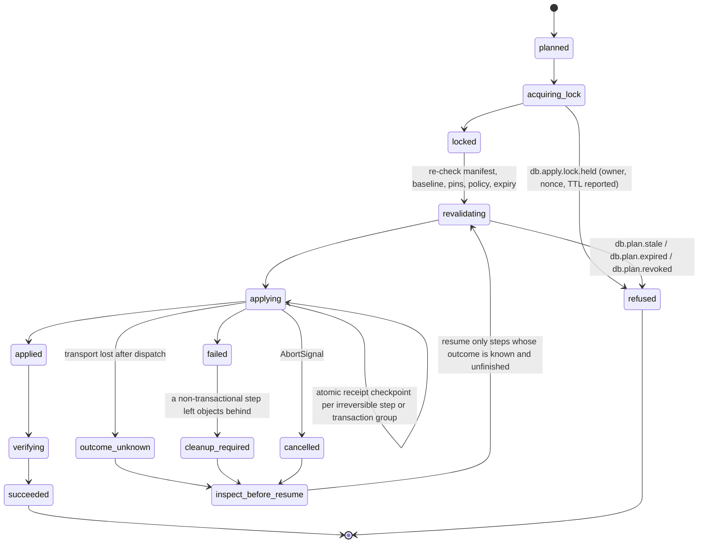

# Database architecture — a provider-neutral kernel with a Prisma 8 PostgreSQL adapter

## Summary

NetScript replaces its inherited database foundation with one provider-neutral composition and
operations kernel, and certifies exactly one adapter first: Prisma 8 on PostgreSQL.

Applications and plugins author schema in **native Prisma TypeScript** — the current model-first
`defineContract(scaffold, callback)` form — and pass that exact native value into a thin NetScript
definition that adds identity, ownership, capability requirements, policy, and lifecycle. NetScript
adds no schema vocabulary of its own: no query DSL, no model language, no re-exported builder. A
pure compiler resolves those definitions into canonical contract artifacts and one deterministic,
content-addressed `DatabaseManifest`. The manifest is the durable join point for everything
downstream: a generated application-local binding whose types are inferred from the native contract,
typed process/request sessions, bounded `StandardSchemaV1` validators at trust boundaries,
programmatic emit/inspect/plan/apply/verify operations, provider markers and ledgers, immutable
operation receipts, and generated CLI, documentation, and agent surfaces.

The end-to-end flow is one pipeline of separately named values, and no stage may impersonate
another:

```text
native contracts + NetScript definitions
  → pure composition → ContractArtifacts → DatabaseManifest
  → generated app-local binding → sessions + bounded validators
  → inspected baseline → ExecutablePlan → provider apply/ledger
  → immutable OperationReceipts → verify / resume
```

This is a clean break. There is no compatibility API, no Prisma 7 fallback, no dual runtime, no
legacy adapter facade, and no application that composes both stacks. Data continuity is nevertheless
absolute: `netscript db adopt` introspects live databases, proposes ownership, writes provider
marker metadata only, and performs **zero** table or data DDL/DML before verification.

Two acceptance conditions bind implementation, and the design is narrowed rather than softened if
either fails:

> **Exact native contract inference survives into the app-local query binding** — no private
> imports, no copied overloads, no casts, no declaration widening.
>
> **Runtime validation is intentionally bounded and fails closed** — a schema is produced only where
> the contract plus registered operation, selection, codec, and extension metadata can prove it;
> everything else raises `DB_VALIDATION_UNSUPPORTED` at schema construction.

Explicit non-goals: no query DSL or repository layer, no portable client facade, no runtime
capability negotiation, no global provider registry, no hosted control plane, and no capability
claimed before a conformance gate proves it. Where a capability cannot be made sound today —
multi-namespace end-to-end typing, full Prisma operation validation from contract data, destructive
plugin removal, non-PostgreSQL providers — this RFC withholds the claim and names the gate that
would release it.

The approved architecture, the locked decision ledger (D-01–D-47), the implementation waves
(W0–W11), and the conformance and publishability matrices live in the
[approved plan](../.llm/runs/docs-database-architecture-rfc--prisma-8-rfc/plan.md); the evidence
behind every upstream claim lives in the linked research artifacts. This document is the decision
and the developer experience.

## Motivation

### The problem is not a Prisma version

NetScript does not have one database architecture. It has five partially overlapping systems whose
identities and ownership rules do not line up: an appsettings/Aspire resource model, a fixed CLI
engine registry and operation runner, a generated per-engine Prisma workspace and task graph, a
runtime adapter wrapping a user-constructed Prisma client, and an install-time plugin fragment
copier. The happy path works only when all five agree about config keys, engine directory names,
environment variables, generated files, Prisma CLI behaviour, adapter packages, and a live Aspire
resource graph — an agreement the framework makes a developer and CI responsibility. There is no
canonical value joining the five views, so every fix lands in one of them and the failure moves
([current-state audit](../.llm/runs/docs-database-architecture-rfc--prisma-8-rfc/research/netscript-current-state.md)).

Three defects are structural rather than incidental.

**Provider identity has replaced target identity.** The generated workspace directory is computed as
`join('database', provider.dirName)` from a closed engine enum
(`packages/cli/src/kernel/adapters/database/workspace-resolver.ts:51`), so two PostgreSQL databases
share one schema tree, one migration history, one generated client, and one task set:
`db add postgres --name analytics` writes another configuration entry but still resolves
`database/postgres/`. `resolveTarget` defaults only when exactly one target is enabled and never
consults `NetScript.PrimaryDatabase` (`:66-91`), so a bare command with two enabled targets throws
`Unknown database target: (default)`, contradicting the documentation. Engine selection is a
`switch` over `'postgres' | 'mysql' | 'sqlite' | 'mssql'` — the literal counter-example doctrine
records as AP-24
([anti-patterns](../docs/architecture/doctrine/09-anti-patterns-and-fitness-functions.md)) — and
every downstream artifact inherits that collapse.

**Generation is a repair pipeline, not an emission.** The nominal `db:generate` path performs
placeholder removal, client generation, a second generation through a Zod wrapper, four kinds of
source rewriting, a generated CRUD alias barrel, client renaming and facade patching, and a further
repair pass. The result is non-atomic generated source that NetScript mutates from upstream textual
output, and a developer can edit the schema, skip the pipeline, and keep compiling against stale
types. Pure code generation also boots Aspire — the open `DB-GENERATE-ASPIRE-COUPLING` debt entry.

**Plugin schema contribution has no ownership semantics.** Plugins ship plain `database/**/*.prisma`
files; on install the CLI copies each fragment into the consumer's schema tree, scans top-level
blocks with a regex/balanced-brace parser, removes byte-identical declarations, and rejects
same-name declarations with different bodies. That cannot express a contribution contract, schema
version, capability requirement, dependency order, declaration or migration ownership, uninstall
data policy, or provenance, and its failure modes are on record: dependency-mode installs reported
success while omitting every plugin table ([#1014][ns-1014]), and model-name clashes broke
authentication installs until namespacing plus a collision guard landed ([PR #1059][ns-1059]).
Removal deletes a directory; it plans no migration at all.

The operational history says the same thing from a different angle. Each row below cost real
recovery time, and each is a missing architectural concept rather than a missing feature:

| Incident                                                 | Lesson the architecture must encode                                                                       |
| -------------------------------------------------------- | --------------------------------------------------------------------------------------------------------- |
| A read-only command killed the resident AppHost          | Operations need one lifecycle owner and an operation class                                                |
| A second AppHost mounted live `PGDATA` and corrupted it  | Operations must bind an authoritative resolved value, not rebuild it                                      |
| Headless migrate returned success with no artifact       | An exit code is not a result; operations need typed postconditions                                        |
| A generated Zod alias hid symbols; its repair broke boot | Generated symbol paths cannot be the framework contract, and validation needs a standards-facing boundary |

Substituting Prisma 8 for Prisma 7 under this structure would preserve every one of those seams.

### Why Prisma 8 changes the calculus

Prisma 8 is not Prisma 7 with a new generator. Its source is arranged as a canonical contract plus
separate control and execution planes: PSL or a TypeScript contract builder lowers into a canonical
`contract.json` and a `contract.d.ts`, a small versioned runtime consumes the contract, a
programmatic control client exposes emit/inspect/plan/apply, migrations are content-addressed graph
edges with per-space markers and a ledger, and **contract spaces** make one contributor's
`(contract, migration graph, head ref)` a first-class disjoint tuple ([ADR 212][adr-212]). That
attacks NetScript's pain points at the root: generated executable client source disappears,
source-rewriting and validator repair passes disappear, schema ownership is modelled instead of
inferred from copied files, migrations are planned and verified programmatically, structured results
replace log scraping, and family/target/adapter/driver/extension become distinct axes instead of one
`engine` string
([deep dive](../.llm/runs/docs-database-architecture-rfc--prisma-8-rfc/research/prisma-8-deep-dive.md)).

It is also not a safe surface to expose directly, and this RFC treats that as a design input:

- Prisma 8 RC1 is Early Access and explicitly not recommended for production ([README][rc1-readme]);
  its release notes warn that RC respins may break, remove, or rename APIs and the contract format
  ([release][rc1-release]). PostgreSQL is the sole database intended for the 8.0 GA target set;
  MongoDB is Early Access, SQLite a proof of concept, MySQL later, SQL Server absent
  ([scorecard][rc1-scorecard]).
- `@prisma/orm-postgres` — the one package an application installs — publishes 138 top-level export
  subpath keys at the pin, spanning adapters, control internals, contract internals, migration
  tooling, query ASTs, runtime, target planning, and utilities. A framework that re-exported that
  surface would convert upstream Early-Access internals into NetScript public API.
- The integration seam moved materially within six days of the RC tag: the `prisma-next` CLI stopped
  being published in favour of a unified CLI ([`3dc98cb`][pn-3dc98cb]), migration and database
  commands were routed through the control API, contract JSON Schema became generated, the
  PostgreSQL floor dropped from 17 to 15, and aggregate number semantics changed.

The correct response to a good architecture on a moving surface is to adopt its _semantics_ through
one small allowlisted adapter, and keep NetScript's own vocabulary, artifacts, and operations stable
across the churn. What that unlocks: a developer declares targets and spaces once, authors schema in
native Prisma TypeScript, and receives query types, lifecycle-owned sessions, boundary validators,
migrations with plans and receipts, plugin schema ownership with independent history, structured CI
evidence, and a generated agent surface — without a copied schema, a hand-synchronised type, a
hand-written adapter, a textual repair, or an implicit target choice.

## Guide-level explanation

This section describes the system as if it had shipped.

> **Example status.** Examples importing `@netscript/*` are intended to be executable exactly as
> written once the packages in [§ The package graph](#the-package-graph) exist. Examples importing
> `@prisma/*` show the current RC1 authoring shape; the exact module specifier is an adapter-pinned,
> implementation-time decision (wave W3). Prisma's own public CLI package name changed six days
> after the RC tag, so freezing an upstream specifier into a NetScript contract would be a design
> error.

### Step 1 — author the contract natively

Schema authoring is Prisma's job and NetScript does not put a vocabulary in front of it. The current
authoring API is model-first: `defineContract(scaffold, callback)`, where the callback receives a
composed helper surface and returns native `types`, `models`, and `enums`
(`packages/3-extensions/postgres/src/contract/define-contract.ts:46-121`; the callback overload
preserves its returned literal types).

```ts
// database/app.contract.ts — provider-native authoring; specifier pinned in W3
import pgvector from '@prisma/orm-extension-pgvector/pack';
import { defineContract, rel } from '@prisma/orm-postgres/contract-builder';

export const appContract = defineContract(
  { extensions: { pgvector } },
  ({ field, model, type }) => {
    const types = { Embedding: type.pgvector.Vector(1536) } as const;

    const User = model('User', {
      fields: {
        id: field.id.uuidv4String(),
        email: field.text().unique(),
        createdAt: field.timestamp().defaultNow(),
      },
    });

    const Post = model('Post', {
      fields: {
        id: field.id.uuidv4String(),
        userId: field.uuidString(),
        title: field.text(),
        embedding: field.namedType(types.Embedding).optional(),
      },
    });

    return {
      types,
      models: {
        User: User.relations({ posts: rel.hasMany(Post, { by: 'userId' }) }),
        Post: Post.relations({ user: rel.belongsTo(User, { from: 'userId', to: 'id' }) }),
      },
    };
  },
);
```

Three things NetScript will **not** do to that code. It will not recreate the older fluent
`target(...).table(...).column(...)` chain — that API was real but was replaced by the model-first
redesign and then removed upstream. It will not introduce a NetScript model DSL that lowers into the
same contract. And it will not vendor or re-export Prisma's builder as though NetScript owned it.

### Step 2 — declare targets and spaces

NetScript's own authoring surface adds identity, ownership, capability requirements, policy, and
lifecycle around that native value — and nothing else.

```ts
// database/database.ts
import {
  defineDatabase,
  defineDatabaseSpace,
  defineDatabaseTarget,
  fromAspire,
  fromEnv,
} from '@netscript/database';
import { prismaPostgres } from '@netscript/database-prisma-postgres';
import { authSpace } from '@netscript/plugin-auth-core/database';
import { appContract } from './app.contract.ts';

const primary = defineDatabaseTarget({
  id: 'primary',
  provider: prismaPostgres({ minVersion: 15 }),
  connection: fromAspire('netscript-db'),
  roles: { writer: {}, 'reader:reporting': { readOnly: true } },
  policy: { destructive: 'deny', defaultOwnership: 'managed' },
});

const analytics = defineDatabaseTarget({
  id: 'analytics', // same provider, different database, zero shared state
  provider: prismaPostgres({ minVersion: 15 }),
  connection: fromEnv('ANALYTICS_DATABASE_URL'),
  policy: { destructive: 'plan-only', defaultOwnership: 'adopted' },
});

export default defineDatabase({
  targets: { primary, analytics },
  spaces: {
    app: defineDatabaseSpace({
      id: 'app',
      owner: 'app',
      version: '1.0.0',
      target: 'primary',
      contract: appContract, // `typeof appContract` is preserved exactly
      policy: { removal: 'retain' },
    }),
    auth: authSpace({ target: 'primary' }),
  },
});
```

The important property is what `defineDatabaseSpace` does to `appContract`: nothing. It stores the
value and preserves `typeof appContract` unchanged. NetScript never reinterprets models, never
copies Prisma overloads, and never widens the contract into a generic record. Everything NetScript
adds — `id`, `owner`, `version`, `target`, `dependencies`, capability requirements, ownership,
retention — is plain data that survives a provider replacement.

The second property is where the target key is checked. `defineDatabaseSpace` is evaluated on its
own and cannot know the keys of a `targets` object that does not exist yet, so it does **not**
promise a type error at its own call site. The check happens where both halves are visible: the
`spaces` parameter of `defineDatabase` requires every space's target to be a key of `targets`, so
`target: 'primry'` is a type error at the `defineDatabase` call. If the type check is bypassed —
JavaScript callers, generated input, `as` casts — composition refuses with
`db.compose.target.unknown` rather than falling back. Today's installer resolves a target through a
fallback chain that can end at a **disabled** target; under this design there is no fallback chain
anywhere in the system.

### Step 3 — the generated binding and typed sessions

Composition emits canonical artifacts and one manifest, and the emitter writes a small
application-local binding module. That module is where inferred provider types live — never inside a
published NetScript package.

```ts
// .netscript/database/primary.binding.ts — GENERATED. Do not edit.
// manifest nsdb1:9f3c… · contract cs:7ab2… · provider @prisma/orm-postgres@<pin>
import type { QueryOf, TransactionQueryOf } from '@netscript/database-prisma-postgres/binding';
import type { AppBinding, ProcessTargetSession } from '@netscript/database-runtime';
import type { AppContract } from './primary/contract.d.ts';

export type PrimaryQuery = QueryOf<AppContract>;
export type PrimaryTxQuery = TransactionQueryOf<AppContract>;
export type PrimarySession = ProcessTargetSession<'primary', PrimaryQuery, PrimaryTxQuery>;

export declare const primaryBinding: AppBinding<'primary', PrimaryQuery, PrimaryTxQuery>;
export declare const PRIMARY_MANIFEST_DIGEST: 'nsdb1:9f3c…';
```

One generic model is used everywhere: a binding carries
`(target id, query type, transaction query
type)`, and every session type is parameterised by
exactly those three. `QueryOf` and `TransactionQueryOf` are provider-specific helpers exported by
the adapter for generated code only; no provider-neutral package ever names them.

```ts
// composition-root.ts — hand-written, and the only place a target is bound by name
import { createDatabaseRuntime } from '@netscript/database-runtime';
import { prismaPostgres } from '@netscript/database-prisma-postgres';
import { manifest } from './.netscript/database/manifest.ts';
import { primaryBinding, type PrimarySession } from './.netscript/database/primary.binding.ts';

await using runtime = await createDatabaseRuntime({
  manifest,
  providers: [prismaPostgres],
  targets: ['primary'],
  scope: 'process',
  connections,
});

const primary: PrimarySession = runtime.bind(primaryBinding);
const accounts: AccountStore = new PrismaAccountStore(primary);
```

Feature code receives `AccountStore` — an application-owned port — not the runtime. `runtime.bind`
is reachable only from declared composition-root and generated files, enforced as an `arch:check`
rule, because a database handle reachable from anywhere is a service locator with a domain name.
NetScript does not generate repositories and does not define what `AccountStore` looks like; that is
application architecture.

Inside the session, the query surface is Prisma's own:

```ts
const recent = await primary.query.orm.post.findMany({
  where: { userId: input.userId },
  select: { id: true, title: true },
});

await primary.transaction(async (tx) => {
  await tx.orm.user.create({ data: { email: input.email } });
  await tx.orm.post.create({ data: { userId: input.userId, title: 'Hello' } });
});
```

There is no NetScript query language wrapping those calls, and there never will be. The transaction
callback receives the binding's `PrimaryTxQuery`, which is inferred from the same contract but is a
**distinct** type: whether an interactive transaction can expose exactly the ordinary query surface
is an upstream behaviour W4 must prove, so the design does not assert it in advance. Interactive
transactions exist only on process-scoped sessions; a request-scoped session is `AsyncDisposable`,
caches no collaborators, and its type has no `transaction` member at all.

### Step 4 — validation at trust boundaries

The same contract that types the query surface produces Standard Schema validators, with no
generated validator file anywhere in the repository:

```ts
import { primaryBinding } from './.netscript/database/primary.binding.ts';

const users = primaryBinding.ref({ space: 'app' }).model('User');

const createUser = users.input('create', { representation: 'json' });
const publicUser = users.output(
  { select: { id: true, email: true } },
  { representation: 'json' },
);
const wholeUser = users.output('model', { representation: 'json' });
```

Two methods and two representations, and the two methods mean materially different things. `input`
produces an **operation input** schema and exists only where the provider or an extension has
contributed exact metadata for that operation. `output` produces a **selected result** schema for
the shape actually requested, or the whole-model shape under the explicit `'model'` form. The only
public representations are `runtime` and `json`; the database-driver wire representation is a third
channel upstream and stays adapter-internal, because calling JSON "wire" would be ambiguous.

Those values implement `StandardSchemaV1`, so they drop into independent consumers unchanged — and
each boundary uses the schema that actually describes it:

```ts
// an oRPC route contract: create-input in, selected output out
const createAccount = baseContract
  .route({ method: 'POST', path: '/accounts' })
  .input(createUser)
  .output(publicUser);

// a Fresh action consuming the same input schema for the same payload shape
const parsed = await createUser['~standard'].validate(formPayload);
if (parsed.issues) return renderFieldErrors(parsed.issues);
```

Validating an inbound payload with a query-result schema is a category error, and the API's shape
makes it visible rather than merely discouraged.

Two honest limits are enforced rather than documented. First, `users.input('create', …)` succeeds
**only** when exact operation metadata exists; otherwise it throws `DB_VALIDATION_UNSUPPORTED` while
the schema is being constructed, naming the missing metadata. The same applies to an `output`
selection whose leaves are computed, raw, aggregated, or otherwise unprovable. Second, invalid user
data never throws: it returns Standard Schema issues with a field path, a stable code, and the
contract coordinates. Construction failures and validation failures are different events with
different audiences.

### Step 5 — a second PostgreSQL database

```ts
spaces: {
  app: /* … bound to 'primary' … */,
  warehouse: defineDatabaseSpace({
    id: 'warehouse',
    owner: 'app',
    version: '1.0.0',
    target: 'analytics',
    contract: warehouseContract,
    policy: { removal: 'retain' },
  }),
}
```

`primary` and `analytics` are both PostgreSQL and share nothing: separate output roots, contract
artifacts, migration lineages, provider markers, runtime bindings, locks, and receipts. A relation
from a `primary` model to an `analytics` model is refused at composition with
`db.compose.cross-target-relation`, and no multi-target operation is ever described as atomic. Those
are not adapter limitations; they are honest statements about two separate databases.

### Step 6 — install a plugin that owns its schema

A plugin whose tables outlive an install — auth, workers, sagas — contributes a **full space**: its
own native contract, its own canonical artifact, its own migration lineage and head, versioned
independently of the application.

```ts
// plugins/auth/core: the plugin owns a space, not a fragment
import { definePluginSpace } from '@netscript/plugin';
import { CAP, pinnedArtifact } from '@netscript/database-contract';

export const authSpace = definePluginSpace({
  id: 'plugin:@netscript/plugin-auth',
  owner: '@netscript/plugin-auth',
  version: '0.0.7',
  contractFormat: '>=1 <2',
  requires: [CAP.sqlFamily, CAP.nativeUuid],
  owns: { tables: ['auth_user', 'auth_session', 'auth_account', 'auth_verification'] },
  augmentation: {
    grants: [{ object: 'auth_user', kind: 'add-optional-column', prefix: 'x_' }],
    denies: ['drop-column', 'change-type', 'add-required-column'],
  },
  policy: { removal: 'retain' },
  artifact: pinnedArtifact('./artifacts/contract.json'),
});
```

The consumer writes one line — `auth: authSpace({ target: 'primary' })` — and installation copies
nothing into the application's schema. It writes a **pinned mirror** under the application's
generated root containing the descriptor snapshot, the space's canonical contract artifact, its
lineage, and its provenance. Production apply and verify read the mirror, so a deployment does not
need the plugin's package graph resolvable at all, and a mirror digest that disagrees with the
installed package digest is `db.space.skew` rather than a latent divergence.

Ownership is checked over `(target, namespace, object kind, name)`, not over declaration text. Two
spaces that both want a table named `user` are an ownership conflict naming both spaces — and while
the first adapter supports only one physical namespace per target (see
[§ The withheld namespace capability](#the-withheld-namespace-capability)), physical name collisions
between spaces are refused at composition. A published space therefore names its objects so they
cannot collide; namespaces will relax that requirement when the capability is released, and will
never replace the ownership check.

Uninstalling is a planned operation, not a directory delete. The guaranteed behaviour is
**detach-and-retain**: the runtime binding goes away, the data and the marker stay, a tombstone
records the history, and ownership is downgraded from `managed` to `adopted` so `verify` keeps
noticing drift instead of going blind. Archiving and dropping are specified in this RFC but ship
only if provider conformance proves them.

### Step 7 — one extension, registered once

Today a single logical extension such as pgvector must be registered independently in schema
authoring (`/pack`), in control/config (`/control`), and at runtime construction (`/runtime`).
Half-registering it is silent until something fails.

```ts
export const pgvectorExtension = defineDatabaseExtension({
  id: 'pgvector',
  version: '0.4.0',
  provider: 'prisma-postgres',
  authoring: pgvectorPack,
  control: pgvectorControl,
  runtime: pgvectorRuntime,
  validation: pgvectorValidation,
});
```

One bundle, one identity, four facets. The generated composition root fans that single declaration
into every phase, and a missing, mismatched, or half-installed facet is a composition error naming
the facet and both versions.

### Step 8 — the operational journey

Every operation is a typed programmatic call first; the CLI, the docs, and the agent surface are
projections of the same catalog. The API boundary — not a promise in prose — is what proves that
pure work cannot reach a database:

```ts
import { createDatabaseControl } from '@netscript/database-control';

// Pure control: artifacts and policy only. It has no connection resolver to reach.
const control = createDatabaseControl({ manifest, providers: [prismaPostgres] });

const emitted = await control.emit({ targets: ['primary'], runId });
const advisory = await control.preview({ targets: ['primary'], runId });

// Live control: constructed from the pure catalog by supplying explicit live dependencies.
await using live = await control.connect({ connections });

const baseline = await live.inspect({ targets: ['primary'], runId });
const plan = await live.plan({ targets: ['primary'], baseline, policy, runId });

const signed = await control.sign(plan); // artifact-side: no database, no lock
const applied = await live.apply({ plan: signed, runId });
const verified = await live.verify({ targets: ['primary'], runId });
```

`emit` is offline because there is no connection in scope, not because an injected resolver happens
to go unused. This is the structural closure of the `DB-GENERATE-ASPIRE-COUPLING` debt entry: Aspire
is a property of a target's connection source, and a pure operation never receives one.

```console
$ netscript db plan --target primary --json
{
  "operation": "plan",
  "runId": "01JYZ…",
  "outcome": "succeeded",
  "perTarget": [
    {
      "target": "primary",
      "status": "succeeded",
      "spaces": [
        { "space": "app", "status": "planned", "steps": 3, "destructive": 0 },
        { "space": "plugin:@netscript/plugin-auth", "status": "planned", "steps": 1, "destructive": 0 }
      ],
      "plan": { "planId": "plan:4c19…", "expiresAt": "2026-08-13T18:42:00Z" }
    }
  ],
  "diagnostics": [],
  "nextAction": { "operation": "apply", "args": { "plan": "plan:4c19…" } }
}
```

Four properties are guaranteed by the shape of that output. Every requested target appears with a
status — there is no silent skip and no implicit "all". `nextAction` is structured data, so the CLI,
CI annotations, and an agent render the same remediation without any of them parsing prose. Human
text is never a contract; gates assert on codes. And the exit code is a projection of `outcome`
(`succeeded` → 0, `refused`/`failed` → non-zero, `partial-success` → non-zero with a resume token),
never the result itself.

When something goes wrong, the vocabulary is equally explicit:

```console
$ netscript db apply --plan plan:4c19…
error db.plan.stale: plan plan:4c19… was bound to manifest nsdb1:9f3c…, current is nsdb1:12ab…
  target: primary
  next:   netscript db plan --target primary
```

### What you stop doing, and what you are refused

The following stop existing as developer-visible work: copying a plugin's `.prisma` file into your
schema; running a generate pipeline whose later steps repair the output of its earlier steps;
keeping a generated Zod mirror in sync; importing a client by its generated filesystem path;
discovering that a command silently used the first target; starting Aspire in order to compile;
reading logs to learn whether a migration produced an artifact; and hand-maintaining an agent
instruction file describing commands that have since changed. Equally important is what the system
declines to do, loudly and early:

| You try to…                                                           | You get                                                                                |
| --------------------------------------------------------------------- | -------------------------------------------------------------------------------------- |
| Bind a space to a target that does not exist                          | A **type error** at the `defineDatabase` call; `db.compose.target.unknown` if bypassed |
| Declare a relation between models in two different targets            | `db.compose.cross-target-relation` at composition                                      |
| Let two spaces manage the same object, or claim the same table name   | `db.compose.ownership.conflict` / `db.compose.object-name.conflict`, naming both       |
| Use a capability the bound target does not declare                    | `db.compose.capability.missing`, naming capability, space, and target                  |
| Request a non-default physical namespace on the first adapter         | `db.target.namespace-unsupported` — the capability is withheld, not faked              |
| Apply a speculative preview                                           | Refusal: a preview has no `planId` and `apply` accepts only bound plans                |
| Apply a plan after the manifest, baseline, pins, or policy changed    | `db.plan.stale`; after its expiry, `db.plan.expired`                                   |
| Migrate a read replica                                                | Refusal: replicas are roles, and no control operation can address a role               |
| Run a destructive step in production with an interactive "yes"        | Refusal: production requires an approved, signed plan                                  |
| Build a validator with no contributed operation or selection metadata | `DB_VALIDATION_UNSUPPORTED` while constructing the schema                              |
| Target Prisma SQLite, MongoDB, MySQL, or SQL Server                   | `db.target.unsupported` — structured, with no fallback and no Prisma 7 path            |
| Drop a plugin's tables on uninstall                                   | Refusal: `retain` is the guaranteed mode; `archive`/`drop` await conformance           |

## Reference-level explanation

### Vocabulary and identity

Similar-looking values are intentionally distinct; conflating any two is a review finding.

| Term                 | Meaning and invariant                                                                                               |
| -------------------- | ------------------------------------------------------------------------------------------------------------------- |
| `DatabaseDefinition` | Authored targets, spaces, connections, capabilities, and policy. Pure; performs no IO. Not a manifest.              |
| `NativeContract`     | A Prisma `defineContract` result. NetScript never translates its entity or query vocabulary.                        |
| `AppBinding`         | App-local generated bridge from the native contract to sessions and validators. Never a published framework export. |
| `SpeculativePreview` | Advisory preview. **Cannot be approved or applied**, and has no `PlanId`.                                           |

A `SpaceContribution` carries a space's owner, version, target, dependencies, ownership,
capabilities, artifact refs, and retention; `ValidationIR` is the internal, never-exported
value/selection algebra behind the validators. The control flow keeps five values separate:
`DatabaseDefinition`, `DatabaseManifest`, `ExecutablePlan`, `ProviderMarker`/`ProviderLedger`, and
`OperationReceipt`. A provider-owned `ContractArtifact` is pinned per space and remains distinct
from all five.

Identity is declared, never derived: provider names, engine names, filesystem paths, config aliases,
and traversal order are never identities and never dependency edges.

| Identity              | Notes                                                                                                                   |
| --------------------- | ----------------------------------------------------------------------------------------------------------------------- |
| `TargetId`            | Author-chosen (`'primary'`). Owns connection, output root, runtime binding, lineage, locks, receipts.                   |
| `RoleRef`             | `(TargetId, 'writer' \| 'reader:<name>')`. A replica is a role, never a target, and no control operation addresses one. |
| `NamespaceRef`        | `(TargetId, namespace)`. A kernel axis; the first adapter declares only the default namespace.                          |
| `SpaceId`             | `'app'`, `'plugin:@netscript/plugin-auth'`. One schema owner; a published identity, never an install path.              |
| `ObjectKey`           | `(TargetId, namespace, objectKind, name)`. The unit of ownership; exactly one `managed` owner.                          |
| `RunId` / `ReceiptId` | Sortable unique ids supplied at the edge, so receipts are addressable and resumable.                                    |

`ContractSnapshotId`, `ManifestDigest`, and `PlanId` are content hashes, described with the
artifacts they address.

### The package graph

Six new units and four changed ones. Each has exactly one doctrine archetype; where two genuinely
apply, the remedy is two packages, not one package with two shapes.

| Unit                                  | Archetype | Why this boundary exists                                                                                                       |
| ------------------------------------- | --------- | ------------------------------------------------------------------------------------------------------------------------------ |
| `@netscript/database-contract`        | A1        | Identities, artifacts, diagnostics, vocabularies, SPIs. Zero dependencies and permissions, so everything can depend on it.     |
| `@netscript/database`                 | A4        | `defineX` builders plus the **pure** compiler. Separation from control keeps composition total and IO-free.                    |
| `@netscript/database-runtime`         | A3        | Scope, connection ownership, close ordering, health, cancellation, sessions. A3 makes the runtime gate column mandatory.       |
| `@netscript/database-control`         | A2        | Operation catalog, plan/apply/verify, policy, locks, receipts, recovery, saga — integration work with failure-injection gates. |
| `@netscript/database-prisma-postgres` | A2        | The **only** framework Prisma import boundary. Independently versioned, so an upstream break is a provider patch.              |
| `@netscript/database-testkit`         | A6        | Runnable provider **and space** conformance certification with machine-readable reports.                                       |

Four existing units change. `@netscript/plugin` (A4) gains `definePluginSpace`, typed only by
`-contract`, and loses the hollow legacy database abstracts, keeping a driver out of every plugin's
dependency graph; first-party `plugins/*` (A5) become thin descriptors plus pinned artifacts from
their `-core` package; `@netscript/aspire` (A2) narrows to one `ConnectionSource` adapter and a
resource projection, **never required by a pure operation**; and `@netscript/cli` (A6) projects the
operation catalog and hosts the adoption codemod, with no database logic and no engine switch.

Dependency law, each clause mechanically checkable. `-contract` imports nothing from this family and
no provider. `-runtime` and `-control` depend on `-contract` and on `-database` for definition types
they must not redeclare, and never import each other or a provider. **No framework package depends
on a provider**: providers are composition-root values, so there is no global registry and no lookup
by string. Nothing depends on the testkit at runtime. And **no framework package re-exports Prisma**
— only the adapter imports Prisma runtime or control modules, while application and plugin authoring
modules import Prisma's public authoring builder directly during the controlled build phase, which
is provider-native authoring, not a re-export. Public subpaths are part of that contract: the
adapter owns exactly two, its root and `/binding`.

Doctrine currently codifies the model this RFC removes — Archetype 5 makes plugin database
contributions plain `*.prisma` files ([archetypes](../docs/architecture/doctrine/06-archetypes.md))
— so wave W0 amends it and registers every new unit in the gated denominator. No database package
inherits the oRPC-only `--allow-slow-types` carve-out
([public surface](../docs/architecture/doctrine/02-public-surface.md)).

### The definition layer and type propagation

`defineDatabaseSpace` wraps an already-authored native contract: `TContract` is inferred from the
passed value and never widened, re-keyed, or re-interpreted, so `SpaceDefinition['contract']` has
type `TContract`. The target key is checked one level up, where both halves are visible:

```ts
// @netscript/database

/** Composes targets and spaces into a frozen definition; the target keys are checked here. */
export declare function defineDatabase<
  const TTargets extends Readonly<Record<string, DatabaseTargetDefinition<string>>>,
  const TSpaces extends Readonly<
    Record<string, DatabaseSpaceDefinition<string, Extract<keyof TTargets, string>, unknown>>
  >,
>(
  input: { targets: TTargets; spaces: TSpaces; policy?: DatabasePolicy },
): DatabaseDefinition<TTargets, TSpaces>;

/** Pure resolution. Total: it returns diagnostics; it does not throw for authoring mistakes. */
export declare function compileDatabase(
  definition: AnyDatabaseDefinition,
  sources: ContractArtifactSource,
): Promise<
  | { readonly ok: true; readonly manifest: DatabaseManifest }
  | { readonly ok: false; readonly diagnostics: readonly Diagnostic[] }
>;
```

Four inference rules, each with a conformance fixture: literal preservation through `const` type
parameters; **contract identity**, so `typeof definition.spaces.app.contract` is exactly
`typeof appContract`; **no structural widening**, so no signature accepts a contract as
`Record<string, ModelLike>` and a deliberately widened fixture must _fail_ its soundness gate; and
**no upstream leakage**, so no published NetScript declaration names a Prisma type.

Two tracks run in parallel and must never be merged. The **inference track** is `typeof contract`:
provider generics, valid only inside the application's own compilation, terminating in generated
app-local files. The **identity track** is `ContractSnapshotId` and `ManifestDigest`: plain data
used by plans, markers, receipts, validators, and agents, crossing every boundary freely. Conflating
them is how a system ends up unable to answer "is this database consistent with this build?" without
type-checking, so every generated binding records the manifest digest and provider pin and startup
refuses a mismatch with `db.artifact.stale`.

**The one deliberate soundness seam.** `runtime.bind` returns a session whose query types come from
generated code, and the kernel cannot prove the runtime value the provider constructs matches them,
because those type parameters are erased. Three gates make the seam safe: the binding is _generated_
from the same manifest and provider declaration artifact that produced the session (hand-writing one
is an `arch:check` failure); it carries the digests the provider verifies at bind time; and a
conformance case asserts that a mismatched binding fails at bind rather than at first query. The
alternative — publishing a contract-typed value from a framework package — `isolatedDeclarations`
and the no-slow-types rule forbid outright.

### Contribution modes

The mode decides migration ownership, and it is explicit.

| Mode                                                                                                                                                          | Owns migrations | Used for                                                       |
| ------------------------------------------------------------------------------------------------------------------------------------------------------------- | --------------- | -------------------------------------------------------------- |
| Space (`definePluginSpace`, `defineDatabaseSpace`) — a complete native contract, canonical artifact, migration lineage, and head, published as pinned data    | The contributor | **All persistent plugin-owned tables**, and application schema |
| App-local fragment (`defineContractFragment`) — a function receiving the exact composed native helpers and returning const-preserved `types`/`models`/`enums` | The application | Application schema an app chooses to split across modules      |

A fragment's `build` parameter necessarily names the provider's composed helper type, so under
`isolatedDeclarations` a **published** package cannot export one without putting a Prisma type in a
published declaration. Fragments are therefore application-local and a published fragment is a gate
failure — which is why persistent plugin tables default to full spaces, whose published surface is
plain data plus pinned artifacts. If W3 proves a mechanism that preserves exact inference across a
published boundary, a published fragment mode may be added then.

Composition is two-phase because extension packs determine the composed helper object's shape
_before_ Prisma invokes the callback, so "register an extension while a fragment is executing"
cannot be sound. Phase 1 collects contribution manifests, extension bundles, dependency edges, and
capability requirements, resolving extension identity and version, detecting facet mismatch,
ordering fragments, and refusing cycles; phase 2 builds one scaffold into the exact composed helper
surface, invokes fragments in dependency order, canonicalizes, and atomically publishes the
artifacts. Both phases are pure, and the generated root is explicit calls and spreads in dependency
order — never a runtime registry, never `Array.reduce`, never a value typed
`Record<string, ModelLike>`:

```ts
// .netscript/database/primary.contract-root.ts — GENERATED. Do not edit.
export const primaryContract = defineContract(scaffold, (h) => {
  const billing = billingFragment.build(h, {});
  const app = appFragment.build(h, { billing });

  return {
    types: { ...billing.types, ...app.types },
    models: { ...billing.models, ...app.models },
    enums: { ...billing.enums, ...app.enums },
  } as const;
});
```

Fragment order must not change the canonical contract digest; that is a conformance case. Plugin
spaces never appear in this root — they are separate contracts with separate artifacts, applied on
their own lineage.

### Artifacts and their authority

Six separately named values, with disjoint responsibilities. Nothing else is authoritative for these
questions.

| Value or artifact                   | Authoritative for                     | Identity and failure behaviour                                                                                          |
| ----------------------------------- | ------------------------------------- | ----------------------------------------------------------------------------------------------------------------------- |
| `DatabaseDefinition`                | Authored intent                       | Source value only; it is compiled and never consumed by runtime, control, apply, or verify                              |
| `ContractArtifact`                  | Provider contract content             | `ContractSnapshotId`; `db.artifact.stale` refuses to plan or bind                                                       |
| `DatabaseManifest`                  | Resolved desired composition          | `ManifestDigest` over the canonical manifest including pins; a consumer with a different digest refuses and names both  |
| `ExecutablePlan`                    | What will be executed                 | `PlanId`; `db.plan.stale`, `db.plan.expired`, `db.plan.revoked`                                                         |
| `ProviderMarker` / `ProviderLedger` | **Applied state**                     | Provider-owned, recorded as opaque versioned attributes; divergence from the manifest is drift, classified by ownership |
| `OperationReceipt`                  | Evidence of attempts and observations | `ReceiptId` per run with ordered checkpoints; never desired state, and a resume reads it _plus_ live state              |

Manifests and plans carry secret _references_ only, so a plan is safe to commit and archive.
Artifact roots are staged and atomically committed, never patched in place, so an interrupted job
leaves a fully old or fully new root. Receipt outcomes are `succeeded`, `refused`, `skipped`,
`failed`, `partial-success`, `cleanup-required`, `outcome-unknown`, and `cancelled`; the last three
are separate from `failed` precisely because "the ledger was repaired" must never read as "the
database was repaired" ([Flyway repair][flyway-repair]).

Composition is pure and total. Beyond the refusals listed in the guide it validates provider pins,
contribution provenance and contract format, mirror integrity, and output/migration root isolation,
refuses dependency cycles and extension facet skew, and is covered by a determinism gate asserting
that `ManifestDigest` is a pure function of the definition, its snapshots, and its pins. Every
invariant has a diagnostic and a negative test.

### Operations, plans, and recovery

Operations are classified before they run, and the class determines what an operation may resolve.

| Class       | Examples                                                    | May resolve                                                                                                                    | Lock     |
| ----------- | ----------------------------------------------------------- | ------------------------------------------------------------------------------------------------------------------------------ | -------- |
| `pure`      | `compose`, `emit`, `inventory`, offline `preview`, `sign`   | Artifact readers, the atomic publisher, the signature policy. **Never** a connection, Aspire, Docker, secrets, or the network. | No       |
| `live-read` | `inspect`, live `preview`, `plan`, `verify`                 | An explicit target connection                                                                                                  | No       |
| `mutating`  | `apply`, `seed`, adoption baseline, space retirement        | An explicit connection, provider lock/fencing, and a bound plan                                                                | Yes      |
| `resident`  | `studio`, and anything whose connection lives inside a host | An explicit target and an orchestration binding                                                                                | Advisory |

`sign` is deliberately `pure`: signing binds a policy decision to an artifact, so it neither takes a
connection nor acquires a migration lock. A plan is created only from an inspected baseline and
binds everything that could invalidate it — manifest digest, closure, baseline fingerprint, provider
pins, policy decision, environment, secret references, ordered steps, the destructive-operation list
with its data-loss risk, and a mandatory expiry. In CI and production the policy must be
`allow-with-approval` **and** the plan must carry a signature.



The rules that give that diagram teeth. **Loss of transport after dispatch produces
`outcome-unknown`, never `failed`** — the engine cannot know whether the provider completed the work
([interrupted updates][pulumi-interrupted]). **Resume always inspects live state and the provider
ledger first**, revalidates the plan bindings, and continues only operations whose outcome is known
and unfinished, never blindly replaying non-idempotent DDL or a data transform; because resume is a
_lookup_, the receipt store supports append plus lookup by `RunId`, `ReceiptId`, and resume token,
and an implementation may split those into source and sink roles. **Checkpoints are per irreversible
operation or provider transaction group.** **Lock scope is `(target, physical database)`**, with
owner identity, nonce, fencing evidence where the provider supports it, TTL, heartbeat, and explicit
force-unlock preconditions; a provider without a certified lock is refused for concurrent-safe
apply, and each target gets its own runner.

**Multi-target execution is a saga, never a transaction.** Selection expands to a dependency
closure, records every omission with a reason code, orders targets deterministically, and gives each
its own runner, lock, and receipt. A mix of successful and failed, refused, or unknown targets
yields `partial-success` with a resume token; if no target succeeds, the aggregate outcome is
failed, refused, or outcome-unknown according to the per-target results. The run ends with a
whole-manifest verification; selective execution is recovery machinery, not the normal deployment
path ([resource targeting][tf-targeting]). The programmatic catalog is the source, and CLI commands,
documentation, and agent instructions are projections of it: a freshness gate fails on any diff, and
a conformance case executes every documented example.

### The runtime layer

A session carries its `TargetId`, scope, contract snapshot id, a `health(signal)` method, and the
provider's own `query` surface supplied by generated app-local code. Scope is a **type**, not a
configuration flag: `ProcessTargetSession<TId, TQuery, TTx>` adds `transaction(run, options?)`,
while `RequestTargetSession<TId, TQuery>` is `AsyncDisposable`, caches no collaborators, and has no
`transaction` member at all. That mirrors an upstream precedent — Prisma's serverless facade creates
an async-disposable runtime per request and omits the closure-cached `orm`, `runtime()`, and
`transaction()` surfaces that would be unsafe in that lifecycle — and it prevents the class of bug
where a closure caches a per-request handle.

Guarantees the A3 gates must prove: **one lifecycle owner** — the runtime constructs the provider
runtime, with no `setClient` and no circular assembly; **close ordering** — sessions drain before
connections close, connections close in reverse bind order, leak-free across repeated start/stop and
request lifecycles; **cancellation** — every long-running call takes an `AbortSignal`, observable in
the receipt and never leaving an orphaned connection; **readers cannot migrate** — a `reader:*` role
produces a read-only session type no control operation can address; **redaction** — connection
strings, passwords, and secret references never appear in diagnostics, receipts, or logs; and **bind
refuses mismatch**.

Ports stay at three or four cohesive methods, because AP-3 names "a port with every operation the
backend can perform" as the integration-package failure mode and today's `DatabaseAdapter<TClient>`
is that anti-pattern in shipped code. **Verify is not a provider method**: it is composed from
`ProviderControl.inspect` plus a manifest comparison plus ownership classification, which is what
keeps drift semantics identical across providers.

### The runtime validation subsystem

This is the second primary axis of the RFC, and the one where an attractive inference is easiest to
over-sell. The
[runtime-validation source audit](../.llm/runs/docs-database-architecture-rfc--prisma-8-rfc/research/runtime-validation-source-audit.md)
is the evidence; three facts are decisive. The contract carries a bounded runtime value algebra —
codec references, value objects, unions, mandatory nullability, `many`, `dict`, value-set
references, and explicit relation and cross-space coordinates. But **the complete operation and
result type universe is not runtime data**: the SQL field, operation, codec, and aggregate type maps
are installed under an optional phantom key, emitted into `contract.d.ts`, and erased at runtime.
And plans retain enough for **direct** projections and no more — a projection carries alias,
expression, and an _optional_ codec reference, absent for computed expressions, subqueries, and raw
aliases. Prisma's own Standard Schema usage validates codec parameters rather than model values,
across three representations (application runtime, driver wire, target JSON), which is why the
public options are `runtime` and `json`.

Three schema classes with materially different guarantees, which is why they are not hidden behind
one method:

| Class           | Guarantee                                                                                                                       | Refusal boundary                                                                                          |
| --------------- | ------------------------------------------------------------------------------------------------------------------------------- | --------------------------------------------------------------------------------------------------------- |
| Model value     | `output('model', …)` validates a named model, value object, or enum.                                                            | Never implies uniqueness, foreign keys, or check constraints are satisfied.                               |
| Operation input | `input(op, …)` exists **only** where the provider or an extension contributes exact runtime operation metadata.                 | Create/update/filter/nested-write/polymorphic semantics absent from runtime data fail at construction.    |
| Selected result | `output(selection, …)` validates a fully-known direct projection whose alias, codec, nullability, and representation are known. | Computed, subquery, raw, aggregate, include, and unknown leaves need a contributed result schema or fail. |

`ValidationIR` covers registered codec leaves, nullability, `many` and `dict`, value objects,
whole-model values with an explicit presence policy, direct-column projections with complete
metadata, model fields and relations whose cross-space references resolve through an
integrity-verified aggregate, unions only where branch identity is deterministically discriminable,
and value sets and enums whose membership resolves from the value set or native-enum entity — never
inferred from a codec id, because the PostgreSQL native-enum codec is a string pass-through carrying
no members.

Schema **construction** throws a deterministic `DB_VALIDATION_UNSUPPORTED` — with coordinates naming
target, space, snapshot, model, operation or selection, representation, and the missing metadata —
for at least: unknown codecs, or codecs with no representation-specific value schema; unknown pack
entity kinds; corrupt or missing aggregate spaces, heads, hashes, cross-space references, or value
sets; ambiguous unions and unresolvable model variants; operation grammar absent from runtime data;
computed, subquery, raw, aggregate, include, or unknown result leaves; opaque SQL index and check
expressions; database-state constraints such as uniqueness and foreign keys, which are not local
value validation; and non-deterministic or asynchronous predicates where the requested mode promises
synchronous validation.

No unsupported case becomes `unknown`, a pass-through, or a warning. This is deliberately **stricter
than the provider's own decoders**, which accept missing codecs and pass through unknown shapes: a
decoder's job is decoding, a validator's job is refusing. Invalid _values_ never throw — they return
Standard Schema issues carrying a stable code, contract coordinates, field path, expected class, and
observed value class.

A codec is supported only when its contributor supplies a deterministic value schema for **every**
advertised public representation:

```ts
defineValidationCodec({
  codecId: 'pgvector.vector@1',
  representations: { runtime: vectorRuntimeSchema, json: vectorJsonSchema },
});
```

Encode/decode functions are not validation: conversion success is compatible with arbitrary
coercion, as the ArkType JSON extension documents — encoding does not validate, so an invalid write
can reach the database and fail only on `RETURNING` decode. A derived validator's cache key covers
the canonical full-contract snapshot digest, contract schema version, `SpaceId`, target/family,
operation or normalized selection shape, representation, interpreter ABI version, and contributor
versions; a storage hash alone is insufficient, because domain, roots, and extension semantics can
change without storage changing. Plugin spaces cache under their own `SpaceId`.

Input validation is **mandatory** at external mutation boundaries wherever a supported schema
exists; output validation is **mandatory** for declared API/RPC responses, SSR/hydration payloads,
and external-service messages, and **opt-in** for internal query loops, because a design that
validates every row on every read gets disabled wholesale. An input failure is a client error with
field paths; an output failure is a server/contract error **and** a drift signal. NetScript
re-exports no validation library, and no ahead-of-time projection is claimed: one may ship later
only if it is content-addressed, atomically replaced, never required by any code path, and proven to
pass the identical semantic corpus as the runtime interpreter.

### Ownership, spaces, and the withheld namespace capability

| Policy     | Planned | Mutated | Verified                         | Typical source                                                   |
| ---------- | ------- | ------- | -------------------------------- | ---------------------------------------------------------------- |
| `managed`  | Yes     | Yes     | Fully                            | An app or plugin space that owns the objects.                    |
| `adopted`  | Yes     | Yes     | Against a reviewed baseline      | Objects brought under management by `db adopt` or by retention.  |
| `external` | No      | No      | Against declared assertions only | Hosted platforms and upstream extensions that own their objects. |
| `ignored`  | No      | No      | No                               | Deliberate exclusion with an auditable recorded reason.          |

Exactly one `managed` owner per `ObjectKey`; identical declaration text from two contributors is
still an ownership conflict; cross-space references require the same target plus a declared
dependency edge; and augmentation is an **owner-granted closed permission**, so the absence of a
grant is a denial and an unsupported modification either asks the owner or becomes an app-owned
migration. The `external` policy is not an edge case — a hosted database whose tables evolve outside
the framework's knowledge is the normal shape of a managed service, and upstream has a recorded
instance of a pinned extension contract diverging from an externally evolving database and failing
verification ([prisma#29896][pn-29896]).

The space lifecycle is `declared → installed → upgraded`, with refusals for overlap, missing or
cyclic dependencies, contract-format skew, capability regression, ownership widening, and mirror
skew; then `detached → retained`, with `archived` and `dropped` specified but unclaimed.
Detach-and-retain is the **only guaranteed removal**: data, marker, tombstone, and ownership history
are preserved, and ownership is downgraded `managed → adopted`. Detaching a space a still-installed
space depends on is refused, naming the dependent.

Prisma's runtime lowering honours per-model namespaces, but its authoring type maps do not: the
authoring path lumps every model under the default storage namespace and leaves additional namespace
maps empty (`packages/2-sql/2-authoring/contract-ts/src/contract-types.ts:644-691`), and the audited
post-RC object retains the limitation. `NamespaceRef` therefore stays a **kernel** identity axis —
manifests, ownership, object keys, and plans all carry it — while the adapter declares only the
target's default physical namespace as a capability, and declaring a second namespace or binding a
space to a non-default one is refused with `db.target.namespace-unsupported`. The capability must
not be advertised until exact type/runtime parity passes with **no casts, no private imports, and no
flattening workaround**. The consequence, stated so it cannot be misread: logical `SpaceId` and
ownership coordinates prevent silent merging, but they do **not** make two identical physical table
names coexist in one namespace, so spaces sharing a target must use distinct physical object names
until the capability is released. If upstream never fixes the type maps, the kernel carries an
unused axis and nothing else needs rework.

### The refusal boundary

These refusals are the architecture: each is mechanically checkable and each has a conformance row
in the [approved plan](../.llm/runs/docs-database-architecture-rfc--prisma-8-rfc/plan.md). Beyond
the non-goals in the summary and the refusals in the guide: **no compatibility layer** — no Prisma 7
facade, legacy generated module, dual client, `setClient` lifecycle, alias barrel, copied schema
bridge, dual migration history, or runtime shim, and no code path that selects between the two
stacks; **no upstream re-export**, since only the adapter imports Prisma runtime or control modules;
**no text-patched generated source and no arbitrary TypeScript during production apply**, because
artifacts are emitted from an IR and replaced atomically while CI consumes verified artifacts; and
**no implicit target selection, cross-target atomicity, cross-database relation, or cross-database
transaction**.

## Drawbacks

**It is a large program, and it lands as a break.** Twelve waves, six new packages, changes to four
existing ones, a doctrine amendment, a first-party plugin conversion, and a cutover. No individual
wave is exotic, but the sequence is long, and until the cutover the repository carries both
foundations on separate branches. Anyone wanting a small change here will find the smallest coherent
unit is still substantial, because the operation contract — not a missing feature — is what is being
replaced.

**It bets on an Early-Access upstream.** RC1 is explicitly not recommended for production, its notes
warn that respins may break APIs and the contract format, and the seam demonstrably moved within six
days of the tag. The mitigation — one adapter package, one facade module, an import allowlist,
independent versioning, and a kill switch that costs a provider rather than the architecture — is
real but not free: it adds a boundary a direct dependency would not need.

**It adds indirection where a direct call used to be.** A definition compiles to a manifest, which
binds a plan, which yields a receipt. For a solo developer with one PostgreSQL database this is more
moving parts than `prisma migrate dev`; the pay-off arrives with the second target, the first plugin
space, the first partial failure, and the first production apply. Six published packages is likewise
a real maintenance surface, each carrying JSR obligations — correct by archetype and gate profile,
but four packages where a less disciplined design would ship one.

**The typed binding is generated, and validation is narrower than users will initially want.**
`isolatedDeclarations` plus the oRPC-only carve-out mean the inferred contract type cannot be
published from a framework package, so it terminates in a generated app-local module and a stale
binding is refused rather than tolerated — correct, but a developer can be told "re-emit" at an
inconvenient moment. Likewise "derive all my validators from the schema" is the intuitive
expectation, and this design refuses it for filters, nested writes, polymorphic narrowing, and
computed/raw/aggregate results unless exact metadata is contributed, so some users will experience
`DB_VALIDATION_UNSUPPORTED` as a missing feature. It is a correct refusal, and this RFC would rather
explain it than silently return a schema that accepts wrong data.

**Some capabilities regress relative to today.** Prisma SQLite, MongoDB, MySQL, and SQL Server are
not carried forward; multi-namespace end-to-end typing is withheld; destructive plugin removal is
not guaranteed. Each names the gate that would release it, but a user with a MySQL target today has
no path inside this design other than the old release line. And one soundness seam at `runtime.bind`
is accepted rather than eliminated, mitigated by three gates but real.

**The conformance matrix is expensive.** Real PostgreSQL, Windows and Linux, failure injection,
crash and unknown-outcome recovery, packed consumer installs, and a two-consumer Standard Schema
corpus are all required before the adapter is advertised. That cost is the point — it turns
"upstream says it is supported" into "NetScript proved it" — but it is a standing CI bill.

## Rationale and alternatives

### Why this shape

Four observations force the design. **The five current systems fail because nothing joins them**, so
a join point is mandatory — and it must be a _value_ rather than a live object, because inspection,
diffing, hashing, review, transport to CI, agent consumption, and stale detection are all properties
of a serialisable value, while a live graph reachable from feature code is a service locator with a
domain name. **Provider identity replaced target identity**, so identity must be declared,
provider-neutral, and the key of every artifact. **Prisma's contract/space/lineage semantics are
genuinely good while its operational layer has gaps** — no mature reset/resolve/diff/squash
workflow, no general shadow-database workflow, no complete advisory lock story, no row-count-aware
data-loss analysis, no extension removal — so waiting would gate adoption on someone else's roadmap,
while owning them means NetScript keeps them when a second provider arrives. And **the publish
constraint decides where types live**: `isolatedDeclarations` plus the oRPC-only carve-out
determines that the inferred binding is generated app-side.

### Alternatives considered and rejected

| Alternative                                                        | Why rejected                                                                                                                                                        |
| ------------------------------------------------------------------ | ------------------------------------------------------------------------------------------------------------------------------------------------------------------- |
| Keep Prisma 7 and add Prisma 8 as an opt-in pilot (issue #313)     | It preserves every seam in Motivation. The current architecture is what a compatibility-first constraint produced; repeating the constraint reproduces the outcome. |
| A one-to-one migration of the current design onto Prisma 8         | Engine-as-identity, the repair pipeline, copied fragments, exit-code results, and Aspire-coupled generation are all independent of the Prisma major version.        |
| A proprietary NetScript schema DSL lowering to the contract        | A third schema language tracking every native type, index kind, constraint, and default; permanently lagging; errors become a translation of a translation.         |
| A live `DatabaseGraph` as the public artifact                      | A runtime graph accretes traversal APIs and becomes a lookup surface. The manifest gives every property the graph was wanted for.                                   |
| Re-export Prisma from a NetScript package                          | Doctrine AP-14, the publish constraint, and 138 upstream export keys at the pin — a re-export converts Early-Access internals into NetScript public API.            |
| Generated mirror validators (a schema file per model/input/output) | Combinatorially wrong for selection-aware output validation, and it recreates the repair pipeline that already failed here.                                         |
| Claim full operation/result validation from contract data          | The pinned source shows the operation and result type maps are phantom and erased at runtime. The claim would be false.                                             |
| Copy plugin schema fragments (status quo)                          | No version, ownership, capability guard, dependency order, provenance, or safe removal — with two recorded production failures.                                     |
| Build a hosted control plane (registry, RBAC, approvals, drift)    | Those are persistent products with operators, not local primitives. Atlas Cloud, Pulumi Cloud, and Bytebase demonstrate the value **and** the required services.    |
| Extend the `--allow-slow-types` carve-out to database packages     | It converts an application-local inference problem into permanent framework-wide publish debt.                                                                      |

### Market lessons

Seventeen comparators were examined for the framework-level problem rather than for ORM popularity
([market analysis](../.llm/runs/docs-database-architecture-rfc--prisma-8-rfc/research/market-analysis.md)).
Five lessons changed this design:

- **One resolved manifest beats many config files.** Named connections in Adonis, Rails, and Django
  are legible, and Atlas proves multiple schema sources can compose — but none yields a
  deterministic content-addressed resolved value, and Atlas's composite ordering is load order
  rather than declared semantic edges.
- **Contributor-owned migration spaces are the only ownership model that scales.** Django's per-app
  graphs and Prisma's contract spaces are the strong examples; Flyway locations and Liquibase
  changelogs merge into one shared history and cannot express contributor isolation.
- **A preview is not an executable plan, and applying a valid plan is not a transaction.** Atlas's
  develop → review → deliver → apply model is the right process shape; Terraform and Pulumi supply
  the harder recovery lesson this RFC encodes as `outcome-unknown` and inspect-before-resume.
- **Managed and external ownership are different.** Rails' `database_tasks: false`, Drizzle's
  filters, Atlas's external sources, and the upstream Supabase drift incident all point one way: a
  framework that treats every visible object as its own reports permanent false drift.
- **Runtime-derived, selection-shaped validation is the right ergonomic, but the boundary must be
  standard.** ZenStack v3 is the closest comparator ([its Zod factory][zenstack-zod]), and its
  validators are Zod-specific, its plugin surface is preview, and schema-time and runtime
  installation can diverge. NetScript binds both halves in one contribution record and keeps
  Standard Schema as the boundary.

Also stated as scope law: a _local_ meta-framework must not rebuild hosted RBAC, workspace and fleet
management, remote schema registries and environment promotion, policy-as-a-service, approval
engines, or continuous drift control planes. NetScript exposes stable artifacts and integration
events so such a system can be added as an adapter.

## Breaking changes and migration

**This is a breaking change.** The tracking issue and the RFC PR carry the `breaking` label.

### The no-compatibility law

None of the following survives: a Prisma 7 client or facade; a legacy generated module or alias
barrel; a dual client or `setClient` lifecycle; a deprecated re-export; a dual migration history; a
copied schema bridge; a runtime shim; or any code path that selects between the old and new stacks.
Old and new stacks may coexist **in the repository**, on separate branches or release lines, while
features are developed; a single application composition may never load both. That is a branch
strategy, not a public API.

| Surface                                                                                     | Break                                                                                                                                                 |
| ------------------------------------------------------------------------------------------- | ----------------------------------------------------------------------------------------------------------------------------------------------------- |
| `@netscript/database` (current adapters, `setClient`) and `@netscript/prisma-adapter-mysql` | Replaced wholesale by the new package graph; the hand-written driver adapter is retired.                                                              |
| Generated engine workspaces `database/<engine>/`                                            | Deleted, along with their `db:*` task graph, repair scripts, and the Zod pipeline.                                                                    |
| Generated client deep imports                                                               | Removed. Applications consume the generated binding, never a path into generated output.                                                              |
| `@netscript/plugin` legacy database abstracts and plugin `*.prisma` fragments               | Replaced by `definePluginSpace` and plugin-owned spaces with pinned artifacts. Copying stops.                                                         |
| The current `db` CLI verbs                                                                  | Replaced by catalog projections; `generate` becomes pure `emit`, `migrate` splits into `plan` + `apply`, `list`/`status` become `inventory`/`verify`. |
| Implicit target defaulting and silent single-target execution                               | **Deliberately removed.** There is no fallback chain anywhere.                                                                                        |
| Prisma SQLite / MySQL / SQL Server targets                                                  | Not carried forward. Structured `db.target.unsupported`, no fallback.                                                                                 |

### The adoption protocol

`netscript db adopt` is a temporary migration codemod and tool. It is not a compatibility layer, not
a permanent command, and it is deleted after the migration window. It operates on an **explicitly
selected target set** and returns a status for **every** selected target — there is no "whatever was
reachable" mode.

| Step | Operation                                                                                                                                       | Mutates the database? | Failure behaviour                                                                                                                     |
| ---- | ----------------------------------------------------------------------------------------------------------------------------------------------- | --------------------- | ------------------------------------------------------------------------------------------------------------------------------------- |
| 1    | Read legacy configuration and layout, and derive explicit `TargetId`s from config keys, never engine names                                      | No                    | Refuse on ambiguous or duplicate keys, and when two keys resolved to one engine directory                                             |
| 2    | Introspect every **selected** target                                                                                                            | No                    | An unreachable target is reported as `not-attempted` with a reason code; the run continues for the rest and cannot be marked complete |
| 3    | Propose ownership — one space per attributable owner, plus `external`/`adopted` — and hard-stop on unattributed or conflicting objects          | No                    | Objects that cannot be attributed are reported, never guessed                                                                         |
| 4    | Compile the manifest, atomically emit artifacts and bindings, and establish one baseline lineage node per space matching the **observed** state | No                    | Standard composition diagnostics                                                                                                      |
| 5    | Write provider marker metadata **only** — zero table or data DDL/DML                                                                            | **Yes, markers only** | Idempotent and re-runnable; produces a receipt                                                                                        |
| 6    | Verify live state against the manifest and baseline; require zero drift on every selected target                                                | No                    | Any diff is a genuine finding: an unattributed object or an incorrect ownership assignment                                            |
| 7    | Delete legacy engine workspaces, task graphs, copied fragments, repair scripts, and old adapters                                                | No                    | Reversible by reverting the commit                                                                                                    |

Step 5 is the load-bearing property: **no table is created, altered, or dropped during adoption**,
which is what makes the migration safe on production data. Full cutover — step 7 and the removal of
the legacy release line — is blocked until every _intended_ target has been reached, attributed,
baselined, and verified; a partially adopted target set is a resumable state, never a finished one.

Required before a release-class cutover: a seeded production-shaped **rehearsal** proving zero
schema/data mutation, with the receipt as evidence; a verified restorable **backup** before the
first mutating operation in each environment; a committed **ownership preflight** artifact listing
every target with reachability and provider version, every `ObjectKey` with owner and policy, every
unattributable object, and every capability requirement against what each target declares;
**destructive consent** as an approved signed plan; per-target **partial outcomes** with resume
tokens; a **crash** fault-injection run exercising checkpoints, `outcome-unknown`, and
inspect-before-resume; **idempotent marker** writes; a **secret** redaction conformance case;
**lock** contention, TTL expiry, holder death, and force-unlock preconditions; and an agreed
migration window, legacy release-line end date, and rollback runbook.

### Rollback boundaries

| Point                                                  | Rollback                                                                                                                                                                                    | Cost                                                           |
| ------------------------------------------------------ | ------------------------------------------------------------------------------------------------------------------------------------------------------------------------------------------- | -------------------------------------------------------------- |
| Before the marker write                                | Delete generated artifacts                                                                                                                                                                  | None; nothing was written to any database                      |
| After markers, before the cutover commit               | Remove the adopted spaces' marker rows **where the provider's certified marker semantics prove removal is safe and idempotent**; otherwise the markers stay and the spaces remain `adopted` | Trivial; markers are metadata and carry no user data           |
| After the cutover commit, before the first new `apply` | Revert the commit                                                                                                                                                                           | Repository-only; the database is untouched                     |
| After the first new `apply`                            | **Forward only** — through lineage, the provider ledger, and receipts                                                                                                                       | Ordinary migration recovery; the receipt names which steps ran |

There is deliberately no "run both stacks" rollback. It would require the compatibility layer this
design refuses, and it would double the failure surface during precisely the window when the system
is least understood.

## Prior art

The
[market analysis](../.llm/runs/docs-database-architecture-rfc--prisma-8-rfc/research/market-analysis.md)
compares seventeen products in depth; the lessons this design actually adopted are listed above. The
sources that most directly shaped specific decisions are
[Django's per-app migration graphs with declared dependencies][django-multidb] and Prisma's
[contract spaces ADR][adr-212] for contributor ownership;
[Terraform's targeting guidance][tf-targeting] and
[Pulumi's interrupted-update recovery][pulumi-interrupted] for saga semantics, partial success, and
inspect-before-resume; [Flyway's `repair`][flyway-repair] for the distinction between repairing a
ledger and repairing a database; [ZenStack's runtime Zod factory][zenstack-zod] for selection-shaped
validator ergonomics; and the upstream [Supabase drift incident][pn-29896] for ownership policy. No
product is a template: the combination proposed here — one deterministic resolved manifest,
contributor-owned spaces with independent lineage, native upstream authoring with framework policy
around it, apply-bound plans with receipts, ownership-aware drift, capability-specific behaviour, a
programmatic core with CLI/agent projections, and a runtime Standard Schema boundary — does not
exist as a single local product today.

NetScript's own prior art is the oRPC integration: the real upstream builder, NetScript policy
around it, precise types flowing from upstream values, Standard Schema consumed structurally, one
const-generic root fanning into several surfaces, and compile-failure soundness tests. The
[transfer analysis](../.llm/runs/docs-database-architecture-rfc--prisma-8-rfc/research/typescript-schema-orpc-audit.md)
states exactly which parts transfer and which must not.

## Unresolved questions

The vocabulary, identity model, package graph, artifact taxonomy, refusal boundary, ownership model,
plan/apply/recovery semantics, validation bounds, and clean-break law are **locked**. Nothing below
can force a package-boundary rewrite; each item is a mechanism, version, or release decision behind
stable public semantics, and the full ledger with owning waves is in the
[approved plan](../.llm/runs/docs-database-architecture-rfc--prisma-8-rfc/plan.md).

Implementation-time, by owning wave: the canonical manifest/digest encoding and format-version
evolution policy (W1 — a `formatVersion` exists and consumers refuse unknown versions); the exact
Prisma import allowlist, module specifiers, and supported compatibility window (W3 — adapter-local
by construction, and pinning a specifier now would design against a surface that moved post-RC);
whether the multi-namespace capability can be claimed at all (W3); the mapping of extension facets
onto the provider's authoring/control/runtime/validation locations (W3); the concrete scope shapes
and whether an interactive transaction can expose the ordinary query type (W4); plan signature
format and production key custody (W5/W10 — the port and the signed-plan requirement are locked,
only the mechanism is open); the provider lock mechanism (W5, per provider); receipt storage
location and retention (W5); the initial augmentation grant vocabulary (W7); whether the testkit
needs a runnable binary or folds into `./testing` subpaths (decided before W1); and the migration
window, legacy release-line end date, and rollback runbook (W10).

Conditional on upstream, each blocking only a _claim_: whether Prisma's namespace type map stops
flattening non-default namespaces (no cast workaround is permitted); whether prepared-statement,
transaction, raw-SQL, and numeric/aggregate semantics settle by GA (aggregate semantics already
changed after RC1, so no public guarantee is made until proven per pin); whether upstream ships an
extension/space removal primitive (if not, `retain` is the product behaviour); whether the contract
format stabilises (more than one format break without a migration path is a kill trigger); whether
the Deno platform matrix is clean without vendoring or patching (failure kills the adapter, not the
kernel); and whether the runtime-derived validation direction is sustained upstream (the bounded
interpreter does not depend on it).

Explicitly deferred rather than open: a second provider; Prisma SQLite, MongoDB, MySQL, and SQL
Server; runtime capability negotiation; AOT validation; archive/drop removal beyond retain; public
raw/prepared/aggregate conveniences; and hosted approval, registry, promotion, fleet, drift, and
secret services. Cross-database relations and transactions are **unsupported**, not deferred parity
debt.

Two questions are genuinely for reviewers. Is detach-and-retain as the only guaranteed removal
acceptable for the first release, given that archive and drop are specified but unclaimed? And is
the generated app-local binding the right trade against the alternative of a framework-published
contract-typed value, which the publish constraint forbids?

## Future possibilities

Natural extensions this architecture enables and this RFC deliberately excludes:

- **A second certified provider**, proving the narrow provider SPI with a real adapter when demand
  and maturity exist — never with a speculative fallback built to prove a port.
- **The multi-namespace capability**, **archive/drop retirement**, and **AOT validation**, each
  released by its gate (upstream type parity, provider conformance, corpus equivalence) rather than
  by a workaround.
- **A policy-applied authoring factory** that pre-applies naming and control defaults and forwards
  the provider's exact composed helpers — revisitable once the thin surface has shipped, and only if
  it needs no cast, private import, or copied overload.
- **Delivery-backend adapters** exporting plans, receipts, and diagnostics to Atlas, Bytebase, or a
  hosted approval system — as adapters over stable artifacts, never a local reimplementation.
- **Deeper agent capability**: an allowlisted operation surface with policy metadata derived from
  the catalog, so an agent gets structured operations rather than unrestricted query access.
- **Additional first-party spaces** beyond auth, workers, sagas, triggers, and streams, and
  **read-replica-aware routing helpers** if a concrete need appears — as composition affordances,
  never a hidden router that could silently send a write to a reader.

<!-- NetScript issues and pull requests -->

[ns-1014]: https://github.com/rickylabs/netscript/issues/1014
[ns-1059]: https://github.com/rickylabs/netscript/pull/1059

<!-- Prisma 8 primary sources, pinned -->

[rc1-release]: https://github.com/prisma/prisma/releases/tag/v8.0.0-rc.1
[rc1-readme]: https://github.com/prisma/prisma/blob/v8.0.0-rc.1/README.md
[rc1-scorecard]: https://github.com/prisma/prisma/blob/v8.0.0-rc.1/scorecard.md
[adr-212]: https://github.com/prisma/prisma/blob/v8.0.0-rc.1/docs/architecture%20docs/adrs/ADR%20212%20-%20Contract%20spaces.md
[pn-3dc98cb]: https://github.com/prisma/prisma/commit/3dc98cb
[pn-29896]: https://github.com/prisma/prisma/issues/29896

<!-- Comparators -->

[flyway-repair]: https://documentation.red-gate.com/flyway/reference/commands/repair
[tf-targeting]: https://developer.hashicorp.com/terraform/tutorials/state/resource-targeting
[pulumi-interrupted]: https://www.pulumi.com/docs/iac/operations/troubleshooting/interrupted-updates/
[zenstack-zod]: https://zenstack.dev/docs/utilities/zod
[django-multidb]: https://docs.djangoproject.com/en/5.2/topics/db/multi-db/
